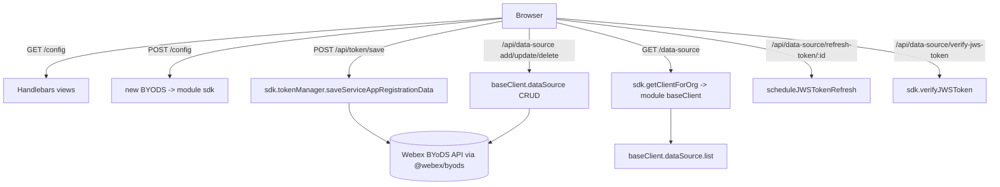
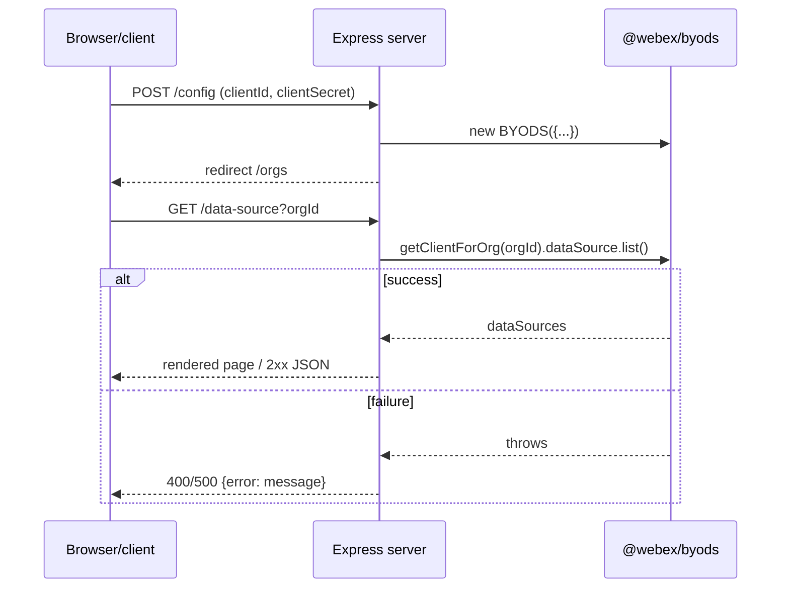

<!-- sdd-generated-metadata
generator: claude-cli
generator_model: us.anthropic.claude-opus-4-8
approved_by: pending-human-review
updated_at: 2026-08-06T00:00:00Z
validation_status: not-run
run_id: 51855eac-8de5-43a2-a3b6-dbcc55ebc91b
-->

# byods-demo-server — SPEC

> Start here → root [`AGENTS.md`](../../../AGENTS.md) (agent entry) · router [`SPEC_INDEX.md`](../../../ai-docs/SPEC_INDEX.md) · system [`ARCHITECTURE.md`](../../../ai-docs/ARCHITECTURE.md). This is the module's canonical spec: orientation, requirements, design, flows, and tests.
> Context-efficiency: link to canonical docs — don't duplicate them. Load specs on demand per `SPEC_INDEX.md`.

## Metadata

| Field | Value |
|---|---|
| Module id | `byods-demo-server` |
| Source path(s) | `packages/byods-demo-server/src/` |
| Parent spec | `—` (standalone private demo app that consumes `@webex/byods`; no parent module) |
| Doc kind | Module spec |
| Coverage score | Pending coverage assessment |
| Generated from | `module-spec` @ SDLC template library `0.2.2` |
| generated_by / approved_by / updated_at | claude-cli / pending-human-review / 2026-08-06 |
| Validation status | not-run, validator `pending`, assessed 2026-08-06 |

Coverage score is `Pending coverage assessment` until the first coverage review runs. Manifest coverage
state (`Partial`) is authoritative and kept in `.sdd/manifest.json`.

## Evidence Rules
Every requirement cites concrete source evidence using `file path`. Test evidence is preferred for WHY.
Requirements are grounded in the Express app under `src/` and the package's `package.json` scripts.

## Source Material Register

| Source material | Scope | Decision | Detail location or disposition |
|---|---|---|---|
| `N/A` | none | none | No pre-existing SDD/AI-docs, architecture, or spec documents were routed to this module; content is derived from source and build config. |

## Overview

`byods-demo-server` is a **private, non-published** example web application that exercises the
`@webex/byods` SDK end to end. It is an Express server with Handlebars views that walks a developer
through configuring BYoDS credentials, saving a service-app token for an organization, and performing
DataSource CRUD plus JWS-token operations against the live Webex BYoDS API through the SDK.

The app is intentionally thin: `src/index.ts` starts the server, and `src/server.ts` wires the Express
middleware, renders Handlebars pages (`config`, `orgs`, `data-source`), and exposes JSON/redirect routes
that delegate directly to a `BYODS` SDK instance and a per-org `BaseClient`. It is meant to be run with
`ts-node` in development (`dev`, `dev:integration`, `dev:hot`) and defaults the environment via
`BYODS_ENVIRONMENT`.

A maintainer should start at `src/server.ts`, which contains the entire route surface and SDK usage.

## Purpose / Responsibility

Owns a runnable demonstration/reference application for the BYoDS SDK: an Express + Handlebars UI and
JSON API that configures the SDK, manages service-app tokens per org, and drives DataSource CRUD and JWS
refresh/verify flows. It does NOT own the BYoDS SDK behavior, token storage durability, or any production
concern — it is a private sample (`"private": true`, no build/publish, no lockstep with a shipped API).

## Stack

TypeScript (`typescript ^5.6.3`), run directly via `ts-node`; Node (`@types/node` 22). Web stack:
`express` 4, `express-handlebars`/`handlebars` views, `express-async-errors`, `helmet` (production),
`morgan` (development logging), `cookie-parser`, and `jet-logger`. Consumes `@webex/byods`
(`workspace:*`). Tooling: ESLint 9 (flat config, `typescript-eslint`), `jasmine`/`supertest` for tests,
`nodemon` for hot reload. No build step — scripts run `ts-node ./src` with `NODE_ENV`/`BYODS_ENVIRONMENT`
set.

## Folder / Package Structure

```
packages/byods-demo-server/src/
├── index.ts     # Entry point: starts the Express server on process.env.port || 3000
├── server.ts    # Express app: middleware, Handlebars view setup, and all routes / SDK usage
├── views/       # Handlebars templates (config, orgs, data-source) rendered by renderTemplate
└── public/      # Static assets served by express.static
```

## Key Files (source of truth)

| File | Holds |
|---|---|
| `packages/byods-demo-server/src/server.ts` | The complete Express app: middleware, `renderTemplate`, and every route plus its `@webex/byods` SDK call |
| `packages/byods-demo-server/src/index.ts` | Server bootstrap (`server.listen(port)`) and the start log message |
| `packages/byods-demo-server/package.json` | `dev`/`dev:integration`/`dev:hot` scripts, `BYODS_ENVIRONMENT`/`NODE_ENV` wiring, dependencies |

## Public Surface

Internal Surface — this is a private demo app, not a library. Its "surface" is the set of HTTP routes an
operator uses in a browser/curl. There is no exported code API and it is not published.

| Contract ID | Type | Surface | Purpose | Compatibility / deprecation | Schema / detail link | Root index |
|---|---|---|---|---|---|---|
| `byods-demo-server.config` | HTTP | `GET /` → redirect `/config`; `GET /config`; `POST /config` | Render config page and initialize a `BYODS` SDK instance from submitted `clientId`/`clientSecret` | Demo-only; not semver-controlled | `packages/byods-demo-server/src/server.ts` | `../../../ai-docs/CONTRACTS.md` |
| `byods-demo-server.token` | HTTP | `POST /api/token/save`; `GET /api/token/list` | Save a service-app registration (refresh token) for an org; list stored tokens | Demo-only | `packages/byods-demo-server/src/server.ts` | `../../../ai-docs/CONTRACTS.md` |
| `byods-demo-server.data-source` | HTTP | `GET /data-source`; `POST /api/data-source/add`; `POST /api/data-source/update`; `DELETE /api/data-source/delete/:id` | Render and perform CRUD on data sources for the selected org via `BaseClient.dataSource` | Demo-only | `packages/byods-demo-server/src/server.ts` | `../../../ai-docs/CONTRACTS.md` |
| `byods-demo-server.jws` | HTTP | `POST /api/data-source/refresh-token/:id`; `POST /api/data-source/verify-jws-token` | Schedule JWS token auto-refresh for a data source; verify a JWS token via the SDK | Demo-only | `packages/byods-demo-server/src/server.ts` | `../../../ai-docs/CONTRACTS.md` |

Compatibility notes:
- As a private sample, routes may change freely to track SDK demonstrations; nothing here is a
  compatibility promise to external consumers.

## Requires (dependencies)

- `@webex/byods` (`workspace:*`) — the SDK under demonstration: `BYODS`, `BaseClient`,
  `InMemoryTokenStorageAdapter`, `LOGGER`.
- `express` (`^4.21.1`) + `express-async-errors` — HTTP server and async error propagation.
- `express-handlebars`/`handlebars` — server-side view rendering (`renderTemplate`).
- `helmet` (production security headers), `morgan` (dev request logging), `cookie-parser`, `jet-logger`.
- Node runtime with `ts-node`; a browser or HTTP client to drive the routes.

## Requirements

| ID | WHAT | WHY | Source Evidence | Test / Example Evidence | Assumptions / Gaps | Confidence |
|---|---|---|---|---|---|---|
| `BYODSDEMO-R-001` | The server listens on `process.env.port || 3000` and logs a start message. | Provide a runnable demo endpoint. | `packages/byods-demo-server/src/index.ts` | None found in module | Port read from `process.env.port` (lowercase) | PRESENT |
| `BYODSDEMO-R-002` | The app applies `express.json`/`urlencoded`, `cookieParser`, `morgan('dev')` only when `NODE_ENV==='development'`, and `helmet()` only when `NODE_ENV==='production'`. | Environment-appropriate logging/security for a demo. | `packages/byods-demo-server/src/server.ts` | None found | Middleware gated on `NODE_ENV` | PRESENT |
| `BYODSDEMO-R-003` | Handlebars is configured (`view engine 'hbs'`, views dir), and `renderTemplate` compiles `views/<name>.hbs`, returning HTTP 500 on read error. | Render the config/orgs/data-source pages. | `packages/byods-demo-server/src/server.ts` | None found | Templates read from `__dirname/views` | PRESENT |
| `BYODSDEMO-R-004` | `POST /config` constructs a `BYODS` SDK from submitted `clientId`/`clientSecret` with an `InMemoryTokenStorageAdapter` and `LOGGER.LOG`, then redirects to `/orgs`. | Initialize the SDK from user input before token/data-source flows. | `packages/byods-demo-server/src/server.ts` | None found | SDK instance held in a module-level `sdk` variable | PRESENT |
| `BYODSDEMO-R-005` | `POST /api/token/save` calls `sdk.tokenManager.saveServiceAppRegistrationData(orgId, refreshToken)` returning 201 on success or 500 with the error message; `GET /api/token/list` returns stored tokens (200) or 400 on error. | Demonstrate service-app token registration and listing. | `packages/byods-demo-server/src/server.ts` | None found | Requires `sdk` initialized via `/config` first | PRESENT |
| `BYODSDEMO-R-006` | `GET /data-source` builds a per-org `BaseClient` via `sdk.getClientForOrg(orgId)` and lists data sources; `POST /add`, `POST /update`, `DELETE /delete/:id` perform the corresponding `baseClient.dataSource` CRUD with 201/204 success and 400 error responses. | Demonstrate DataSource CRUD through the SDK's per-org client. | `packages/byods-demo-server/src/server.ts` | None found | `baseClient` held in a module-level variable set by `GET /data-source` | PRESENT |
| `BYODSDEMO-R-007` | `POST /api/data-source/refresh-token/:id` calls `baseClient.dataSource.scheduleJWSTokenRefresh(id, tokenLifetimeMinutes, crypto.randomUUID nonce)`, and `POST /api/data-source/verify-jws-token` calls `sdk.verifyJWSToken(jws)`. | Demonstrate scheduled JWS refresh and JWS verification. | `packages/byods-demo-server/src/server.ts` | None found | Uses `crypto.randomUUID` for nonce | PRESENT |
| `BYODSDEMO-R-008` | A terminal Express error handler logs via `jet-logger` and responds 400 with `{error: message}`. | Centralized demo error responses. | `packages/byods-demo-server/src/server.ts` | None found | Also calls `next(err)` after responding | PRESENT |

## Design Overview

The app is a classic single-file Express server. `server.ts` creates the app, installs body/cookie
parsing, environment-gated `morgan`/`helmet`, and Handlebars view configuration, then serves static
assets. Routes fall into three UI pages (`/config`, `/orgs`, `/data-source`) rendered via a small
`renderTemplate` helper, and a set of JSON API routes under `/api/*` that delegate to the BYoDS SDK.

State is deliberately minimal and module-scoped: a `sdk: BYODS` instance created on `POST /config`, and a
`baseClient: BaseClient` created on `GET /data-source`. Because these are module-level singletons, the
demo assumes a single-user, sequential walkthrough (configure → pick org → manage data sources). The SDK
does all real work — the server just marshals request bodies into SDK calls and shapes JSON/HTTP
responses.

## Data Flow



## Sequence Diagram(s)

The routes share one operation group — an HTTP request marshalled into a `@webex/byods` SDK call — so a
single representative sequence with an error `alt` is sufficient; the walkthrough order is captured in
Use Cases.

Sequence coverage:

| Operation group | Diagram | Failure / recovery coverage |
|---|---|---|
| HTTP route → SDK call | 1. Demo request lifecycle | `alt` shows SDK success (2xx JSON/redirect) vs error (4xx/5xx with `{error}`); terminal handler logs + 400 |

### 1. Demo request lifecycle



## Class / Component Relationships

```mermaid
flowchart LR
  index[index.ts] -->|listen| server[server.ts app]
  server -->|module sdk| BYODS[[@webex/byods BYODS]]
  server -->|module baseClient| BaseClient[[@webex/byods BaseClient]]
  server --> Handlebars[Handlebars views]
  server --> Middleware[express/helmet/morgan/cookieParser]
```

The demo has no domain classes of its own; it composes Express middleware and the SDK's `BYODS`/
`BaseClient` objects held as module-level references.

## Use Cases

- **UC-1 Configure the SDK:** operator opens `/config`, submits `clientId`/`clientSecret`; the server
  creates a `BYODS` instance and redirects to `/orgs`. Evidence: `packages/byods-demo-server/src/server.ts`.
- **UC-2 Register a token for an org:** operator posts an org id + refresh token to `/api/token/save`;
  the server stores it via the SDK token manager. Evidence: `packages/byods-demo-server/src/server.ts`.
- **UC-3 Manage data sources:** operator opens `/data-source?orgId=...` (creating a per-org `BaseClient`),
  then adds/updates/deletes data sources via the `/api/data-source/*` routes. Evidence:
  `packages/byods-demo-server/src/server.ts`.
- **UC-4 Refresh / verify JWS:** operator schedules JWS refresh for a data source or verifies a JWS via
  the SDK. Evidence: `packages/byods-demo-server/src/server.ts`.

## Concurrency & Reactive Flow

The server relies on module-level `sdk` and `baseClient` singletons that are (re)assigned by `POST
/config` and `GET /data-source`. This makes it inherently single-session: concurrent users would clobber
each other's SDK/client references. `express-async-errors` lets `async` route handlers reject into the
terminal error middleware without manual `try/catch` in every route (though several routes still catch
explicitly). This is acceptable for a local demo but must not be treated as a concurrency-safe pattern.

## Error Handling & Failure Modes

| Condition | Signal (error/code/result) | Caller recovery |
|---|---|---|
| Handlebars template read fails | HTTP 500 `Error reading template` | Fix the view path/file |
| Token save fails | HTTP 500 with `Error saving refresh token: <message>` | Re-check org id / refresh token |
| Data-source list/CRUD fails | HTTP 400 with `{error}` / `Error fetching data sources` | Ensure `sdk`/`baseClient` initialized and org valid |
| Uncaught route error | terminal handler logs via `jet-logger`, responds HTTP 400 `{error}` | Inspect server logs |
| SDK not yet initialized (no `/config` first) | route throws on undefined `sdk`/`baseClient` → 400/500 | Run the `/config` then `/data-source` walkthrough in order |

## Pitfalls

- `sdk` and `baseClient` are **module-level mutable singletons**; the flow must be run in order
  (`/config` → `/data-source`) and is not safe for concurrent users.
- The listen port is read from `process.env.port` (lowercase), not the conventional `PORT`.
- `helmet` is only applied when `NODE_ENV==='production'`; running the demo in development intentionally
  omits those security headers.
- This package is `private` with no build step; it is a reference/sample, not a deployable production
  service.

## Module Do's / Don'ts

- DO drive all BYoDS behavior through the `@webex/byods` SDK objects (`sdk`, `baseClient`); keep this app
  a thin demonstration layer.
- DON'T add production hardening, durable token storage, or multi-tenant state here — extend the SDK or a
  real service instead.

## Test-Case Strategy (module)

No tests exist in the module today, though `jasmine`/`supertest` are available as dev dependencies. A
reasonable strategy is HTTP-level supertest coverage against `server.ts`: positive cases that `POST
/config` redirects to `/orgs` and that data-source routes return 201/204 when the SDK is stubbed to
succeed; negative cases that routes return 400/500 with an `{error}` body when the SDK call throws or the
template read fails. Because behavior is delegated to `@webex/byods`, the SDK should be mocked so tests
assert the server's marshalling and status codes, not live API behavior.

| Behavior / Requirement | Existing test evidence | Gap |
|---|---|---|
| `BYODSDEMO-R-001`/`R-002` | None found | Add supertest boot + middleware-gating assertions |
| `BYODSDEMO-R-003`/`R-004` | None found | Assert view rendering and `/config` SDK init + redirect |
| `BYODSDEMO-R-005`/`R-006` | None found | Assert token save/list and data-source CRUD status codes with a mocked SDK |
| `BYODSDEMO-R-007`/`R-008` | None found | Assert JWS refresh/verify routes and the terminal error handler |

## Traceability

- Repo architecture: [`ARCHITECTURE.md`](../../../ai-docs/ARCHITECTURE.md) · Registry: [`SPEC_INDEX.md`](../../../ai-docs/SPEC_INDEX.md)
- BYoDS SDK spec: [`packages/byods/ai-docs/byods-spec.md`](../../byods/ai-docs/byods-spec.md)
- Contracts catalog: [`CONTRACTS.md`](../../../ai-docs/CONTRACTS.md)
- Coverage state & contracts baseline: `.sdd/manifest.json`
