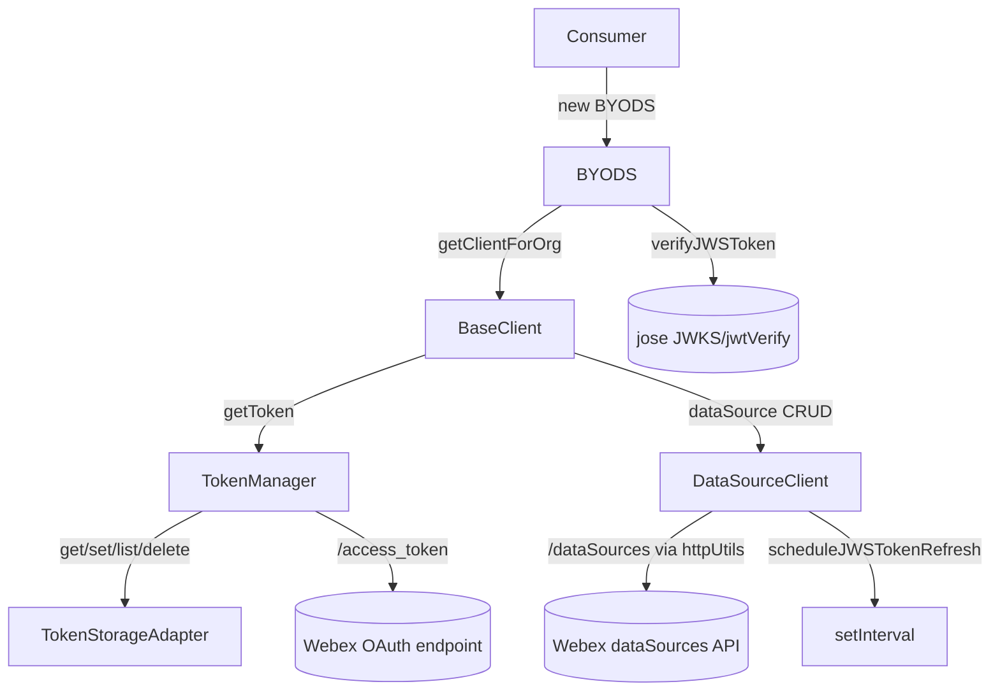
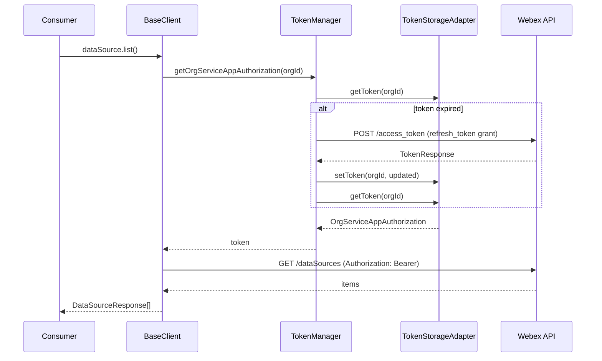
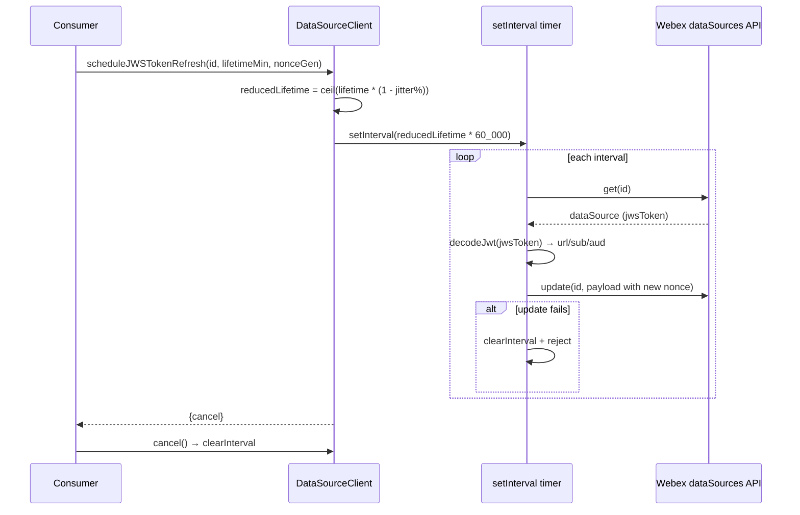
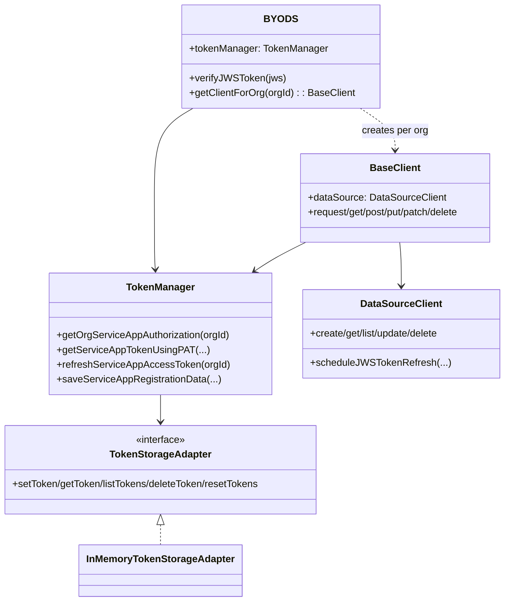

<!-- sdd-generated-metadata
generator: claude-cli
generator_model: us.anthropic.claude-opus-4-8
approved_by: pending-human-review
updated_at: 2026-08-06T00:00:00Z
validation_status: not-run
run_id: 51855eac-8de5-43a2-a3b6-dbcc55ebc91b
-->

# @webex/byods — SPEC

> Start here → root [`AGENTS.md`](../../../AGENTS.md) (agent entry) · router [`SPEC_INDEX.md`](../../../ai-docs/SPEC_INDEX.md) · system [`ARCHITECTURE.md`](../../../ai-docs/ARCHITECTURE.md). This is the module's canonical spec: orientation, requirements, design, flows, and tests.
> Context-efficiency: link to canonical docs — don't duplicate them. Load specs on demand per `SPEC_INDEX.md`.

## Metadata

| Field | Value |
|---|---|
| Module id | `byods` |
| Source path(s) | `packages/byods/src/` |
| Parent spec | `—` (standalone published SDK package; no parent module) |
| Doc kind | Module spec |
| Coverage score | Pending coverage assessment |
| Generated from | `module-spec` @ SDLC template library `0.2.2` |
| generated_by / approved_by / updated_at | claude-cli / pending-human-review / 2026-08-06 |
| Validation status | not-run, validator `pending`, assessed 2026-08-06 |

Coverage score is `Pending coverage assessment` until the first coverage review runs. Manifest coverage
state (`Partial`) is authoritative and kept in `.sdd/manifest.json`.

## Evidence Rules
Every requirement cites concrete source evidence using `file path`. Test evidence is preferred for WHY.
Requirements are grounded in the TypeScript implementation under `src/` and the package's build config.

## Source Material Register

| Source material | Scope | Decision | Detail location or disposition |
|---|---|---|---|
| `packages/byods/README.md` | overview | reference-only | Retained developer README (getting started / build / test); its intent summary informs Overview, not copied here. |
| Other basis | none | none | No SDD/AI-docs, architecture, or spec documents were routed to this module; content is derived from source, README intent, and build config. |

## Overview

`@webex/byods` is the **Bring Your Own Data Source (BYoDS)** Node.js SDK. It lets developers register and
manage external data sources with the Webex BYoDS system without managing the integration plumbing
themselves: it handles service-app token management, per-organization API clients, JWS token
verification, and automatic JWS-token refresh scheduling.

The entry point `src/index.ts` re-exports the top-level `BYODS` class plus `TokenManager`, `BaseClient`,
`DataSourceClient`, the `InMemoryTokenStorageAdapter`, the `LOGGER` level enum, and the
`TokenStorageAdapter` type. A consumer constructs `new BYODS({clientId, clientSecret, ...})`, which
selects the production or integration environment (from `process.env.BYODS_ENVIRONMENT`), builds a
`TokenManager`, and prepares a remote JWKS set (via `jose`) for verifying inbound JWS tokens. From the
SDK the consumer obtains a per-org `BaseClient` through `getClientForOrg(orgId)`, and each `BaseClient`
exposes a `dataSource` (`DataSourceClient`) for CRUD and scheduled token refresh on `/dataSources`.

A maintainer should start at `src/index.ts` for the public surface, then `src/byods/index.ts` (the
`BYODS` orchestrator), `src/token-manager/index.ts`, `src/base-client/index.ts`, and
`src/data-source-client/index.ts`.

## Purpose / Responsibility

Owns the BYoDS SDK: service-app OAuth token lifecycle (retrieve/refresh/store per org), per-organization
HTTP client creation, DataSource CRUD, JWS-token verification, and scheduled JWS-token auto-refresh. It
does NOT own the remote Webex BYoDS/data-source services, the developer's data-source content, or UI —
those live in the Webex cloud and in consuming applications (e.g. `byods-demo-server`).

## Stack

TypeScript 4.9 (target Node; `@types/node` 22, `engines` unspecified but Node fetch-based). Built via
`webex-legacy-tools build` (`-js -ts`) plus `tsc --declaration` emitting `dist/types`; TypeDoc for docs.
Tests run with Jest (`webex-legacy-tools test --unit --runner jest`) using `chai`/`sinon`/`ts-jest`;
Karma configuration is present for browser-style runs. Runtime dependencies: `jose` (JWKS/JWT),
`node-fetch` (HTTP), and `@types/node-fetch`. Published as `@webex/byods`
(`main: dist/module/index.js`, `types: dist/types/index.d.ts`).

## Folder / Package Structure

```
packages/byods/src/
├── index.ts                    # Barrel: exports BYODS, TokenManager, BaseClient, DataSourceClient, LOGGER, InMemoryTokenStorageAdapter, TokenStorageAdapter type
├── constants.ts                # URLs (prod/integration base + JWKS), USER_AGENT, module names, DEFAULT_LOGGER_CONFIG
├── types.ts                    # SDKConfig, TokenResponse, ServiceAppToken, OrgServiceAppAuthorization, LoggerConfig, JWSTokenVerificationResult
├── byods/                      # BYODS orchestrator class (env selection, JWKS setup, verifyJWSToken, getClientForOrg)
├── token-manager/              # TokenManager: service-app token retrieve/refresh/store per org
├── base-client/                # BaseClient: per-org HTTP verbs (request/get/post/put/patch/delete) + dataSource
├── data-source-client/         # DataSourceClient: /dataSources CRUD + scheduleJWSTokenRefresh
├── token-storage-adapter/      # InMemoryTokenStorageAdapter + TokenStorageAdapter interface
├── http-client/                # HttpClient/ApiResponse types
├── http-utils/                 # httpUtils (node-fetch wrapper) + HttpRequestInit
├── Logger/                     # log helper + LOGGER level enum/types
└── Errors/                     # ExtendedError catalog + ERROR_TYPE
```

## Key Files (source of truth)

| File | Holds |
|---|---|
| `packages/byods/src/index.ts` | The published export surface; import from here, not deep paths |
| `packages/byods/src/constants.ts` | Prod/integration base + JWKS URLs, `USER_AGENT`, `APPLICATION_ID_PREFIX`, module log names, `DEFAULT_LOGGER_CONFIG` (do not hardcode elsewhere) |
| `packages/byods/src/byods/index.ts` | Environment selection, JWKS cache config, `verifyJWSToken`, `getClientForOrg` |
| `packages/byods/src/token-manager/index.ts` | Service-app token retrieval (`getServiceAppTokenUsingPAT`), refresh, save, and adapter-backed storage |
| `packages/byods/src/token-storage-adapter/index.ts` | `InMemoryTokenStorageAdapter` reference implementation of `TokenStorageAdapter` |

## Public Surface

Published, imported SDK/code API — the exports from `src/index.ts`. No network server or CLI of its own;
it consumes remote Webex BYoDS HTTP endpoints.

| Contract ID | Type | Surface | Purpose | Compatibility / deprecation | Schema / detail link | Root index |
|---|---|---|---|---|---|---|
| `byods.BYODS` | SDK | `new BYODS(config: SDKConfig)` → `{tokenManager, verifyJWSToken, getClientForOrg}` | Top-level SDK: env selection, JWKS setup, token manager, per-org client factory | Default export class; constructor config is semver-controlled | `packages/byods/src/byods/index.ts` | `../../../ai-docs/CONTRACTS.md` |
| `byods.TokenManager` | SDK | `new TokenManager(clientId, clientSecret, baseUrl?, adapter?, loggerConfig?)` | Service-app token retrieve/refresh/save/list/delete per org | Named export; method contract semver-controlled | `packages/byods/src/token-manager/index.ts` | `../../../ai-docs/CONTRACTS.md` |
| `byods.BaseClient` | SDK | `new BaseClient(baseUrl, headers, tokenManager, orgId, loggerConfig?)`; `.request/get/post/put/patch/delete`; `.dataSource` | Per-org authenticated HTTP client with a bound DataSourceClient | Named export | `packages/byods/src/base-client/index.ts` | `../../../ai-docs/CONTRACTS.md` |
| `byods.DataSourceClient` | SDK | `create/get/list/update/delete`, `scheduleJWSTokenRefresh(id, tokenLifetimeMinutes?, nonceGenerator?)` | CRUD over `/dataSources` and scheduled JWS token auto-refresh | Named export | `packages/byods/src/data-source-client/index.ts` | `../../../ai-docs/CONTRACTS.md` |
| `byods.InMemoryTokenStorageAdapter` | SDK | `implements TokenStorageAdapter` (`setToken/getToken/listTokens/deleteToken/resetTokens`) | Default in-memory token store; consumers can supply their own adapter | Named export; `TokenStorageAdapter` type is the extension contract | `packages/byods/src/token-storage-adapter/index.ts` | `../../../ai-docs/CONTRACTS.md` |
| `byods.LOGGER` | SDK | `LOGGER` enum (`ERROR`/`WARN`/`INFO`/`LOG`/...) | Log-level selection for `SDKConfig.logger` | Named export enum | `packages/byods/src/Logger/types.ts` | `../../../ai-docs/CONTRACTS.md` |

Compatibility notes:
- `src/index.ts` is the semver surface (classes, the `TokenStorageAdapter` type, and `LOGGER`).
- `TokenStorageAdapter` is a consumer extension point; changing its method set is breaking for custom
  adapters.

## Requires (dependencies)

- `jose` (`5.8.0`) — `createRemoteJWKSet`, `jwksCache`, `jwtVerify` for JWS verification; `decodeJwt` for
  reading the JWS payload during scheduled refresh.
- `node-fetch` (`3.3.2`) + `@types/node-fetch` — underlies `httpUtils` HTTP calls.
- Remote Webex services: the OAuth/access-token endpoint (`<baseUrl>/access_token`) and the
  `/dataSources` API, plus the ID-broker JWKS verification endpoint (prod/integration).
- A `TokenStorageAdapter` implementation (defaults to `InMemoryTokenStorageAdapter`).

## Requirements

| ID | WHAT | WHY | Source Evidence | Test / Example Evidence | Assumptions / Gaps | Confidence |
|---|---|---|---|---|---|---|
| `BYODS-R-001` | `new BYODS(config)` selects production or integration base + JWKS URLs from `process.env.BYODS_ENVIRONMENT` (defaulting to production), constructs a `TokenManager`, and builds a remote JWK set with a 10-minute cache max age and 30-second cooldown. | Consumers must target the correct environment and be able to verify inbound tokens without manual JWKS wiring. | `packages/byods/src/byods/index.ts`, `packages/byods/src/constants.ts` | `packages/byods/test/` (Jest unit tier) / example in `byods-demo-server` | Env is read from `process.env`; no explicit env param | PRESENT |
| `BYODS-R-002` | `verifyJWSToken(jws)` resolves `{isValid:true}` on successful `jwtVerify`, and `{isValid:false, error}` (never throws) on failure, logging a `TOKEN_ERROR`. | Callers get a safe boolean result for token validation instead of exceptions. | `packages/byods/src/byods/index.ts` | `packages/byods/test/` | Error message defaults to `'Unknown error'` when absent | PRESENT |
| `BYODS-R-003` | `getClientForOrg(orgId)` throws `orgId is required` when `orgId` is falsy, otherwise returns a `BaseClient` bound to the SDK base URL, headers, token manager, and org. | Every API client is scoped to exactly one organization. | `packages/byods/src/byods/index.ts` | `packages/byods/test/` | none identified | PRESENT |
| `BYODS-R-004` | `TokenManager` requires non-empty `clientId`/`clientSecret` (throws otherwise), derives `serviceAppId` as base64 of `ciscospark://us/APPLICATION/<clientId>`, and persists tokens through the `TokenStorageAdapter`. | Service-app identity and token storage must be deterministic and pluggable. | `packages/byods/src/token-manager/index.ts`, `packages/byods/src/constants.ts` | `packages/byods/test/` | Storage backend is adapter-defined | PRESENT |
| `BYODS-R-005` | `getOrgServiceAppAuthorization(orgId)` returns the stored token, and when it is expired first calls `saveServiceAppRegistrationData` (refresh-token grant) and re-reads the refreshed token. | Callers always receive a valid, non-expired service-app token. | `packages/byods/src/token-manager/index.ts` | `packages/byods/test/` | Expiry compared against `new Date()` | PRESENT |
| `BYODS-R-006` | Token acquisition uses two flows: `getServiceAppTokenUsingPAT` (Bearer PAT + JSON body to `/access_token`) and `saveServiceAppRegistrationData`/`refreshServiceAppAccessToken` (`grant_type=refresh_token`, form-urlencoded); both call `updateServiceAppToken` to compute `expiresAt`/`refreshAccessTokenExpiresAt`. | Supports both initial PAT-based authorization and ongoing refresh, matching the Webex login-with-webex token endpoint. | `packages/byods/src/token-manager/index.ts` | `packages/byods/test/` | `refreshServiceAppAccessToken` throws when no refresh token is found | PRESENT |
| `BYODS-R-007` | `BaseClient.request` injects `Authorization: Bearer <token>` obtained via `TokenManager.getOrgServiceAppAuthorization`, refreshing the token when the stored `expiresAt` has passed, and exposes `get/post/put/patch/delete` plus a `getHttpClientForOrg()` façade. | Every data-source call is authenticated and transparently uses a fresh token. | `packages/byods/src/base-client/index.ts` | `packages/byods/test/` | On failure logs `TOKEN_ERROR` and throws `Failed to obtain token` | PRESENT |
| `BYODS-R-008` | `DataSourceClient` implements `create/get/list/update/delete` against `DATASOURCE_ENDPOINT`, with `list()` unwrapping `data.items`. | Provides typed CRUD over the `/dataSources` API. | `packages/byods/src/data-source-client/index.ts` | `packages/byods/test/` | Endpoint sourced from `data-source-client/constants.ts` | PRESENT |
| `BYODS-R-009` | `scheduleJWSTokenRefresh(dataSourceId, tokenLifetimeMinutes=60, nonceGenerator=crypto.randomUUID)` starts an interval that refreshes at 90–95% of the token lifetime, re-reads the data source, decodes its JWS to rebuild the update payload, and returns a `{cancel}` handle that clears the timer. | Keeps a data source's JWS token valid automatically before it expires, with jitter to avoid thundering herds. | `packages/byods/src/data-source-client/index.ts` | `packages/byods/test/` | Interval self-clears on update error; percentage jitter is 5–10% | PRESENT |

## Design Overview

`BYODS` is the composition root. Its constructor resolves the environment (prod/integration) into base
and JWKS URLs, sets a `User-Agent` header, instantiates `TokenManager` (passing the resolved base URL
and the token-storage adapter), and creates a cached remote JWK set with `jose`. `verifyJWSToken`
delegates to `jose.jwtVerify` and normalizes failures into a boolean result. `getClientForOrg` is a
factory that binds a `BaseClient` to a single org.

`TokenManager` centralizes the service-app OAuth lifecycle. It never stores tokens itself — it delegates
to a `TokenStorageAdapter` (default `InMemoryTokenStorageAdapter`) so consumers can plug durable storage.
It exposes two acquisition paths (PAT-based initial authorization and refresh-token grant) plus
list/delete/reset, and it transparently refreshes an expired token inside
`getOrgServiceAppAuthorization`.

`BaseClient` is a thin authenticated HTTP layer: a private `getToken()` pulls a valid token from
`TokenManager` (refreshing when expired) and every verb funnels through `request()`, which sets the
bearer header and calls `httpUtils`. It also constructs and owns a `DataSourceClient` via an
`HttpClient` façade so callers use `client.dataSource.*`.

`DataSourceClient` implements the `/dataSources` CRUD surface and the auto-refresh scheduler. The
scheduler computes a reduced lifetime (5–10% jitter below the configured minutes), sets an interval that
fetches the current data source, decodes its JWS payload for the URL/subject/audience, generates a fresh
nonce, and issues an update; any update error clears the interval and rejects.

## Data Flow



## Sequence Diagram(s)

Operation groups derived from the public surface: (1) obtaining a per-org authenticated request, and (2)
scheduled JWS-token refresh. They differ in actors, timing, and failure behavior, so each has its own
diagram.

Sequence coverage:

| Operation group | Diagram | Failure / recovery coverage |
|---|---|---|
| Authenticated data-source request | 1. get token + call `/dataSources` | `alt` shows fresh vs expired token refresh; token failure throws `Failed to obtain token` |
| Scheduled JWS-token refresh | 2. `scheduleJWSTokenRefresh` interval | Interval self-clears and rejects on update error; `cancel()` clears the timer |

### 1. Authenticated data-source request



### 2. Scheduled JWS-token refresh



## Class / Component Relationships



## Use Cases

- **UC-1 Initialize and authorize:** consumer creates `new BYODS({clientId, clientSecret})`, then calls
  `sdk.tokenManager.getServiceAppTokenUsingPAT(orgId, pat)` (or `saveServiceAppRegistrationData`) to
  store a service-app token. Evidence: `packages/byods/src/byods/index.ts`,
  `packages/byods/src/token-manager/index.ts`, `packages/byods-demo-server/src/server.ts`.
- **UC-2 CRUD a data source:** consumer gets `client = sdk.getClientForOrg(orgId)` then calls
  `client.dataSource.create/list/update/delete`. Evidence: `packages/byods/src/base-client/index.ts`,
  `packages/byods/src/data-source-client/index.ts`.
- **UC-3 Auto-refresh a data source token:** consumer calls
  `client.dataSource.scheduleJWSTokenRefresh(id)` and later `result.cancel()`. Evidence:
  `packages/byods/src/data-source-client/index.ts`.
- **UC-4 Verify an inbound JWS:** consumer calls `sdk.verifyJWSToken(jws)` to validate a token the Webex
  system sent. Evidence: `packages/byods/src/byods/index.ts`.

## Concurrency & Reactive Flow

- `scheduleJWSTokenRefresh` runs an asynchronous `setInterval`; its callback is `async` and must not
  block. On any update error it clears its own interval and rejects, so a failed refresh does not keep
  firing. The `cancel()` handle lets callers stop the timer.
- `getOrgServiceAppAuthorization` performs a refresh inline when the token is expired; concurrent callers
  could each trigger a refresh (no explicit single-flight), so callers relying on high concurrency should
  be aware repeated refreshes are possible.
- JWKS verification uses `jose`'s cached remote key set (10-minute max age, 30-second cooldown) to avoid
  fetching keys on every `verifyJWSToken` call.

## Business Rules & Invariants

- `clientId` and `clientSecret` are mandatory for `TokenManager`; construction throws otherwise
  (`src/token-manager/index.ts`).
- `getClientForOrg` requires a truthy `orgId` (`src/byods/index.ts`).
- `serviceAppId` is always base64 of `ciscospark://us/APPLICATION/<clientId>`
  (`APPLICATION_ID_PREFIX` in `src/constants.ts`).
- Environment defaults to `production` when `BYODS_ENVIRONMENT` is unset or unrecognized
  (`src/byods/index.ts`).
- `verifyJWSToken` never throws; failures are returned as `{isValid:false, error}`.

## Error Handling & Failure Modes

| Condition | Signal (error/code/result) | Caller recovery |
|---|---|---|
| Missing `clientId`/`clientSecret` | `Error('clientId and clientSecret are required')` | Provide both credentials |
| `getClientForOrg` with falsy orgId | `Error('orgId is required')` | Pass a valid org id |
| JWS verification fails | `{isValid:false, error}` (logged `TOKEN_ERROR`) | Reject the token; inspect `error` |
| No refresh token stored for org | `Error('Refresh token was not found for org:<id>')` | Re-authorize via PAT flow |
| `BaseClient.getToken` fails | logs `TOKEN_ERROR`, throws `Error('Failed to obtain token')` | Re-authorize / retry |
| Scheduled refresh update fails | interval cleared, promise rejects with wrapped error (`START_AUTO_REFRESH_ERROR`) | Reschedule after fixing the data source |

## Pitfalls

- The environment is read from `process.env.BYODS_ENVIRONMENT` at construction time, not from a config
  field; setting it after `new BYODS(...)` has no effect.
- `getOrgServiceAppAuthorization` refreshes expired tokens inline with no single-flight guard —
  concurrent calls for the same org may issue multiple refreshes.
- `scheduleJWSTokenRefresh` clears its interval on the first update error, so a transient failure stops
  future refreshes; callers must reschedule.
- The refresh interval is 5–10% *below* the configured lifetime (jitter), so effective refresh cadence is
  shorter than `tokenLifetimeMinutes`.

## Export Stability

`src/index.ts` is the semver surface: `BYODS`, `TokenManager`, `BaseClient`, `DataSourceClient`,
`InMemoryTokenStorageAdapter`, `LOGGER`, and the `TokenStorageAdapter` type. Adding an export or an
optional config field is a minor change; removing/renaming an export, changing a constructor signature,
or altering the `TokenStorageAdapter` method set is breaking for consumers and custom adapters.

## Test-Case Strategy (module)

Unit tests run under Jest (`test:unit`). Recommended coverage per public unit: `BYODS` env selection and
`verifyJWSToken` valid/invalid branches (positive + negative); `getClientForOrg` throw on empty orgId;
`TokenManager` credential-required throw, PAT and refresh-grant token acquisition, expiry-triggered
refresh in `getOrgServiceAppAuthorization`, and missing-refresh-token error; `BaseClient` bearer
injection and refresh-on-expiry; `DataSourceClient` CRUD (including `list` unwrapping `items`) and the
scheduler's refresh, jitter, cancel, and error-clears-interval behavior; `InMemoryTokenStorageAdapter`
set/get/list/delete/reset including the not-found throws.

| Behavior / Requirement | Existing test evidence | Gap |
|---|---|---|
| `BYODS-R-001` / `BYODS-R-002` / `BYODS-R-003` | `packages/byods/test/` | Confirm env-branch and verify valid/invalid coverage |
| `BYODS-R-004` / `BYODS-R-005` / `BYODS-R-006` | `packages/byods/test/` | Confirm PAT + refresh-grant and expiry-refresh cases |
| `BYODS-R-007` | `packages/byods/test/` | Confirm bearer injection + refresh-on-expiry |
| `BYODS-R-008` | `packages/byods/test/` | Confirm `list()` items unwrap and error paths |
| `BYODS-R-009` | `packages/byods/test/` | Confirm jitter, cancel, and error-clears-interval behavior |

## Traceability

- Repo architecture: [`ARCHITECTURE.md`](../../../ai-docs/ARCHITECTURE.md) · Registry: [`SPEC_INDEX.md`](../../../ai-docs/SPEC_INDEX.md)
- Contracts catalog: [`CONTRACTS.md`](../../../ai-docs/CONTRACTS.md)
- Coverage state & contracts baseline: `.sdd/manifest.json`
