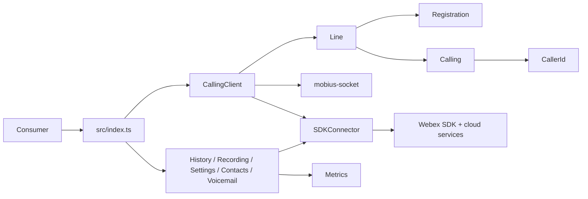
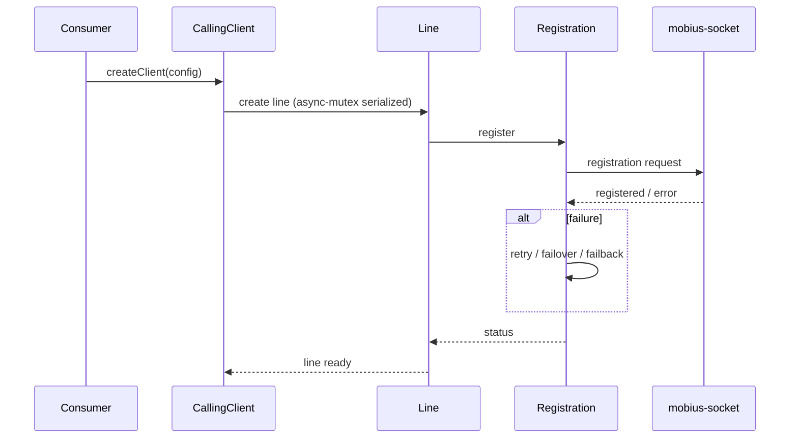
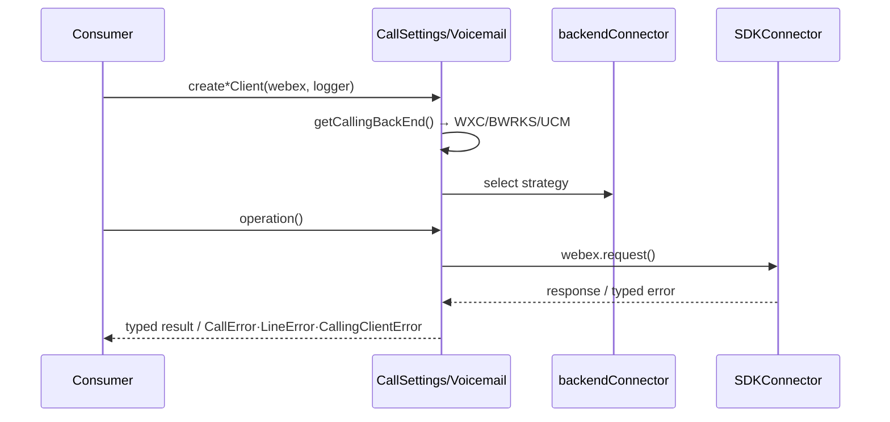
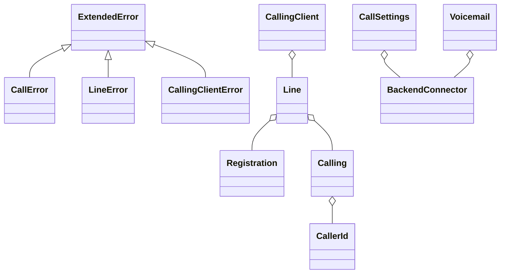

# @webex/calling (package) — SPEC

> Start here → root [`AGENTS.md`](../../../AGENTS.md) (agent entry) · router [`SPEC_INDEX.md`](../../../ai-docs/SPEC_INDEX.md) · system [`ARCHITECTURE.md`](../../../ai-docs/ARCHITECTURE.md). This is the package's root-level canonical spec; per-submodule detail lives in the package-local `.sdd` tree.
> Context-efficiency: link to canonical docs — don't duplicate them.

## Metadata
| Field | Value |
|---|---|
| Module id | `packages/calling` |
| Source path(s) | `packages/calling/src/` |
| Parent spec | — |
| Doc kind | Module spec |
| Coverage score | Pending coverage assessment |
| Generated from | `module-spec` @ SDLC template library `0.2.2` |
| generated_by / approved_by / updated_at | claude-cli / pending / 2026-08-05T00:00:00Z |
| Validation status | not-run |

## Evidence Rules
Migrated from `packages/calling/AGENTS.md` and `packages/calling/ai-docs/ARCHITECTURE.md`. The package already maintains its own complete SDD tree (`packages/calling/.sdd/manifest.json` + per-submodule specs), which remains authoritative for submodule detail; this root-routed spec aggregates and routes to it. Confidence is PRESENT for facts quoted from the migrated package architecture (backend connectors, error hierarchy, module graph), WEAK where not re-verified against current code in this pass.

## Source Material Register
| Source material | Scope | Decision | Detail location or disposition |
|---|---|---|---|
| Reviewed prior package agent-entry | overview / API | used | Overview, commands, gotchas → Overview/Stack/Pitfalls; original retained. |
| Reviewed prior package architecture | architecture / API | used | Backend-connector strategy, error hierarchy, module graph, caching → Design/Class/State/Data Flow; original retained. |
| Package-local submodule specs + manifest | architecture / API / tests | reference-only | Authoritative in the package `.sdd` tree; referenced by contract id from Sub-modules, not duplicated. |

## Overview
`@webex/calling` is the published TypeScript SDK package for Webex Calling: clients, line registration, call control/media, call history, recordings, settings, contacts, voicemail, telemetry, and Mobius WebSocket transport. `CallingClient` coordinates line registration and call control while focused feature modules provide facades over their Webex services and backend-specific connectors. Shared infrastructure covers SDK access (SDKConnector), logging, metrics, typed events, errors, and common utilities.

## Purpose / Responsibility
Owns the Webex Calling client SDK surface and its feature modules. It does NOT own a UI, a datastore, or the remote Webex services/records; it is a typed adapter over calling backends, SDK services, media, and transport.

## Stack
TypeScript 4.9; Node 22.14 documented for this package's local dev; Yarn workspaces + `tsc`. Jest (`jsdom`) unit tests with co-located `*.test.ts`, ESLint/Prettier, TypeDoc, Playwright package journeys. Media via `@webex/internal-media-core` (`^2.26.1`).

## Folder / Package Structure
```
packages/calling/src/
├── CallHistory/        # createCallHistoryClient -> ICallHistory
├── CallRecording/      # createCallRecordingClient -> ICallRecording
├── CallSettings/       # createCallSettingsClient -> ICallSettings
├── CallingClient/      # createClient -> ICallingClient
│   ├── calling/        #   ICall + CallManager (CallerId/)
│   ├── line/           #   ILine operations
│   └── registration/   #   register/deregister/failover/keepalive
├── Contacts/           # createContactsClient -> IContacts
├── Metrics/            # MetricManager singleton
├── SDKConnector/       # Webex SDK adapter (singleton)
├── Voicemail/          # createVoicemailClient -> IVoicemail
├── mobius-socket/      # MobiusSocket request/response + events
├── Errors/ Events/ Logger/ common/   # shared infrastructure
└── index.ts            # public exports
```

## Sub-modules
<!-- module.has_submodules = true — routed to the package-local .sdd tree -->
| Sub-module | Responsibility | Manifest coverage state | Spec |
|---|---|---|---|
| `src/CallHistory/` | Call-history query/update/delete + events | Partial | `packages/calling/src/CallHistory/ai-docs/call-history-spec.md` |
| `src/CallRecording/` | Recording read/delete + events | Partial | `packages/calling/src/CallRecording/ai-docs/call-recording-spec.md` |
| `src/CallSettings/` | Waiting/DND/forwarding/voicemail settings | Partial | `packages/calling/src/CallSettings/ai-docs/call-settings-spec.md` |
| `src/CallingClient/` | Client lifecycle, line creation, registration orchestration | Partial | `packages/calling/src/CallingClient/ai-docs/calling-client-spec.md` |
| `src/Contacts/` | Contact/group CRUD | Partial | `packages/calling/src/Contacts/ai-docs/contacts-spec.md` |
| `src/Metrics/` | Calling telemetry submission | Partial | `packages/calling/src/Metrics/ai-docs/metrics-spec.md` |
| `src/SDKConnector/` | Webex SDK request/service/credential/device/Mercury adapter | Untracked | `packages/calling/src/SDKConnector/ai-docs/sdk-connector-spec.md` |
| `src/Voicemail/` | Voicemail list/content/state/transcript | Partial | `packages/calling/src/Voicemail/ai-docs/voicemail-spec.md` |
| `src/mobius-socket/` | Mobius request/response + async events | Partial | `packages/calling/src/mobius-socket/ai-docs/mobius-socket-spec.md` |

Scope rule: every section below describes the package as a whole; behavior owned by a sub-module is recorded in that sub-module's package-local spec and referenced here by contract id — not duplicated.

## Key Files (source of truth)
| File | Holds |
|---|---|
| `packages/calling/src/index.ts` | Public exports (semver-sensitive) |
| `packages/calling/src/common/Utils.ts` | `getCallingBackEnd()` backend detection; error handler utilities |
| `packages/calling/src/Errors/catalog/` | Error hierarchy (`ExtendedError`, `CallError`, `LineError`, `CallingClientError`) |
| `packages/calling/src/Logger/types.ts` | `LOGGING_LEVEL` / `LOGGER` levels and format |
| `packages/calling/.sdd/manifest.json` | Authoritative package-local module/coverage registry |

## Public Surface
| Contract ID | Type | Surface | Purpose | Compatibility / deprecation | Schema / detail link | Root index |
|---|---|---|---|---|---|---|
| `calling.createClient` | SDK | `createClient(config) -> ICallingClient` | Client lifecycle, line creation, registration | semver-sensitive | `src/index.ts` | [`CONTRACTS.md`](../../../ai-docs/CONTRACTS.md) |
| `calling.createCallHistoryClient` | SDK | `createCallHistoryClient(webex, logger) -> ICallHistory` | Call history | semver-sensitive | submodule spec | [`CONTRACTS.md`](../../../ai-docs/CONTRACTS.md) |
| `calling.createCallRecordingClient` | SDK | `createCallRecordingClient(webex, logger) -> ICallRecording` | Recordings | semver-sensitive | submodule spec | [`CONTRACTS.md`](../../../ai-docs/CONTRACTS.md) |
| `calling.createCallSettingsClient` | SDK | `createCallSettingsClient(webex, logger) -> ICallSettings` | Settings | semver-sensitive | submodule spec | [`CONTRACTS.md`](../../../ai-docs/CONTRACTS.md) |
| `calling.createContactsClient` | SDK | `createContactsClient(webex, logger) -> IContacts` | Contacts | semver-sensitive | submodule spec | [`CONTRACTS.md`](../../../ai-docs/CONTRACTS.md) |
| `calling.createVoicemailClient` | SDK | `createVoicemailClient(webex, logger) -> IVoicemail` | Voicemail | semver-sensitive | submodule spec | [`CONTRACTS.md`](../../../ai-docs/CONTRACTS.md) |

Compatibility notes:
- Public exports in `src/index.ts` and type declarations are semver-sensitive even when implementation files look internal.

## Requires (dependencies)
- `SDKConnector` + Webex device/feature/service plugins; requires an initialized, authorized WebexSDK instance with Mercury.
- Webex services: Mobius (call control), Janus (history), Hydra (recording/people), XSI/UCM gateway (settings/voicemail), contacts service, KMS (contacts encryption), metrics.
- `@webex/internal-media-core` (`^2.26.1`) ROAP/media; `async-mutex`; `xstate`; `ws`.
- Mercury real-time events.

## Requirements
| ID | WHAT | WHY | Source Evidence | Test / Example Evidence | Assumptions / Gaps | Confidence |
|---|---|---|---|---|---|---|
| `CALLING-R-001` | The package exposes typed factory functions (`createClient`, `create*Client`) and interfaces from `src/index.ts` | Stable public SDK surface | `packages/calling/src/index.ts` | package-local submodule tests | none | PRESENT |
| `CALLING-R-002` | Calling backend is detected via `getCallingBackEnd()` in `common/Utils.ts` (callingBehavior + entitlements → WXC/BWRKS/UCM/INVALID; INVALID returned, not thrown) | Unify three backends behind one facade | `packages/calling/src/common/Utils.ts` | migrated architecture diagram | confirm current entitlement strings | WEAK |
| `CALLING-R-003` | `CallSettings` and `Voicemail` select a backend connector via the Strategy pattern (WXC/BWRKS/UCM) | Backend capabilities differ | `packages/calling/src/CallSettings/`, `src/Voicemail/` | submodule specs | none | PRESENT |
| `CALLING-R-004` | All HTTP traffic flows through the Webex SDK `request()` via `SDKConnector`; real-time events arrive over Mercury by scope (`event:mobius`, `event:janus.*`) | Centralized auth/service-catalog/retry + eventing | `packages/calling/src/SDKConnector/` | submodule specs | none | PRESENT |
| `CALLING-R-005` | Errors extend `ExtendedError` (`CallError`/`LineError`/`CallingClientError`) with factory functions and HTTP-status handler utilities | Consistent typed error contracts | `packages/calling/src/Errors/catalog/` | migrated architecture | none | PRESENT |
| `CALLING-R-006` | `CallingClient` serializes line creation with `async-mutex`; `Registration` uses an inlined Web Worker keepalive | Prevent duplicate registrations; non-blocking keepalive | `src/CallingClient/`, `src/CallingClient/registration/webWorkerStr.ts` | submodule specs | none | PRESENT |

## Design Overview
The package is a facade-per-feature library over Webex Calling backends. `CallingClient` owns client lifecycle and delegates registration and active-call behavior to Line/Registration/Calling submodules, using `mobius-socket` for Mobius transport. `CallSettings` and `Voicemail` use the Strategy pattern to unify WXC/BWRKS/UCM backends behind one interface, selected by `getCallingBackEnd()`. Shared infrastructure (SDKConnector, Logger, Metrics, Events, Errors, common) is consumed by all feature modules. Detailed per-module design lives in the package-local specs.

## Data Flow


## Sequence Diagram(s)
Sequence coverage:

| Operation group | Diagram | Failure / recovery coverage |
|---|---|---|
| Client init + line registration | Registration sequence | failover/failback/keepalive (Registration submodule) |
| Feature request (history/settings/voicemail) | Backend-facade sequence | backend detection + typed error mapping |





## Class / Component Relationships

`CallingClient` composes Line/Calling/Registration; feature facades compose a backend connector; all errors extend `ExtendedError`.

## Use Cases
- **UC-1 Register and place a call:** `createClient` → line created (mutex) → `Registration` registers via Mobius → `Calling`/`CallManager` handles call control/media. Evidence: `src/CallingClient/`, package architecture.
- **UC-2 Fetch settings across backends:** `createCallSettingsClient` → backend detected → strategy connector issues XSI/UCM request → typed result. Evidence: `src/CallSettings/`.

Cross-service flow: each use case crosses the package → SDKConnector → Webex services (+ Mercury events) boundary.

## State Model
<!-- module.holds_client_state = true -->
`CallingClient` owns the in-memory line registry and session-listener lifecycle; each `Line` owns registration status and delegates active-call membership to `CallManager`; `Call` owns signaling/media state machines; `Registration` owns registration/retry/failover/keepalive state; `Contacts`, `Voicemail`, and `mobius-socket` keep bounded module-local caches. Evidence: `src/CallingClient/CallingClient.ts`, `line/index.ts`, `calling/call.ts`, `registration/register.ts`.

## Business Rules & Invariants
<!-- module.enforces_domain_rules = true -->
- A `SDKConnector` may be initialized only once and requires an authorized, ready Webex SDK with Mercury.
- CallingClient transport access goes through `src/CallingClient/utils/request.ts`; `MobiusSocket` must not be imported directly elsewhere.
- WXC/UCM/BroadWorks capabilities differ — verify the backend matrix before exposing behavior.

## Concurrency & Reactive Flow
<!-- module.is_concurrent_async = true -->
- `CallingClient` uses `async-mutex` (`Mutex`) to serialize line creation and prevent duplicate registrations during concurrent init.
- `Registration` runs a Web Worker keepalive (inlined `webWorkerStr.ts`, instantiated via `Blob` URL) to keep the main thread free.
- `CallManager` routes WebSocket events to the correct `Call` by `correlationId`; events may be async/out-of-order — preserve correlation ids and clean up listeners/timers.

## State Machine
<!-- module.stateful_transitions = true -->
`Registration` and `Call` are state machines (registration lifecycle: unregistered → registering → registered → failover/failback → deregistered; call: signaling/media progression). Exact states/guards live in `src/CallingClient/registration/ai-docs/registration-spec.md` and `src/CallingClient/calling/ai-docs/calling-spec.md`; referenced here, not duplicated.

## Protocol / Wire Format
<!-- module.exposes_wire_protocol = true -->
- Mobius: REST + Mercury WebSocket (call setup/progress/connect/disconnect/info). Janus: REST + Mercury WS (history records; viewed/deleted state). XSI Actions: REST/XML (settings/voicemail). Detailed frame/format ownership lives in `mobius-socket` and the feature submodule specs.

## Error Handling & Failure Modes
<!-- module.returns_caller_errors = true -->
| Condition | Signal (error/code/result) | Caller recovery |
|---|---|---|
| Call-control/media failure | `CallError` (correlationId, errorLayer) via `createCallError()` | Inspect layer; retry per policy |
| Line/registration failure | `LineError` (status: RegistrationStatus) | Await failover/failback |
| Client-level failure | `CallingClientError` (status) via `createClientError()` | Reinitialize/authorize |
| Invalid backend | `CALLING_BACKEND.INVALID` returned (not thrown) | Verify entitlements |

## Pitfalls
- Test `--targets` values are relative to the test-type spec directory, not repo-relative.
- Public exports in `src/index.ts` are semver-sensitive even when implementation looks internal.
- Events may be asynchronous/out-of-order; preserve correlation ids and clean up listeners/timers.

## Module Do's / Don'ts
<!-- module.module_specific_conventions = true -->
- DO route transport through `SDKConnector`/`CallingClient/utils/request.ts`; DON'T import `MobiusSocket` directly.
- DO use typed error/event contracts from `Errors/`/`Events/`; DON'T swallow failures.
- DO use `src/Logger/`; DON'T add `console.log` or log tokens/PII.

## Export Stability
<!-- module.published_package = true -->
Published as `@webex/calling` via the workspace release pipeline. Public exports/type declarations are consumer contracts; incompatible removals require an approved major-version migration and changelog entry.

## Key Design Trade-off
<!-- module.has_design_tradeoff = true -->
- The Strategy-per-backend facade (WXC/BWRKS/UCM behind one interface) trades internal complexity for a single stable public surface across heterogeneous backends.

## Test-Case Strategy (module)
Jest with `jsdom`; co-located `*.test.ts`; `getTestUtilsWebex()` mock SDK; `flushPromises()`/`waitForMsecs()` for async; `toBeCalledOnceWith` matcher; backend connectors have dedicated fixtures. Per-submodule coverage and gaps are tracked in the package-local `.sdd/manifest.json` and submodule specs.

| Behavior / Requirement | Existing test evidence | Gap |
|---|---|---|
| `CALLING-R-001` | package-local submodule tests | root-level public-surface % not yet measured |
| `CALLING-R-002` | migrated architecture only | confirm `getCallingBackEnd` unit tests |
| `CALLING-R-006` | `src/CallingClient/CallingClient.test.ts` | confirm keepalive worker tests |

## Traceability
- Repo architecture: [`../../../ai-docs/ARCHITECTURE.md`](../../../ai-docs/ARCHITECTURE.md) · Registry: [`../../../ai-docs/SPEC_INDEX.md`](../../../ai-docs/SPEC_INDEX.md)
- Package-local registry: `packages/calling/.sdd/manifest.json`
- Coverage state & contracts baseline: `.sdd/manifest.json`
