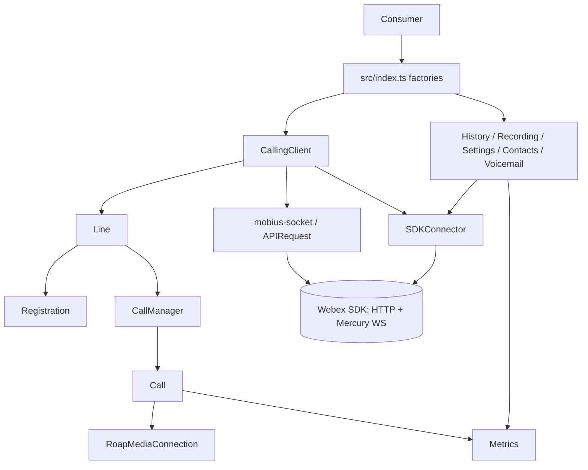
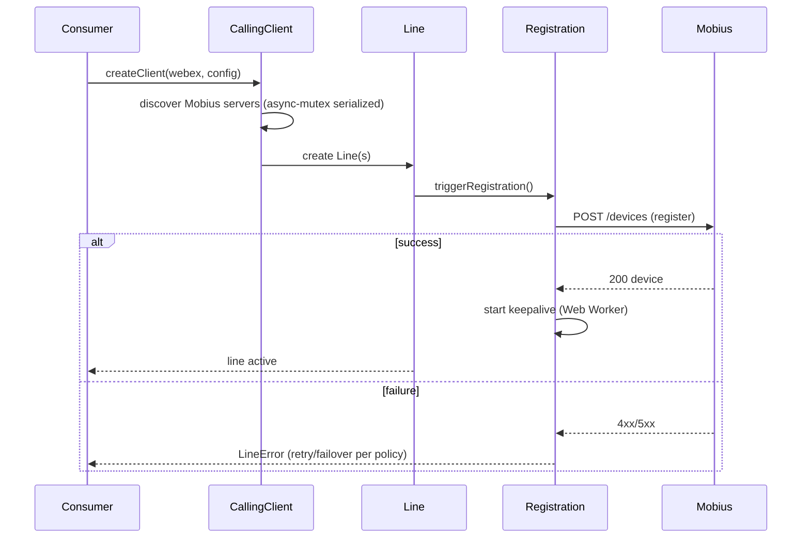
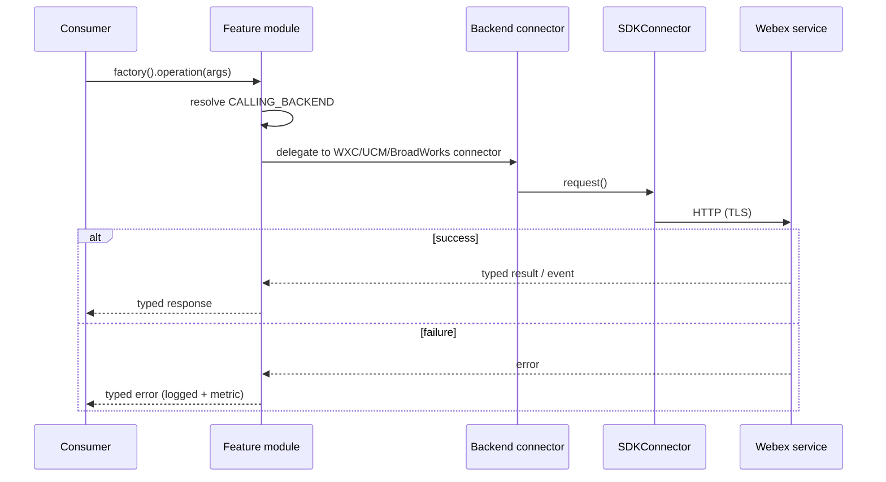
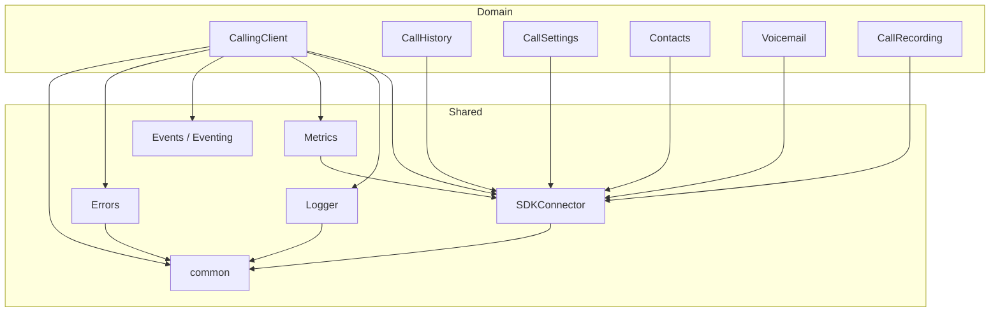

<!-- sdd-generated-metadata
generator: claude-cli
generator_model: us.anthropic.claude-opus-4-8
approved_by: pending-human-review
updated_at: 2026-08-06T00:00:00Z
validation_status: not-run
run_id: 51855eac-8de5-43a2-a3b6-dbcc55ebc91b
-->

# @webex/calling — SPEC

> Start here → root [`AGENTS.md`](../../../AGENTS.md) (agent entry) · router [`SPEC_INDEX.md`](../../../ai-docs/SPEC_INDEX.md) · system [`ARCHITECTURE.md`](../../../ai-docs/ARCHITECTURE.md). This is the package's canonical spec: orientation, requirements, design, flows, state, protocol, and tests. Package-local standing docs live under `packages/calling/ai-docs/`.
> Context-efficiency: link to canonical docs — don't duplicate them. Load specs on demand per `SPEC_INDEX.md`.

## Metadata

| Field | Value |
|---|---|
| Module id | `calling` |
| Source path(s) | `packages/calling/src/` |
| Parent spec | `—` (published `@webex/calling` SDK package; no parent module) |
| Doc kind | Module spec |
| Coverage score | Pending coverage assessment |
| Generated from | `module-spec` @ SDLC template library `0.2.2` |
| generated_by / approved_by / updated_at | claude-cli / pending-human-review / 2026-08-06 |
| Validation status | not-run, validator `pending`, assessed 2026-08-06 |

Coverage score is `Pending coverage assessment` until the first coverage review runs. Manifest coverage
state (`Partial`) is authoritative and kept in `.sdd/manifest.json`. This package spec is listed in
`spec_policy.protected_specs`.

## Evidence Rules
Every requirement cites concrete source evidence using `file path`. Test evidence is preferred for WHY.
Commit rationale is permitted because the repository category (`cat1-legacy`) marks history trustworthy.
The extensive package-local `ai-docs/` standing docs and the source-local sub-area specs were routed as
migration source and placed here by meaning; code under `src/` and co-located `*.test.ts` remain the
behavioral source of truth. No line-number anchors or local run-report paths are canonical evidence.

## Source Material Register

| Source material | Scope | Decision | Detail location or disposition |
|---|---|---|---|
| Package AI/agent guide | overview / rules | used and code-verified | Orientation, conventions, and routing placed in Overview, Design Overview, and Module Do's / Don'ts |
| Package architecture doc | architecture | used and code-verified | Component inventory, interaction, dependency graph, and infra placed in Design Overview, Data Flow, and Class / Component Relationships |
| Package contracts/service-state/getting-started/glossary/security docs | API / overview / security | used and code-verified | Public surface, dependencies, events, and security posture placed in Public Surface, Requires, and Error Handling |
| Source-local sub-area specs (CallingClient, calling, line, registration, CallerId, CallHistory, CallRecording, CallSettings, Contacts, Voicemail, Metrics, SDKConnector, mobius-socket) | architecture / API / tests | reference-only, code-verified | Detailed per-area behavior remains in the retained source-local specs; summarized here and referenced by area, not copied wholesale |

## Overview

`@webex/calling` is the TypeScript SDK package for Webex Calling. It exposes factory functions that build
typed clients for the major calling domains — the core `CallingClient` (line registration + call
control/media), plus `CallHistory`, `CallRecording`, `CallSettings`, `Contacts`, and `Voicemail` — over
Webex backend services, real-time Mercury events, WebRTC media, and Mobius HTTP/WebSocket transport.

Consumers enter through `src/index.ts`, whose exports are the semver surface: `createClient`,
`createCallHistoryClient`, `createCallSettingsClient`, `createContactsClient`, `createVoicemailClient`,
`createCallRecordingClient`, the `Logger`, re-exported media helpers, and the typed interfaces, event-key
enums, and error classes. Internally the package layers domain modules over shared infrastructure:
`SDKConnector` (a frozen singleton bridge to the host Webex SDK), `Logger`, `Metrics` (`MetricManager`
singleton), `Events` (a typed `Eventing<T>` base), an `Errors` hierarchy, and `common/` (types, constants,
`Utils`).

The most behaviorally complex area is `CallingClient` and its `calling/` sub-area, where each `Call`
runs two XState state machines (call signaling and ROAP media negotiation) and `CallManager` routes
Mobius WebSocket events to the correct call by `correlationId`. `CallSettings` and `Voicemail` use the
Strategy pattern to serve three backends (WXC, UCM, BroadWorks) behind one facade. Detailed per-area
behavior lives in the retained source-local specs under each `src/**/ai-docs/`; this package spec is the
canonical orientation, contract, flow, and cross-cutting record. A maintainer should start at
`src/index.ts`, then the area routing in `ai-docs/RULES.md` and the source-local sub-area specs.

## Purpose / Responsibility

Owns the client-side Webex Calling SDK: line registration lifecycle, call control and WebRTC media
negotiation, call history, recording, settings, contacts, and voicemail, plus the shared transport,
eventing, metrics, logging, and error infrastructure that binds them. It does NOT own the remote Webex
Calling/Janus/XSI/UCM services or their persisted records, and it is not a UI application or datastore
owner.

## Stack

TypeScript 4.9 (strict), Node.js 22.14 for this repository, built with `tsc` under Yarn workspaces
(`build:src`). Tests: Jest (jsdom) unit tier with co-located `*.test.ts`, sinon, custom matchers, and
Playwright package journeys (`test:e2e`); lint via ESLint/Prettier (`test:style`); TypeDoc
(`build:docs`). Key runtime dependencies: `@webex/internal-media-core` (`2.26.1`, ROAP/WebRTC),
`@webex/media-helpers`, `@webex/internal-plugin-device`, `@webex/internal-plugin-metrics`, `xstate`
(state machines), `async-mutex`, `ws` (Node WebSocket), `uuid`, and `lodash`.

## Folder / Package Structure

```
packages/calling/
├── src/
│   ├── index.ts                # Public exports (factories, interfaces, event enums, error classes)
│   ├── api.ts                  # Extended exports (includes classes for internal use)
│   ├── CallingClient/          # Orchestrator: registration + call control
│   │   ├── CallingClient.ts    # Creates Lines, discovers Mobius, owns line registry
│   │   ├── calling/            # Call + CallManager (signaling/media state machines) + CallerId/
│   │   ├── line/               # Line class (registration + call bridge)
│   │   ├── registration/       # Mobius device registration, keepalive (Web Worker), failover
│   │   └── utils/              # request.ts (HTTP/WSS transport selector), wsFeatureFlag.ts
│   ├── CallHistory/            # Call history records (Janus API + Mercury events)
│   ├── CallRecording/          # Recording metadata (hydraDeveloperApi)
│   ├── CallSettings/           # DND/CF/CW/VM settings; WxC + UCM backend connectors (Strategy)
│   ├── Contacts/               # Contacts/groups CRUD with KMS encryption (SCIM)
│   ├── Voicemail/              # Voicemail; WxC + UCM + BroadWorks backend connectors (Strategy)
│   ├── SDKConnector/           # Frozen singleton bridge to the host Webex SDK
│   ├── Logger/                 # Structured logging (5 levels) with file/method context
│   ├── Metrics/                # MetricManager singleton (operational/behavioral telemetry)
│   ├── Events/                 # Eventing<T> base (typed-emitter) + all event key enums/maps
│   ├── Errors/                 # ExtendedError → CallError / LineError / CallingClientError
│   ├── common/                 # Shared types, constants, Utils (backend detection, error handlers)
│   └── mobius-socket/          # Mobius WebSocket transport (singleton client), reconnect, refresh
├── package.json
├── tsconfig.json
└── jest.config.js
```

## Key Files (source of truth)

| File | Holds |
|---|---|
| `packages/calling/src/index.ts` | The authoritative public export list; import from here, not deep paths |
| `packages/calling/src/api.ts` | Extended/TypeDoc exports including internal-use classes |
| `packages/calling/src/common/types.ts` | Shared enums/types: `CALLING_BACKEND`, `HTTP_METHODS`, `ServiceIndicator`, `RegistrationStatus`, `CallDetails` |
| `packages/calling/src/common/Utils.ts` | Backend detection (`getCallingBackEnd`/`resolveCallingBackend`), XSI resolution, SCIM, and the `handle*Errors` mappers |
| `packages/calling/src/Events/types.ts` | All event-key enums and typed event maps (the event contract) |
| `packages/calling/src/Errors/types.ts` | `ERROR_TYPE`, `ERROR_CODE`, `ERROR_LAYER` and error object shapes |
| `packages/calling/src/SDKConnector/types.ts` | The `WebexSDK` interface — the exact host-SDK surface this package consumes |

## Sub-modules

No child modules are recorded for `packages/calling` in `.sdd/manifest.json`; the `src/**` areas below
are internal areas of this single package, not separately tracked modules. Their detailed behavior is
retained in source-local specs and referenced by area throughout this document rather than duplicated
here.

## Public Surface

Published, imported SDK/code API — the exports from `src/index.ts`. The package also emits typed events
and consumes remote Webex services; it has no network server or CLI of its own. Exact TypeScript
declarations remain authoritative in the cited native files; the repo-wide index is
[`CONTRACTS.md`](../../../ai-docs/CONTRACTS.md).

| Contract ID | Type | Surface | Purpose | Compatibility / deprecation | Schema / detail link | Root index |
|---|---|---|---|---|---|---|
| `calling.createClient` | SDK | `createClient(webex, config?): Promise<ICallingClient>` | Top-level calling-client factory (registration + call control) | Semver-controlled export | `packages/calling/src/CallingClient/CallingClient.ts` | `../../../ai-docs/CONTRACTS.md` |
| `calling.createCallHistoryClient` | SDK | `createCallHistoryClient(webex, logger): ICallHistory` | Call-history client factory | Semver-controlled export | `packages/calling/src/CallHistory/CallHistory.ts` | `../../../ai-docs/CONTRACTS.md` |
| `calling.createCallSettingsClient` | SDK | `createCallSettingsClient(webex, logger, useProdWebexApis?): ICallSettings` | Call-settings client factory | Semver-controlled export | `packages/calling/src/CallSettings/CallSettings.ts` | `../../../ai-docs/CONTRACTS.md` |
| `calling.createContactsClient` | SDK | `createContactsClient(webex, logger): IContacts` | Contacts client factory | Semver-controlled export | `packages/calling/src/Contacts/ContactsClient.ts` | `../../../ai-docs/CONTRACTS.md` |
| `calling.createVoicemailClient` | SDK | `createVoicemailClient(webex, logger): IVoicemail` | Voicemail client factory | Semver-controlled export | `packages/calling/src/Voicemail/Voicemail.ts` | `../../../ai-docs/CONTRACTS.md` |
| `calling.createCallRecordingClient` | SDK | `createCallRecordingClient(webex, logger): ICallRecording` | Call-recording client factory | Semver-controlled export | `packages/calling/src/CallRecording/CallRecording.ts` | `../../../ai-docs/CONTRACTS.md` |
| `calling.events` | event | `CALL_EVENT_KEYS`, `LINE_EVENT_KEYS`, `CALLING_CLIENT_EVENT_KEYS`, `COMMON_EVENT_KEYS`, `MOBIUS_SOCKET_DISCONNECT_REASON` | Typed lifecycle/error/media events consumers subscribe to | Enum values/payloads are semver-sensitive | `packages/calling/src/Events/types.ts` | `../../../ai-docs/CONTRACTS.md` |
| `calling.errors` | SDK | `CallError`, `LineError`, `ERROR_TYPE`, `ERROR_LAYER` | Typed error contracts returned/emitted to consumers | Semver-controlled | `packages/calling/src/Errors/index.ts`, `types.ts` | `../../../ai-docs/CONTRACTS.md` |
| `calling.media-helpers` | SDK | `createMicrophoneStream`, `LocalMicrophoneStream`, `NoiseReductionEffect` | Re-exported `@webex/media-helpers` surface | Re-export; follows media-helpers semver | external `@webex/media-helpers` | `../../../ai-docs/CONTRACTS.md` |

Compatibility notes:
- Public factories, interfaces, types, and event names/payloads are semver-controlled through
  `src/index.ts`. Additive optional fields are preferred; removals/renames require an approved
  major-version transition and changelog/deprecation plan.
- Internal cross-module surfaces (`getCallManager`, `getMetricManager`, the frozen `SDKConnector`, and
  the `mobius-socket` singleton) are not exported from `src/index.ts` and are not consumer semver
  promises; only the `MOBIUS_SOCKET_DISCONNECT_REASON`/`MobiusSocketDisconnectedEvent` types are
  re-exported.

## Requires (dependencies)

- Host **Webex JS SDK** — an initialized, authorized instance with Mercury; reached only through the
  frozen `SDKConnector` (`internal.device`, `internal.mercury`, `internal.services`, `internal.metrics`,
  `internal.encryption`, `people`, `credentials`, `request()`).
- **Mobius** (call control) — REST + Mercury WS; discovered via the services catalog. Transport selected
  by `CallingClient/utils/request.ts` (HTTP or WSS via feature flag).
- **Janus** (call history), **XSI Actions**/**Hydra** (settings/voicemail), **VMGateway** (UCM VM),
  **Contacts Service**, and **KMS** (contact-field encryption) — remote services resolved through the SDK.
- `@webex/internal-media-core` (`2.26.1`) ROAP/WebRTC engine; `@webex/media-helpers` streams/effects;
  `xstate`, `async-mutex`, `ws`, `uuid`, `lodash`.
- Each domain module preserves its own timeout/retry/fallback and backend-strategy behavior; see the
  source-local sub-area specs and [`SERVICE_STATE.md`](SERVICE_STATE.md).

## Requirements

| ID | WHAT | WHY | Source Evidence | Test / Example Evidence | Assumptions / Gaps | Confidence |
|---|---|---|---|---|---|---|
| `CALLING-R-001` | The package exposes factory functions from `src/index.ts` that build typed clients (`ICallingClient`, `ICallHistory`, `ICallSettings`, `IContacts`, `IVoicemail`, `ICallRecording`) plus the `Logger` and media-helper re-exports. | One stable entry point gives consumers typed clients without deep imports; the barrel is the semver surface. | `packages/calling/src/index.ts`, `packages/calling/src/api.ts` | `packages/calling/src/**/**.test.ts` | Partial coverage; cross-check per-area | PRESENT |
| `CALLING-R-002` | `SDKConnector` is a set-once frozen singleton: `setWebex` validates via `validateWebex()` and stores the reference, throwing if called more than once or if the SDK is unauthorized/not-ready/lacks Mercury. | All modules must share exactly one validated Webex reference; replacing it mid-session would break transport/eventing. | `packages/calling/src/SDKConnector/index.ts`, `packages/calling/src/SDKConnector/utils.ts` | `packages/calling/src/SDKConnector/*.test.ts` | Untracked per manifest; verify during coverage | WEAK |
| `CALLING-R-003` | Each `Call` runs two coordinated XState state machines — call signaling and ROAP media — and only their explicit event entry points mutate state; `CallManager` routes `event:mobius` events to the correct `Call` by `correlationId` (falling back to `callId`). | Separating signaling from media prevents transport events from directly mutating WebRTC state and keeps out-of-order/duplicate events from corrupting an unrelated call. | `packages/calling/src/CallingClient/calling/call.ts`, `packages/calling/src/CallingClient/calling/callManager.ts` | `packages/calling/src/CallingClient/calling/call.test.ts`, `callManager.test.ts` | Re-check negative/out-of-order edges | PRESENT |
| `CALLING-R-004` | Active calls support hold/resume, blind/consult transfer, mute (user/system), DTMF, and media updates during a call, with a 10s `supplementaryServicesTimer` emitting `HOLD_ERROR`/`RESUME_ERROR` when Mobius does not confirm via a mid-call state event. | Mid-call operations must route through the call state machine and time out safely rather than hang. | `packages/calling/src/CallingClient/calling/call.ts` | `packages/calling/src/CallingClient/calling/call.test.ts` | Re-check timeout/error edges | PRESENT |
| `CALLING-R-005` | Caller identity is resolved from SIP headers with `P-Asserted-Identity` taking precedence over the `From` fallback, and `x-broadworks-remote-party-info` triggering async SCIM enrichment that emits a `CALLER_ID` update. | Network-asserted identity must win, and async enrichment must not delay showing the incoming call. | `packages/calling/src/CallingClient/calling/CallerId/index.ts` | `packages/calling/src/CallingClient/calling/CallerId/index.test.ts` | Re-check malformed-header fallback | PRESENT |
| `CALLING-R-006` | `Registration` manages Mobius device registration, keepalive (via a Web Worker to avoid main-thread timer blocking), and failover/failback; `CallingClient` uses `async-mutex` to serialize line creation and prevent duplicate registrations. | Registration must survive network flaps and concurrent init without duplicate devices or blocked timers. | `packages/calling/src/CallingClient/registration/register.ts`, `packages/calling/src/CallingClient/CallingClient.ts` | `packages/calling/src/CallingClient/registration/*.test.ts` | Cross-check failover matrix | PRESENT |
| `CALLING-R-007` | `CallSettings` and `Voicemail` select a backend connector (WXC, UCM, BroadWorks) behind a unified facade based on the resolved `CALLING_BACKEND` from `getCallingBackEnd()`. | WXC/UCM/BroadWorks capabilities differ; a Strategy facade keeps callers backend-agnostic. | `packages/calling/src/CallSettings/CallSettings.ts`, `packages/calling/src/Voicemail/Voicemail.ts`, `packages/calling/src/common/Utils.ts` | `packages/calling/src/CallSettings/*.test.ts`, `packages/calling/src/Voicemail/*.test.ts` | Verify entitlement→backend matrix | PRESENT |
| `CALLING-R-008` | Errors use the `ExtendedError` hierarchy (`CallError`/`LineError`/`CallingClientError`) with `ERROR_TYPE`/`ERROR_LAYER` context; the `handle*Errors` utilities map HTTP status codes to typed errors, and failures are logged and emitted/propagated, never silently swallowed. | Consumers need deterministic, typed, observable failure behavior. | `packages/calling/src/Errors/`, `packages/calling/src/common/Utils.ts` | `packages/calling/src/**/*.test.ts` | Re-check keepalive 401/403/404 abort paths | PRESENT |
| `CALLING-R-009` | All operational/behavioral telemetry is submitted through the `MetricManager` singleton for both success and failure paths across registration, keepalive, call control, media, connection, voicemail, Mobius discovery, and log-upload. | Consistent metrics on every path are required for operability. | `packages/calling/src/Metrics/index.ts`, `packages/calling/src/Metrics/types.ts` | `packages/calling/src/Metrics/*.test.ts` | Verify success+failure metric pairs | PRESENT |

Detailed per-area requirements (e.g. `Call`/`CallManager` behavior) remain in the source-local sub-area
specs; the rows above are the package-level observable contracts.

## Design Overview

The package is layered: **factory-created domain modules** over a **shared infrastructure layer**. A
consumer calls a factory (`createClient`, `createCallHistoryClient`, …); the module resolves backend and
service configuration through `SDKConnector`, performs HTTP/WebSocket/media work through its owning
adapter, and returns a typed result or emits a typed event. Failure paths use typed errors, logging,
metrics, retries, or backend fallbacks defined by the owning module.

`CallingClient` is the orchestrator. It discovers Mobius servers, creates `Line` objects (serialized by
`async-mutex`), and owns the in-memory line registry and session-listener lifecycle. Each `Line` owns a
`Registration` (device registration, keepalive via Web Worker, failover/failback) and bridges to
`CallManager`. `CallManager` is a singleton that subscribes to `event:mobius`, maintains a
`callCollection` keyed by `correlationId`, and routes signaling/media/disconnect events to the right
`Call`. Each `Call` owns a signaling state machine and a ROAP media state machine, a
`RoapMediaConnection` from `@webex/internal-media-core`, timers (session keepalive, supplementary
services), and typed event emission.

The feature modules (`CallHistory`, `CallRecording`, `CallSettings`, `Contacts`, `Voicemail`) are
facades over their Webex services. `CallSettings` and `Voicemail` add a Strategy layer: a
`backendConnector` selected from the resolved `CALLING_BACKEND` (WXC via XSI Actions/Hydra, UCM via
Webex/VMGateway APIs, BroadWorks via BW XSI + BW token). Shared infrastructure — `SDKConnector`
(frozen singleton), `Logger` (5 cumulative levels, file/method context), `Metrics` (`MetricManager`
singleton), `Events` (`Eventing<T>` typed base), `Errors` (four-class hierarchy + factories), and
`common/` (types/constants/`Utils`) — is depended on by every domain module and never bypassed.

## Data Flow

All HTTP traffic flows through the Webex SDK `request()` via `SDKConnector` (OAuth, service-catalog URL
resolution, retry/circuit-breaking). Real-time events arrive over Mercury (WebSocket): `event:mobius`
(call control → `CallManager`), and `event:janus.*` (call-history record/viewed/deleted →
`CallHistory`/`CallingClient`). Mobius call-control transport is selected per feature flag between HTTP
and WSS in `CallingClient/utils/request.ts`.



## Sequence Diagram(s)

The package's operation groups come from its public surfaces and event flows: (1) client/line
registration, (2) outbound call setup + ROAP media, (3) inbound call answer + ROAP media, (4) mid-call
supplementary services (hold/resume/transfer), and (5) a feature-module service call (history/settings/
voicemail/contacts/recording). Outbound and inbound differ in actor order and buffering, so each has its
own diagram; the feature-module calls share one actor/ordering/transport shape and are represented once.
Full per-area diagrams (keepalive, remote disconnect, ROAP error/timeout, backend detection) are
retained in the source-local sub-area specs.

Sequence coverage:

| Operation group | Diagram | Failure / recovery coverage |
|---|---|---|
| Client/line registration | 1. createClient → register | Registration errors emit `LineError`; keepalive failure triggers failover/retry (see registration spec) |
| Outbound call + ROAP | 2. Outbound setup + media | Setup 4xx/5xx → `CALL_ERROR` → `E_UNKNOWN` → cleared (see calling spec) |
| Inbound call + ROAP | 3. Inbound answer + media | Reject/disconnect and media failure reuse the same state machines |
| Mid-call services | 4. Hold/resume | `alt` API-error vs 10s-timeout both emit `HOLD_ERROR`/`RESUME_ERROR` and return to established |
| Feature-module call | 5. Feature service request | `alt` success vs typed-error emit; backend selected via `CALLING_BACKEND` |

### 1. createClient → register



### 2. Outbound setup + media

```mermaid
sequenceDiagram
    participant App as Application
    participant Call as Call
    participant Mobius as Mobius
    participant MC as MediaConnection

    App->>Call: dial(localAudioStream)
    Call->>MC: initiateOffer()
    MC-->>Call: ROAP OFFER
    Call->>Mobius: POST /devices/{id}/call (ROAP offer)
    Mobius-->>Call: 200 {callId}
    Mobius-->>Call: callprogress → emit(PROGRESS)
    Mobius-->>Call: media ANSWER → roapMessageReceived
    Mobius-->>Call: callconnected → emit(CONNECT)
    Call->>Mobius: POST /media (ROAP OK)
    Call->>App: emit(ESTABLISHED); start sessionTimer
```

### 3. Inbound answer + media

```mermaid
sequenceDiagram
    participant Mobius as Mobius
    participant CM as CallManager
    participant Call as Call
    participant App as Application

    Mobius->>CM: event:mobius CALL_SETUP
    CM->>Call: createCall(INBOUND); startCallerIdResolution
    CM-->>App: emit(INCOMING_CALL)
    Call->>Mobius: PATCH /calls/{id} (alerting)
    App->>Call: answer(localAudioStream)
    Call->>Mobius: PATCH /calls/{id} (connected)
    Note over Call,Mobius: ROAP OFFER/ANSWER/OK exchange
    Call-->>App: emit(ESTABLISHED)
```

### 4. Hold/resume

```mermaid
sequenceDiagram
    participant App as Application
    participant Call as Call
    participant Mobius as Mobius

    App->>Call: doHoldResume()
    Call->>Mobius: POST /callhold/hold|resume
    Call->>Call: start supplementaryServicesTimer(10s)
    alt mid-call state received
        Mobius-->>Call: CALL_SETUP {callState: HELD|CONNECTED}
        Call->>App: emit(HELD|RESUMED); clear timer
    else error or timeout
        Mobius-->>Call: 4xx/5xx or no response
        Call->>App: emit(HOLD_ERROR|RESUME_ERROR); back to established
    end
```

### 5. Feature service request



## Class / Component Relationships



`CallingClient` composes `Line` → `Registration` and `CallManager` → `Call` (→ `CallerId`,
`RoapMediaConnection`). Feature modules are facades; `CallSettings`/`Voicemail` hold a `backendConnector`
chosen by `CALLING_BACKEND`. Every module depends on `SDKConnector` (frozen singleton), `Logger`,
`Events` (`Eventing<T>`), `Errors`, and `common`. The error hierarchy is
`ExtendedError → {CallError, LineError, CallingClientError}` with factory functions.

## Use Cases

- **UC-1 Register and place an outbound call:** consumer `await createClient(webex, config)`, gets a
  `Line`, calls `line.makeCall(destination).dial(stream)`; the call progresses setup → progress →
  connect → established. Evidence: `packages/calling/src/CallingClient/CallingClient.ts`,
  `packages/calling/src/CallingClient/calling/call.ts`.
- **UC-2 Answer an incoming call:** consumer listens for `LINE_EVENT_KEYS.INCOMING_CALL`, then
  `call.answer(stream)`; ROAP negotiates and `ESTABLISHED` fires. Evidence:
  `packages/calling/src/CallingClient/calling/callManager.ts`.
- **UC-3 Manage settings/voicemail across backends:** consumer uses
  `createCallSettingsClient`/`createVoicemailClient`; the facade routes to the WXC/UCM/BroadWorks
  connector. Evidence: `packages/calling/src/CallSettings/CallSettings.ts`,
  `packages/calling/src/Voicemail/Voicemail.ts`.
- **UC-4 Read call history / contacts / recordings:** consumer uses the respective factory to fetch typed
  records and subscribe to Janus/recording events. Evidence: `packages/calling/src/CallHistory/`,
  `packages/calling/src/Contacts/`, `packages/calling/src/CallRecording/`.

## State Model

`CallingClient` owns the in-memory line registry and session-listener lifecycle. Each `Line` owns its
registration status and delegates active-call membership to `CallManager`. Each `Call` owns two XState
machines — call signaling (`S_IDLE → … → S_CALL_ESTABLISHED → … → S_CALL_CLEARED`) and ROAP media
(`S_ROAP_IDLE → … → S_ROAP_OK → S_ROAP_TEARDOWN`) — plus identifiers, timers, media connection, caller
info, and disconnect reason. `Registration` owns registration, retry, failover/failback, and keepalive
state. `Contacts`, `Voicemail`, and `mobius-socket` hold bounded process-memory caches with module-local
invalidation. Evidence: `packages/calling/src/CallingClient/calling/call.ts`,
`packages/calling/src/CallingClient/registration/register.ts`; full state diagrams are in the
source-local `calling`/`registration` specs.

## Business Rules & Invariants

- `SDKConnector` is initialized exactly once with a validated, authorized, Mercury-ready Webex instance;
  the exported connector is frozen. Enforced in `src/SDKConnector/index.ts`/`utils.ts`.
- Mobius events are routed by `correlationId` (fallback `callId`); unknown or out-of-order events must
  not mutate an unrelated call. Enforced in `src/CallingClient/calling/callManager.ts`.
- Signaling and media transitions occur only through their XState event entry points; call cleanup
  removes listeners/timers and deletes the call from `CallManager` exactly once.
- `P-Asserted-Identity` outranks the `From` fallback in caller-ID resolution
  (`src/CallingClient/calling/CallerId/index.ts`).
- Credentials/tokens stay inside the host SDK/transport adapters; code must not persist them or log
  tokens, credentials, raw PII, or sensitive identity/contact/media payloads (see
  [`SECURITY.md`](SECURITY.md)).

## Concurrency & Reactive Flow

- `CallingClient` uses `async-mutex` (`Mutex`) to serialize line creation and prevent duplicate
  registrations during concurrent initialization.
- `Registration` runs keepalive heartbeats in a **Web Worker** (inlined source instantiated via a `Blob`
  URL) so timers do not block the main thread.
- `CallManager` maintains a `callCollection` map and routes asynchronous WebSocket events to the correct
  `Call` by `correlationId`; events may arrive out of order (e.g. media before setup) and are handled
  defensively.
- `Call` keepalive uses a `sessionTimer` (default 600000 ms) with bounded retries
  (`MAX_CALL_KEEPALIVE_RETRY_COUNT`); supplementary-service responses are bounded by a 10s timer.
- `mobius-socket` preserves bounded reconnect backoff, token-refresh, and cleanup behavior. Evidence:
  `packages/calling/src/CallingClient/CallingClient.ts`, `registration/register.ts`,
  `calling/callManager.ts`, `calling/call.ts`, `mobius-socket/`.

## Protocol / Wire Format

- **Mobius call control** (relative to `{mobiusUrl}` = `{mobiusHost}/api/v1/calling/web/`):
  `POST /devices/{deviceId}/call` (outgoing setup), `PATCH /devices/{deviceId}/calls/{callId}` (state),
  `DELETE /devices/{deviceId}/calls/{callId}` (disconnect), `POST …/media` (ROAP),
  `POST …/status` (keepalive), and supplementary-service `POST /services/callhold/{hold,resume}` and
  `POST /services/calltransfer/commit`.
- **ROAP media** payloads carry `localMedia.roap = {seq, messageType: OFFER|ANSWER|OK, sdp}`; SDP is run
  through `modifySdpForIPv4()` before send. Message types map to media-machine events
  (`OFFER→E_RECV_ROAP_OFFER`, `ANSWER→E_RECV_ROAP_ANSWER`, `OFFER_REQUEST→E_RECV_ROAP_OFFER_REQUEST`,
  `OK→E_ROAP_OK`).
- **Mercury events** consumed: `event:mobius` (call signaling/media/disconnect) and `event:janus.*`
  (history record/viewed/deleted). Transport (HTTP vs WSS) is selected by
  `CallingClient/utils/request.ts`. Exact frame/field shapes and the full state machines live in the
  source-local `calling`, `registration`, and `mobius-socket` specs. Evidence:
  `packages/calling/src/CallingClient/calling/call.ts`, `packages/calling/src/mobius-socket/`.

## Error Handling & Failure Modes

All custom errors extend `ExtendedError`; `CallError` carries `correlationId`/`errorLayer`, `LineError`
and `CallingClientError` carry `status: RegistrationStatus`. `handleCallErrors`/`handleCallingClientErrors`
map HTTP status codes to typed errors, honor `retry-after` for 429/503, and return an abort signal for
keepalive 401/403/404.

| Condition | Signal (error/code/result) | Caller recovery |
|---|---|---|
| Call setup POST fails (4xx/5xx) | `CALL_EVENT_KEYS.CALL_ERROR` (`CallError`) then `S_UNKNOWN → S_CALL_CLEARED` | Inspect error; retry as a new call |
| Hold/resume fails or times out (10s) | `HOLD_ERROR` / `RESUME_ERROR` (`CallError`), returns to `S_CALL_ESTABLISHED` | Retry the supplementary service |
| Transfer fails | `TRANSFER_ERROR` (`CallError`) | Retry or fall back to manual handling |
| ROAP media error | `CALL_ERROR` (MEDIA layer), call disconnects | Re-establish the call |
| Registration fails (403/429) | `LineError` (status) | Verify entitlements/token; SDK retries 429 with backoff |
| Keepalive 401/403/404 | abort → `E_SEND_CALL_DISCONNECT` | Call disconnects after max retries |
| `SDKConnector.setWebex` called twice / invalid SDK | throws | Initialize once with a valid, ready, Mercury-enabled SDK |

## Pitfalls

- Test `--targets` values are relative to the test-type spec directory, not repository-relative paths.
- `CallingClient` transport access goes through `src/CallingClient/utils/request.ts`; do not import
  `MobiusSocket` directly elsewhere.
- WXC, UCM, and BroadWorks capabilities differ — verify the backend matrix (`getCallingBackEnd()`) before
  exposing behavior; `CALLING_BACKEND.INVALID` is *returned*, not thrown.
- Mercury/Mobius events may be asynchronous or out of order; preserve correlation identifiers and clean up
  listeners/timers.
- `SDKConnector` may be initialized only once and requires an authorized, ready Webex SDK with Mercury.
- Public exports in `src/index.ts` are semver-sensitive even when implementation files look internal.
- `CallingClientError` is defined in `Errors/catalog/CallingDeviceError.ts` but exported as
  `CallingClientError` and takes `status: RegistrationStatus` (not `correlationId`/`errorLayer`).

## Module Do's / Don'ts

- DO use the factories, typed interfaces, event enums, and adapters exported from `src/index.ts`; route
  network access through `SDKConnector`/existing adapters and log via `src/Logger/` with `{file, method}`.
- DO add or update positive and negative tests with behavior changes and keep the affected sub-area spec,
  `CONTRACTS.md`, `SERVICE_STATE.md`, and native declarations current in the same merge.
- DON'T use `console.*`, log secrets/PII, emit raw string event names, swallow errors silently, or expose
  internal helpers as public exports.
- DON'T change public exports, events, backend contracts, security-sensitive flows, or performance-critical
  transport behavior without explicit approval.

## Export Stability

`src/index.ts` is the semver surface: factories, interfaces (`ICallingClient`, `ILine`, `ICall`, feature
interfaces), event-key enums, typed error classes, and the re-exported media helpers. Adding an export or
an optional field is a minor change; removing/renaming an export, changing a factory signature, or
altering an event name/payload or backend contract is breaking and requires an approved major-version
migration with a changelog/deprecation entry.

## Key Design Trade-off

Separate signaling and media state machines prevent transport events from directly mutating WebRTC state,
at the cost of requiring explicit coordination of ROAP and call-control events. Likewise, the Strategy
backend connectors keep callers backend-agnostic at the cost of a capability matrix that maintainers must
respect. Evidence: `packages/calling/src/CallingClient/calling/call.ts`,
`packages/calling/src/CallSettings/`, `packages/calling/src/Voicemail/`.

## Test-Case Strategy (module)

Unit tests are co-located as `*.test.ts` next to source, run under Jest (jsdom) with `getTestUtilsWebex()`
mocks, `jest.mock()` singleton stubs, backend fixture files, `flushPromises()`/`waitForMsecs()` async
helpers, and the `toBeCalledOnceWith` matcher; Playwright package journeys cover cross-module flows. Every
public method should assert a positive and a negative/error case, and event emissions must be typed and
deterministic. Detailed per-area strategies live in the source-local sub-area specs.

| Behavior / Requirement | Existing test evidence | Gap |
|---|---|---|
| `CALLING-R-001` | `packages/calling/src/**/**.test.ts` | Confirm the export list is asserted, not only individual factories |
| `CALLING-R-002` | `packages/calling/src/SDKConnector/*.test.ts` | Manifest marks SDKConnector Untracked — verify set-once/validation coverage |
| `CALLING-R-003` / `CALLING-R-004` / `CALLING-R-005` | `packages/calling/src/CallingClient/calling/*.test.ts` | Re-check out-of-order events, supplementary-service timeouts, and caller-ID fallback |
| `CALLING-R-006` | `packages/calling/src/CallingClient/registration/*.test.ts` | Cross-check failover/failback and keepalive Web Worker paths |
| `CALLING-R-007` | `packages/calling/src/CallSettings/*.test.ts`, `packages/calling/src/Voicemail/*.test.ts` | Verify each backend connector branch |
| `CALLING-R-008` / `CALLING-R-009` | `packages/calling/src/**/*.test.ts` | Confirm typed-error mapping and success+failure metric submission |

## Traceability

- Repo architecture: [`ARCHITECTURE.md`](../../../ai-docs/ARCHITECTURE.md) · Registry: [`SPEC_INDEX.md`](../../../ai-docs/SPEC_INDEX.md)
- Package standing docs: [`ai-docs/ARCHITECTURE.md`](ARCHITECTURE.md), [`ai-docs/CONTRACTS.md`](CONTRACTS.md), [`ai-docs/SERVICE_STATE.md`](SERVICE_STATE.md), [`ai-docs/SECURITY.md`](SECURITY.md), [`ai-docs/RULES.md`](RULES.md), [`ai-docs/GLOSSARY.md`](GLOSSARY.md), [`ai-docs/GETTING_STARTED.md`](GETTING_STARTED.md), [`ai-docs/SPEC_INDEX.md`](SPEC_INDEX.md)
- Contracts catalog: [`CONTRACTS.md`](../../../ai-docs/CONTRACTS.md)
- Coverage state & contracts baseline: `.sdd/manifest.json`
