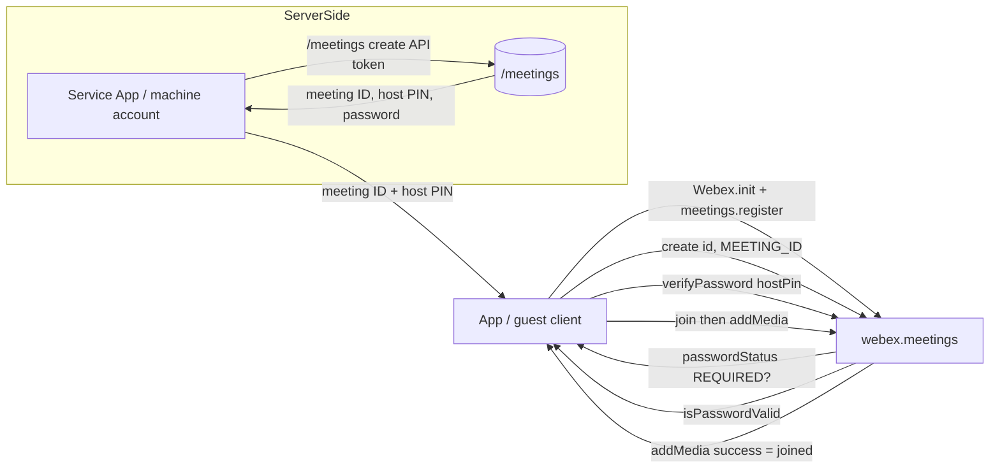
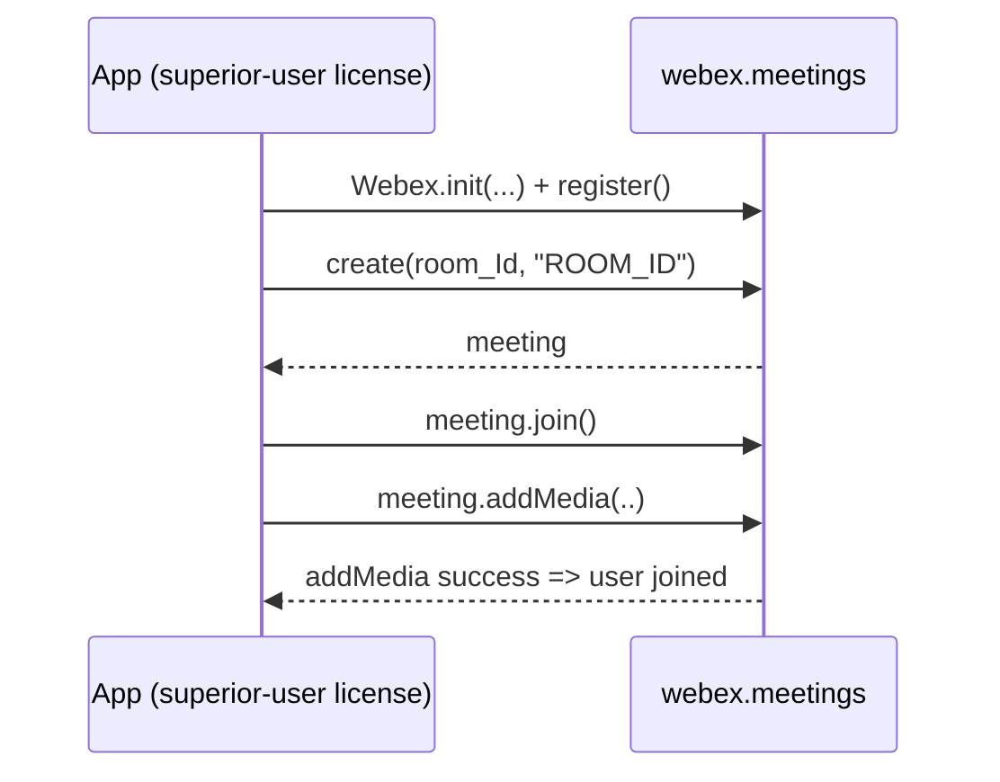
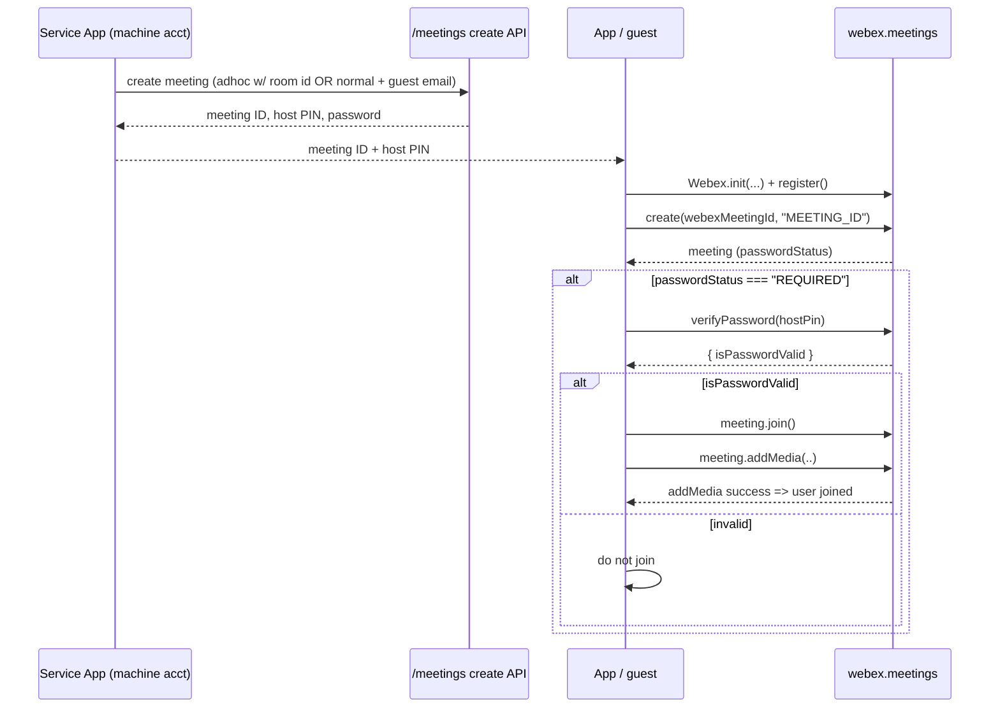
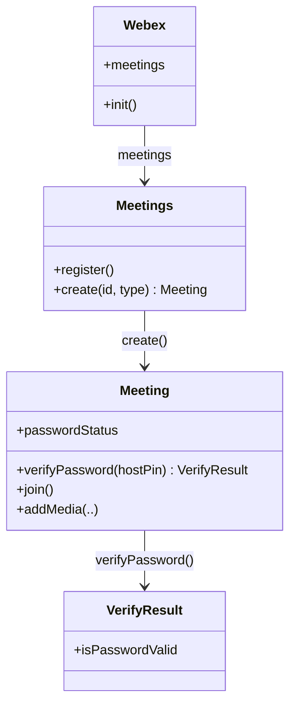

<!-- ───────────────────────────────
  Template:     Module Spec
  Template-ID:  module-spec
  Generates:    <module-path>/ai-docs/<module-name>-spec.md
  Library ver:  0.2.1
─────────────────────────────── -->

# calling — SPEC (USM meeting migration / design note)

> Start here → root [`AGENTS.md`](../../../AGENTS.md) (agent entry) · router [`SPEC_INDEX.md`](../../../ai-docs/SPEC_INDEX.md) · system [`ARCHITECTURE.md`](../../../ai-docs/ARCHITECTURE.md). This is the module's canonical spec: orientation, requirements, design, flows, and tests.
> Context-efficiency: link to canonical docs — don't duplicate them. Load specs on demand per `SPEC_INDEX.md`.

> **Scope note — forward-looking migration/design note.** This spec migrates a routed design note that describes SDK-side changes to move customers to USM (Unified Space Meetings / service-app-created) meetings for the calling + meetings flow. The **new** flow described here is aspirational / in-progress: it must be verified against the actual implementation in `packages/calling/` and `packages/@webex/plugin-meetings/` before being treated as shipped behavior. Coverage is **Partial** and this is an **assess-only** migration — the code remains the source of truth.

## Metadata
| Field | Value |
|---|---|
| Module id | `calling` |
| Source path(s) | `packages/calling/` |
| Doc kind | Module spec |
| Coverage score | 19% (3/16) assessed 2026-07-28; critical 1/8, important 0/5; aspirational design note, no implementing code/test located — below 40% field-score guideline, flagged for human review of Partial status |
| Generated from | `module-spec` @ SDLC template library `0.2.1` |
| generated_by / approved_by / updated_at | generated_by: module-spec migration · approved_by: pending · updated_at: 2026-07-28 |
| Validation status | not-run |

Coverage score is `Pending coverage assessment` pending the first coverage report. Manifest coverage state is tracked outside this rendered doc as **Partial** (assess-only; code is source of truth).

## Evidence Rules
Every generated requirement below cites concrete source evidence using `file path`. Source evidence, test evidence, examples, assumptions, and gaps are kept separate so validators and future agents can distinguish truth from context. This spec is migrated from a **design note**; nearly all requirements carry **WEAK** confidence because no implementing code or test was located for the described USM flow at migration time. Verify against `packages/calling/` and `packages/@webex/plugin-meetings/` before promoting.

## Source Material Register
| Source material | Scope | Decision | Detail location or disposition |
|---|---|---|---|
| `packages/calling/usm sdk flow.md` | overview / API / design note (routed, migrate-existing, retain) | used / migrated by meaning | Prerequisites → Requirements + Requires; existing room-based flow and new MEETING_ID flow → Use Cases, Sequence Diagram(s), Public Surface; both code examples reproduced in Use Cases / Design Overview; password-verify branch → Sequence Diagram(s) + Pitfalls. |

## Overview
The USM migration changes **how the Webex JS SDK is asked to create and join a meeting** for guest users in a space. Historically, an application joined a meeting by handing `webex.meetings.create(...)` a **Hydra room ID** (typed `"ROOM_ID"`) and relying on the license of a superior user already in the space. USM (Unified Space Meetings) decouples the room from the meeting: a service application (machine account) creates the meeting via the `/meetings` create API, receives a **meeting ID, host PIN, and password**, and the SDK caller now passes the **meeting ID** (typed `"MEETING_ID"`) instead of the room ID.

The consuming surface is the `webex.meetings` plugin (`packages/@webex/plugin-meetings/`); this `calling` module (`packages/calling/`) is the sibling media/calling stack referenced by the combined calling + meetings flow. The maintainer-facing change is a shift in the second argument to `create(...)` (`"ROOM_ID"` → `"MEETING_ID"`) plus a new **password-verification step**: when `meeting.passwordStatus === "REQUIRED"`, the caller must call `meeting.verifyPassword(hostPin)` and only proceed to `join()` / `addMedia(...)` when the returned `isPasswordValid` is true.

A maintainer should start by confirming which of these APIs already exist in `packages/@webex/plugin-meetings/` and treating the new-flow code below as a target design, not a guarantee.

## Purpose / Responsibility
Describe the SDK-side contract for migrating guest/space meeting join from **room-based** creation to **service-app-created USM meetings**: pass a meeting ID rather than a room ID, and gate `join()` on host-PIN/password verification. It does **not** own the server-side `/meetings` create API, license assignment, or space/guest provisioning.

## Stack
TypeScript (`tsc` build), Jest unit tests (`jest.config.js`), Karma browser tests (`karma.conf.js`); published as `@webex/calling` (`main: dist/module/index.js`). Consumed alongside the `@webex/plugin-meetings` plugin via the `window.Webex` / `webex.meetings` runtime surface. Node engine `>=18`. (Stack from `packages/calling/package.json`.)

## Folder / Package Structure
```
packages/calling/
├── src/
│   ├── CallingClient/   # calling client entry
│   ├── CallHistory/     # call history
│   ├── CallSettings/    # call settings
│   ├── Contacts/        # contacts
│   ├── Voicemail/       # voicemail
│   ├── Metrics/         # metrics
│   ├── Events/          # event definitions
│   ├── Errors/          # error types
│   ├── Logger/          # logging
│   ├── SDKConnector/    # SDK connector to @webex
│   ├── common/          # shared helpers
│   ├── api.ts           # public API surface
│   └── index.ts         # package entry / barrel
├── package.json         # @webex/calling manifest
└── usm sdk flow.md      # migrated design note (this spec's source)
```
> Note: the migrated meeting create/join surface (`webex.meetings.create`, `join`, `addMedia`, `verifyPassword`) lives in `packages/@webex/plugin-meetings/`, not under `packages/calling/src/`. Confirm the exact file before editing.

## Key Files (source of truth)
| File | Holds |
|---|---|
| `packages/calling/usm sdk flow.md` | The migrated USM design note (existing vs new SDK flow, both code examples). |
| `packages/calling/src/index.ts` / `packages/calling/src/api.ts` | `@webex/calling` public entry / API surface. |
| `packages/@webex/plugin-meetings/` (verify path) | Actual implementation of `webex.meetings.create/join/addMedia/verifyPassword` — source of truth for the described new flow. |

## Public Surface
| Contract ID | Type | Surface | Purpose | Compatibility / deprecation | Schema / detail link | Root index |
|---|---|---|---|---|---|---|
| `meetings.create` | SDK | `webex.meetings.create(id, "ROOM_ID" \| "MEETING_ID")` | Create a meeting object from a room ID (legacy) or meeting ID (USM). | Second arg migrating `"ROOM_ID"` → `"MEETING_ID"`; room decoupled from meeting going forward. | `packages/calling/usm sdk flow.md` | `../../../ai-docs/CONTRACTS.md` |
| `meeting.join` | SDK | `meeting.join()` | Join the created meeting. | Stable across both flows. | `packages/calling/usm sdk flow.md` | `../../../ai-docs/CONTRACTS.md` |
| `meeting.addMedia` | SDK | `meeting.addMedia(..)` | Add media; user is considered joined when this succeeds. | Stable across both flows. | `packages/calling/usm sdk flow.md` | `../../../ai-docs/CONTRACTS.md` |
| `meeting.verifyPassword` | SDK | `meeting.verifyPassword(hostPin)` → `{ isPasswordValid }` | Verify host PIN / password before join in the USM flow. | New in USM flow. | `packages/calling/usm sdk flow.md` | `../../../ai-docs/CONTRACTS.md` |
| `meeting.passwordStatus` | SDK | `meeting.passwordStatus` (e.g. `"REQUIRED"`) | Indicates a password/PIN must be verified before join. | New usage in USM flow. | `packages/calling/usm sdk flow.md` | `../../../ai-docs/CONTRACTS.md` |

Compatibility notes:
- The type tag passed as the second argument to `create(...)` changes from `"ROOM_ID"` to `"MEETING_ID"`; the room is being **decoupled** from the meeting, so callers no longer pass a room ID in the USM flow.

## Requires (dependencies)
- `webex.meetings.register()` must be called after `window.Webex.init(...)` before creating a meeting (both flows).
- A machine-account **service application token** to call the `/meetings` create API (USM flow only).
- **Prerequisites (from the design note):** developers have created an integration bot / integration; created spaces and added **guest users** to the space; have the **Hydra room ID** to start the meeting on the space; a **guest** will start the meeting in the space.
- Runtime host exposing `window.Webex` / `window.webex` and the `@webex/plugin-meetings` plugin.

## Requirements
| ID | WHAT | WHY | Source Evidence | Test / Example Evidence | Assumptions / Gaps | Confidence |
|---|---|---|---|---|---|---|
| `CALLING-R-001` | Before creating a meeting the caller runs `window.Webex.init(...)` then `await webex.meetings.register()`. | Registration is the documented precondition in both existing and new flows. | `packages/calling/usm sdk flow.md` | None found | Applies to both flows. | WEAK |
| `CALLING-R-002` | Legacy flow: caller passes a Hydra room ID and the tag `"ROOM_ID"` to `webex.meetings.create(room_Id, "ROOM_ID")`, using the license of a superior user in the space. | Reproduces the existing room-based workflow. | `packages/calling/usm sdk flow.md` | None found | Legacy behavior; being superseded. | WEAK |
| `CALLING-R-003` | USM flow: caller passes a **meeting ID** and the tag `"MEETING_ID"` to `webex.meetings.create(webexMeetingId, "MEETING_ID")` — no room ID is passed. | Room is decoupled from the meeting; developers use the `/meetings` APIs going forward. | `packages/calling/usm sdk flow.md` | None found | New/aspirational; verify in `packages/@webex/plugin-meetings/`. | WEAK |
| `CALLING-R-004` | A service application (machine account) creates the space meeting via the `/meetings` create API and receives a **host ID/PIN and password**. | The SDK caller obtains the meeting ID and host PIN from this server-side step. | `packages/calling/usm sdk flow.md` | None found | Server-side API not owned by this module. | WEAK |
| `CALLING-R-005` | `/meetings` create offers two options: (1) create a meeting with the room id marked **adhoc** ⇒ returns meeting ID, host PIN and password; (2) create a **normal** meeting starting in a few minutes/later and add the guest email address to the meeting via the API. | Documents the two creation paths a developer chooses between using the service-app token. | `packages/calling/usm sdk flow.md` | None found | Server-side API detail; verify field names. | WEAK |
| `CALLING-R-006` | When `meeting.passwordStatus === "REQUIRED"`, the caller must call `meeting.verifyPassword(hostPin)` and only proceed when the returned `isPasswordValid` is true. | Gates join on host-PIN/password verification in the USM flow. | `packages/calling/usm sdk flow.md` | None found | New behavior; verify return shape `{ isPasswordValid }`. | WEAK |
| `CALLING-R-007` | In both flows the user is considered **joined when `meeting.addMedia(..)` succeeds**, after `meeting.join()`. | Defines the join-complete signal for callers. | `packages/calling/usm sdk flow.md` | None found | Ordering: `join()` then `addMedia(..)`. | WEAK |

Confidence is WEAK across the board because the source is a design note; no implementing code or tests for the USM flow were located during migration.

## Design Overview
The migration is fundamentally a **decoupling of room from meeting**. In the legacy design, identity of "which meeting" was carried by the room and its participants' licenses; `create(room_Id, "ROOM_ID")` bound the meeting to the room, and a superior user's license authorized it. USM inverts this: a service application creates the meeting up front through the `/meetings` create API, so the meeting exists independently of any room and carries its own credentials (host PIN + password). The SDK caller then addresses the meeting **by meeting ID** (`create(webexMeetingId, "MEETING_ID")`).

Because the meeting now owns credentials, the join path gains a verification gate: `passwordStatus` may be `"REQUIRED"`, in which case `verifyPassword(hostPin)` must succeed (`isPasswordValid === true`) before `join()` and `addMedia(..)`. The final "user is joined" signal is unchanged — it is when `addMedia(..)` resolves successfully.

Legacy code example (existing room-based workflow — uses the license of one of the superior users in the space):
```javascript
const webex = (window.webex = window.Webex.init(…))
await webex.meetings.register();

const room_Id = "csdsd-sdsd-sds-dsd-sddsd-" // room where the user is part of
const meeting = await webex.meetings.create(room_Id, "ROOM_ID");

await meeting.join()
await meeting.addMedia(..)

// User should be joined when add Media is successful
```

New USM code example (service-app-created meeting; pass MEETING_ID and verify host PIN):
```javascript
const webex = (window.webex = window.Webex.init(…))
await webex.meetings.register();

const webexMeetingId = "34343434" // webex id for the meeting
const hostPin = "344545"
const meeting = await webex.meetings.create(webexMeetingId, "MEETING_ID");

if (meeting.passwordStatus === "REQUIRED") {
  const response = meeting.verifyPassword(hostPin)
}

if (response.isPasswordValid) {
  await meeting.join()
  await meeting.addMedia(..)
}

// User should be joined when add Media is successful
```

## Data Flow


## Sequence Diagram(s)
Sequence coverage:

| Operation group | Diagram | Failure / recovery coverage |
|---|---|---|
| Legacy room-based join | "Existing ROOM_ID flow" | Join proceeds directly; no password gate. |
| USM meeting-ID join | "New MEETING_ID flow" | `alt` branch on `passwordStatus === "REQUIRED"` and on `isPasswordValid`; join skipped when password invalid. |

Existing ROOM_ID flow:


New MEETING_ID flow:


## Class / Component Relationships

`webex.meetings.create(...)` returns a `Meeting`; the meeting's `passwordStatus` and `verifyPassword(hostPin)` (returning `{ isPasswordValid }`) gate `join()` / `addMedia(..)` in the USM flow. Types are inferred from the design note and must be confirmed against `packages/@webex/plugin-meetings/`.

## Use Cases
- **UC-1 Existing room-based workflow:** superior-user-licensed app → `Webex.init` → `register()` → `create(room_Id, "ROOM_ID")` → `join()` → `addMedia(..)` → user joined when `addMedia` succeeds. Uses the license of one of the superior users in the space. Evidence: `packages/calling/usm sdk flow.md`.
- **UC-2 New USM (service-app-created) workflow:** service app creates the meeting via `/meetings` (adhoc-with-room-id or normal-with-guest-email) → gets meeting ID + host PIN + password → guest app `create(webexMeetingId, "MEETING_ID")` → if `passwordStatus === "REQUIRED"` call `verifyPassword(hostPin)` → if `isPasswordValid` then `join()` → `addMedia(..)` → user joined when `addMedia` succeeds. Evidence: `packages/calling/usm sdk flow.md`.

## Pitfalls
- **Pass `MEETING_ID`, not `ROOM_ID`, in the USM flow.** The second argument to `create(...)` changed; passing a room ID (or the `"ROOM_ID"` tag) in the new flow is wrong because the room is decoupled from the meeting.
- **Handle `passwordStatus === "REQUIRED"`.** Do not call `join()` before verifying the host PIN; only proceed when `verifyPassword(hostPin)` returns `isPasswordValid === true`. In the example, `response` is only assigned inside the `passwordStatus === "REQUIRED"` branch, so callers must guard against it being undefined.
- **Joined ≠ join() returning.** The user is considered joined only when `addMedia(..)` succeeds, not merely when `join()` resolves (both flows).
- **Design note, not shipped truth.** The new flow may be aspirational/in-progress; verify against `packages/calling/` and `packages/@webex/plugin-meetings/` before relying on it.

## Test-Case Strategy (module)
No tests were located for the USM meeting flow at migration time. Suggested unit coverage once the flow is confirmed in `packages/@webex/plugin-meetings/`: assert `create(id, "MEETING_ID")` addresses a meeting by meeting ID (positive) and that passing a room ID / `"ROOM_ID"` in the USM path is rejected or clearly legacy (negative); assert that when `passwordStatus === "REQUIRED"`, `join()`/`addMedia` are gated on `verifyPassword(hostPin)` returning `isPasswordValid === true` (positive) and are skipped when `isPasswordValid` is false (negative); assert the "joined-on-addMedia-success" contract for both flows.

| Behavior / Requirement | Existing test evidence | Gap |
|---|---|---|
| `CALLING-R-001` | None found | No registration precondition test. |
| `CALLING-R-002` | None found | No legacy ROOM_ID create/join test. |
| `CALLING-R-003` | None found | No MEETING_ID create test. |
| `CALLING-R-004` | None found | Server-side `/meetings` create not covered here. |
| `CALLING-R-005` | None found | Two-option create path uncovered. |
| `CALLING-R-006` | None found | No password-verify branch test. |
| `CALLING-R-007` | None found | No join-on-addMedia-success test. |

## Traceability
- Repo architecture: `../../../ai-docs/ARCHITECTURE.md` · Registry: `../../../ai-docs/SPEC_INDEX.md`
- Coverage state & contracts baseline: `.sdd/manifest.json`
- Migrated source: `packages/calling/usm sdk flow.md`
