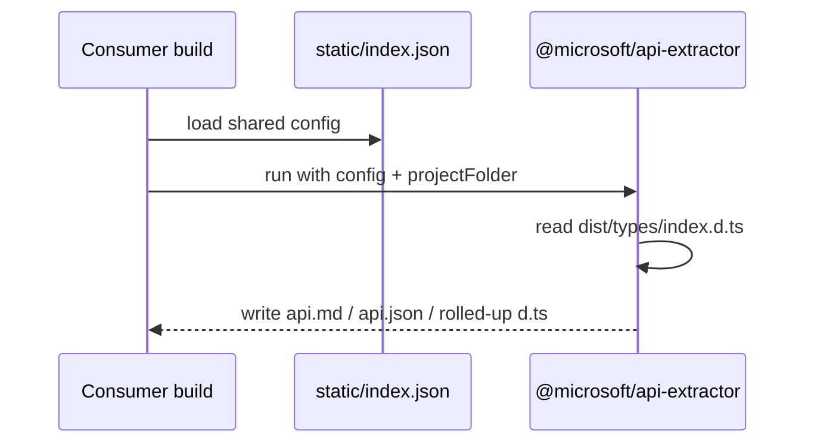

<!-- sdd-generated-metadata
generator: claude-cli
generator_model: us.anthropic.claude-opus-4-8
approved_by: pending-human-review
updated_at: 2026-08-06T00:00:00Z
validation_status: not-run
run_id: 51855eac-8de5-43a2-a3b6-dbcc55ebc91b
-->

# @webex/api-extractor-config — SPEC

> Start here → root [`AGENTS.md`](../../../../AGENTS.md) (agent entry) · router [`SPEC_INDEX.md`](../../../../ai-docs/SPEC_INDEX.md) · system [`ARCHITECTURE.md`](../../../../ai-docs/ARCHITECTURE.md). This is the module's canonical spec: orientation, requirements, design, flows, and tests.
> Context-efficiency: link to canonical docs — don't duplicate them. Load specs on demand per `SPEC_INDEX.md`.

## Metadata

| Field | Value |
|---|---|
| Module id | `api-extractor` |
| Source path(s) | `packages/config/api-extractor/static/` |
| Parent spec | `—` (shared workspace build-config package; no parent module) |
| Doc kind | Module spec |
| Coverage score | Pending coverage assessment |
| Generated from | `module-spec` @ SDLC template library `0.2.2` |
| generated_by / approved_by / updated_at | claude-cli / pending-human-review / 2026-08-06 |
| Validation status | not-run, validator `pending`, assessed 2026-08-06 |

Coverage score is `Pending coverage assessment` until the first coverage review runs. Manifest coverage
state (`Partial`) is authoritative and kept in `.sdd/manifest.json`.

## Evidence Rules
Every requirement cites concrete source evidence using `file path`. This is a configuration-only package,
so requirements are grounded in `package.json` and the static config it ships, not runtime code.

## Source Material Register

| Source material | Scope | Decision | Detail location or disposition |
|---|---|---|---|
| `N/A` | none | none | No pre-existing SDD/AI-docs, architecture, or spec documents were routed to this module; content is derived from `package.json` and the shipped static config. |

## Overview

`@webex/api-extractor-config` is a **shared configuration package** consumed by workspace builds. It ships
a single static Microsoft API Extractor configuration (`static/index.json`) as its main entry, so
individual packages can extend one canonical `api-extractor` config instead of duplicating settings. It
enables the API report, doc model, and `.d.ts` rollup that API Extractor produces from a package's
compiled type declarations.

It is a `private` package with no build step and no runtime code — its "surface" is the JSON config and
the `@microsoft/api-extractor` peer dependency it expects the consumer to provide. A maintainer should
read `static/index.json` to understand what report/doc-model/rollup outputs it enables and the
`<projectFolder>` token placeholders it relies on.

## Purpose / Responsibility

Owns the one canonical API Extractor configuration for the workspace (API report + doc model + untrimmed
`.d.ts` rollup, driven from `<projectFolder>/dist/types/index.d.ts`). It does NOT run API Extractor
itself or provide runtime code — consumers install `@microsoft/api-extractor` (peer) and point it at this
config.

## Stack

JSON configuration only. `type: commonjs`, `packageManager: yarn@3.4.1`, `engines` Node `>=18`, npm
`>=8`, yarn `>=3`. `main: ./static/index.json`; only the `static/` directory is published via `files`.
Peer dependency: `@microsoft/api-extractor` (`^7.34.4`). No source code, no tests, no build.

## Folder / Package Structure

```
packages/config/api-extractor/
├── package.json          # name, engines, main -> static/index.json, api-extractor peer dep
└── static/
    └── index.json        # The shared API Extractor configuration
```

## Key Files (source of truth)

| File | Holds |
|---|---|
| `packages/config/api-extractor/static/index.json` | The canonical API Extractor config: `apiReport`, `docModel`, `dtsRollup`, `mainEntryPointFilePath`, and message-reporting levels |
| `packages/config/api-extractor/package.json` | The `main` entry, published `files`, engines, and the `@microsoft/api-extractor` peer dependency |

## Public Surface

Internal Surface — internal use only. This package is consumed as a config artifact by other workspace
packages; it exports no code API.

| Contract ID | Type | Surface | Purpose | Compatibility / deprecation | Schema / detail link | Root index |
|---|---|---|---|---|---|---|
| `api-extractor.config` | SDK | `main: ./static/index.json` | The shared API Extractor configuration object consumed by workspace builds | Config schema follows `@microsoft/api-extractor` `^7.34.4`; changing enabled outputs affects all consumers | `packages/config/api-extractor/static/index.json` | `../../../../ai-docs/CONTRACTS.md` |

Compatibility notes:
- The config uses `<projectFolder>` token substitution; consumers must run API Extractor with a project
  folder whose `dist/types/index.d.ts` exists. Changing enabled reports/rollup paths is a change every
  consumer inherits.

## Requires (dependencies)

- `@microsoft/api-extractor` (`^7.34.4`, peer) — the tool that reads this config; must be installed by
  the consuming package/build.
- A consumer package that has already compiled TypeScript declarations to
  `<projectFolder>/dist/types/index.d.ts` (the configured `mainEntryPointFilePath`).

## Requirements

| ID | WHAT | WHY | Source Evidence | Test / Example Evidence | Assumptions / Gaps | Confidence |
|---|---|---|---|---|---|---|
| `APIEXTRACTOR-R-001` | The package exposes a single API Extractor config as `main` (`static/index.json`) and publishes only `static/`. | Give the workspace one canonical, reusable API Extractor config. | `packages/config/api-extractor/package.json` | None (config package) | none identified | PRESENT |
| `APIEXTRACTOR-R-002` | The config enables `apiReport` (writing `index.api.md` to `<projectFolder>/dist/docs/metadata/`), `docModel` (`index.api.json`), and `dtsRollup` (untrimmed `index.d.ts`) from `mainEntryPointFilePath` `<projectFolder>/dist/types/index.d.ts`. | Produce the API report, doc model, and rolled-up types the workspace uses for API surface tracking/docs. | `packages/config/api-extractor/static/index.json` | None | Requires compiled `dist/types/index.d.ts` to exist | PRESENT |
| `APIEXTRACTOR-R-003` | Message reporting defaults to `warning` for compiler/extractor/tsdoc, with `ae-wrong-input-file-type` set to `none`. | Keep API Extractor noisy enough to catch issues without failing on the known wrong-input-file-type case. | `packages/config/api-extractor/static/index.json` | None | none identified | PRESENT |
| `APIEXTRACTOR-R-004` | `@microsoft/api-extractor` is a peer dependency (`^7.34.4`), not bundled. | Let the consumer control the API Extractor version and avoid duplicate installs. | `packages/config/api-extractor/package.json` | None | none identified | PRESENT |

Data/schema-style config values (paths, log levels) are recorded here as configuration facts, not as
behavioral requirements.

## Design Overview

The package is a pure configuration shim. It contains no executable code; its design is simply to
centralize one API Extractor JSON so every package in the workspace extends the same report/doc-model/
rollup behavior. The `<projectFolder>` and `.`-relative `projectFolder` settings let each consuming
package supply its own root while inheriting identical extractor behavior. Because it is `private` and
declares `@microsoft/api-extractor` as a peer, it deliberately avoids owning the tool version.

## Data Flow

```mermaid
flowchart LR
  Consumer[Workspace package build] -->|extends / points at| Config[static/index.json]
  Config -->|drives| APIExtractor[[@microsoft/api-extractor]]
  APIExtractor -->|reads| DTS[<projectFolder>/dist/types/index.d.ts]
  APIExtractor -->|writes| Report[dist/docs/metadata/index.api.md + index.api.json + index.d.ts]
```

## Sequence Diagram(s)

This is a configuration-only package with a single conceptual operation group — a build consuming the
config — so one sequence is sufficient.

Sequence coverage:

| Operation group | Diagram | Failure / recovery coverage |
|---|---|---|
| Build consumes config | 1. API Extractor run | Failure is owned by `@microsoft/api-extractor` (e.g. missing `dist/types/index.d.ts`), not by this package |

### 1. API Extractor run



## Class / Component Relationships

```mermaid
flowchart LR
  Pkg[@webex/api-extractor-config] -->|ships| Json[static/index.json]
  Json -.peer.-> AE[[@microsoft/api-extractor]]
```

No classes or components — the package relates to consumers only as a shared JSON config plus a peer
tool.

## Use Cases

- **UC-1 Reuse the extractor config:** a workspace package references
  `@webex/api-extractor-config`'s `static/index.json` so its build emits the standard API report, doc
  model, and `.d.ts` rollup. Evidence: `packages/config/api-extractor/static/index.json`,
  `packages/config/api-extractor/package.json`.

## Pitfalls

- The config assumes `<projectFolder>/dist/types/index.d.ts` already exists; running API Extractor before
  TypeScript declaration output is generated will fail in the consumer, not here.
- `@microsoft/api-extractor` is a peer dependency — a consumer that forgets to install it (at a compatible
  `^7.34.4`) cannot use this config.
- Output paths (`dist/docs/metadata/`) are fixed in the shared config; a consumer needing different
  locations must not silently expect this package to change them for one package only.

## Test-Case Strategy (module)

There is no executable code to unit test. Validation is by consumption: a package that uses this config
should, on build, produce `dist/docs/metadata/index.api.md`, `index.api.json`, and the rolled-up
`index.d.ts`. A reasonable check is a CI assertion in a consuming package that these artifacts are
generated, plus JSON-schema validation of `static/index.json` against the installed API Extractor
version.

| Behavior / Requirement | Existing test evidence | Gap |
|---|---|---|
| `APIEXTRACTOR-R-001`..`R-004` | None found (config-only package) | Add a consuming-package CI check that the report/doc-model/rollup artifacts are produced |

## Traceability

- Repo architecture: [`ARCHITECTURE.md`](../../../../ai-docs/ARCHITECTURE.md) · Registry: [`SPEC_INDEX.md`](../../../../ai-docs/SPEC_INDEX.md)
- Contracts catalog: [`CONTRACTS.md`](../../../../ai-docs/CONTRACTS.md)
- Coverage state & contracts baseline: `.sdd/manifest.json`
