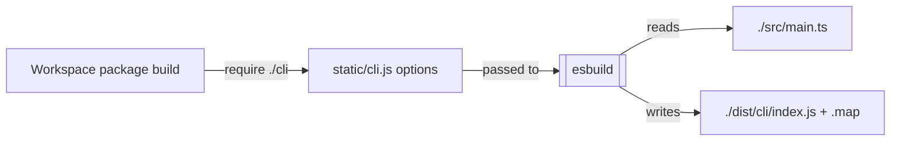
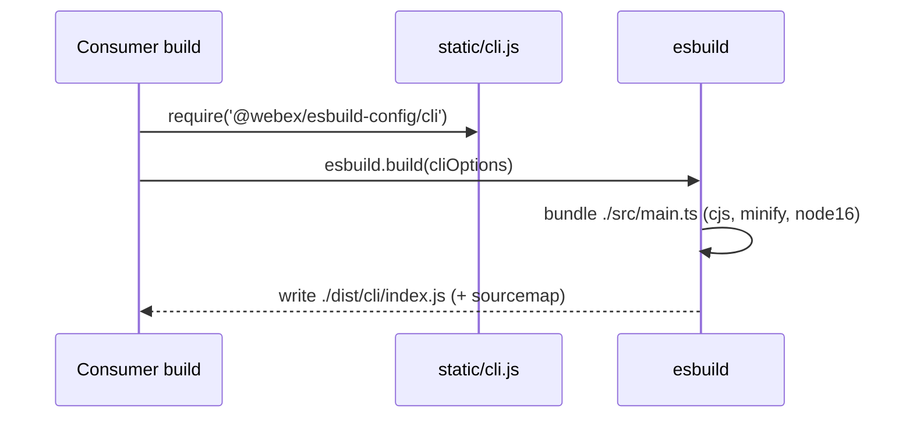
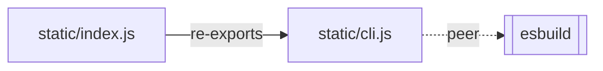

<!-- sdd-generated-metadata
generator: claude-cli
generator_model: us.anthropic.claude-opus-4-8
approved_by: pending-human-review
updated_at: 2026-08-06T00:00:00Z
validation_status: not-run
run_id: 51855eac-8de5-43a2-a3b6-dbcc55ebc91b
-->

# @webex/esbuild-config — SPEC

> Start here → root [`AGENTS.md`](../../../../AGENTS.md) (agent entry) · router [`SPEC_INDEX.md`](../../../../ai-docs/SPEC_INDEX.md) · system [`ARCHITECTURE.md`](../../../../ai-docs/ARCHITECTURE.md). This is the module's canonical spec: orientation, requirements, design, flows, and tests.
> Context-efficiency: link to canonical docs — don't duplicate them. Load specs on demand per `SPEC_INDEX.md`.

## Metadata

| Field | Value |
|---|---|
| Module id | `esbuild` |
| Source path(s) | `packages/config/esbuild/static/` |
| Parent spec | `—` (shared workspace build-config package; no parent module) |
| Doc kind | Module spec |
| Coverage score | Pending coverage assessment |
| Generated from | `module-spec` @ SDLC template library `0.2.2` |
| generated_by / approved_by / updated_at | claude-cli / pending-human-review / 2026-08-06 |
| Validation status | not-run, validator `pending`, assessed 2026-08-06 |

Coverage score is `Pending coverage assessment` until the first coverage review runs. Manifest coverage
state (`Partial`) is authoritative and kept in `.sdd/manifest.json`.

## Evidence Rules
Every requirement cites concrete source evidence using `file path`. This is a configuration package, so
requirements are grounded in `package.json` and the static JS config it ships.

## Source Material Register

| Source material | Scope | Decision | Detail location or disposition |
|---|---|---|---|
| `N/A` | none | none | No pre-existing SDD/AI-docs, architecture, or spec documents were routed to this module; content is derived from `package.json` and the shipped static config. |

## Overview

`@webex/esbuild-config` is a **shared configuration package** that ships a canonical
[esbuild](https://esbuild.github.io/) build configuration for workspace packages. It exposes two entry
points: the package root (`static/index.js`), which re-exports a `{cli}` object, and a `./cli` subpath
(`static/cli.js`), which is the esbuild options object used to bundle a CLI entry point.

The `cli` config bundles `./src/main.ts` into a minified, sourcemapped CommonJS `./dist/cli/index.js`
targeting `node16` for the `node` platform. It is a `private`, code-free-at-runtime config package (no
build step); consumers import the config and pass it to esbuild. A maintainer should read
`static/cli.js` for the exact bundle options and `static/index.js` for the export shape.

## Purpose / Responsibility

Owns the canonical esbuild CLI bundling configuration for the workspace (bundle `src/main.ts` → minified
CJS `dist/cli/index.js`, Node 16 target). It does NOT run esbuild itself or provide runtime application
code — `esbuild` is a peer dependency the consumer supplies.

## Stack

JavaScript configuration only (`type: commonjs`). `packageManager: yarn@3.4.1`, `engines` Node `>=18`,
npm `>=8`, yarn `>=3`. Exports: `.` → `./static/index.js`, `./cli` → `./static/cli.js`; only `static/`
is published. Peer dependency: `esbuild` (`^0.17.11`). Dev dependencies: `@webex/eslint-config`
(`workspace:*`) and `eslint`. No source app code, no tests, no build.

## Folder / Package Structure

```
packages/config/esbuild/
├── package.json          # name, exports (. and ./cli), esbuild peer dep, eslint dev deps
└── static/
    ├── index.js          # Re-exports { cli } from ./cli
    └── cli.js            # esbuild options for bundling the CLI entry point
```

## Key Files (source of truth)

| File | Holds |
|---|---|
| `packages/config/esbuild/static/cli.js` | The esbuild options object: `bundle`, `entryPoints: ['./src/main.ts']`, `format: 'cjs'`, `minify`, `outfile: './dist/cli/index.js'`, `platform: 'node'`, `sourcemap`, `target: ['node16']` |
| `packages/config/esbuild/static/index.js` | The package export shape (`module.exports = { cli }`) |
| `packages/config/esbuild/package.json` | The `exports` map, published `files`, engines, and the `esbuild` peer dependency |

## Public Surface

Internal Surface — internal use only. Consumed as a config artifact by other workspace packages; exports
config objects, not a runtime API.

| Contract ID | Type | Surface | Purpose | Compatibility / deprecation | Schema / detail link | Root index |
|---|---|---|---|---|---|---|
| `esbuild.index` | SDK | `require('@webex/esbuild-config')` → `{cli}` | Root export exposing the named CLI config | Export shape is the contract; adding configs is additive | `packages/config/esbuild/static/index.js` | `../../../../ai-docs/CONTRACTS.md` |
| `esbuild.cli` | SDK | `require('@webex/esbuild-config/cli')` → esbuild options | The esbuild bundle options for the CLI entry point | Options object schema follows `esbuild` `^0.17.11` | `packages/config/esbuild/static/cli.js` | `../../../../ai-docs/CONTRACTS.md` |

Compatibility notes:
- The `cli` options hard-code `entryPoints`/`outfile`/`target`; changing them affects every consumer that
  bundles through this config. Adding a new named config to `index.js` is additive.

## Requires (dependencies)

- `esbuild` (`^0.17.11`, peer) — the bundler this config drives; installed by the consumer.
- A consumer package with a `./src/main.ts` entry (the configured `entryPoints`) to bundle.

## Requirements

| ID | WHAT | WHY | Source Evidence | Test / Example Evidence | Assumptions / Gaps | Confidence |
|---|---|---|---|---|---|---|
| `ESBUILD-R-001` | The package exposes `.` (`static/index.js` → `{cli}`) and `./cli` (`static/cli.js`) exports and publishes only `static/`. | Give the workspace one canonical esbuild config with a stable import shape. | `packages/config/esbuild/package.json`, `packages/config/esbuild/static/index.js` | None (config package) | none identified | PRESENT |
| `ESBUILD-R-002` | The `cli` config sets `bundle:true`, `entryPoints:['./src/main.ts']`, `format:'cjs'`, `minify:true`, `outfile:'./dist/cli/index.js'`, `platform:'node'`, `sourcemap:true`, `target:['node16']`. | Produce a minified, sourcemapped Node CJS CLI bundle consistently across packages. | `packages/config/esbuild/static/cli.js` | None | Assumes consumer's CLI entry is `src/main.ts` | PRESENT |
| `ESBUILD-R-003` | `esbuild` is a peer dependency (`^0.17.11`), not bundled. | Let the consumer control the esbuild version. | `packages/config/esbuild/package.json` | None | none identified | PRESENT |

Config values (paths, target, flags) are recorded as configuration facts, not behavioral requirements.

## Design Overview

The package is a pure configuration shim: `static/cli.js` defines the esbuild options object and
`static/index.js` re-exports it under a `cli` key. Splitting the root export (`{cli}`) from the direct
`./cli` subpath lets consumers either destructure a named set of configs or import the CLI options
directly. Because it is `private` and declares `esbuild` as a peer, it centralizes bundle settings
without owning the bundler version or executing any build itself.

## Data Flow



## Sequence Diagram(s)

Configuration-only package with one operation group — a build consuming the config — so one sequence is
sufficient.

Sequence coverage:

| Operation group | Diagram | Failure / recovery coverage |
|---|---|---|
| Build consumes config | 1. esbuild bundle | Failure is owned by `esbuild` (e.g. missing `src/main.ts`), not this package |

### 1. esbuild bundle



## Class / Component Relationships



No classes — the package relates to consumers as shared config objects plus a peer bundler.

## Use Cases

- **UC-1 Bundle a CLI:** a workspace package imports `@webex/esbuild-config/cli` and passes it to esbuild
  to produce a minified Node CJS CLI bundle. Evidence: `packages/config/esbuild/static/cli.js`,
  `packages/config/esbuild/package.json`.

## Pitfalls

- `entryPoints` is fixed to `./src/main.ts` and `outfile` to `./dist/cli/index.js`; a package with a
  different CLI entry must override these rather than assume this config adapts.
- `esbuild` is a peer dependency — a consumer that omits it (at a compatible `^0.17.11`) cannot use this
  config.
- `target: ['node16']` and `platform: 'node'` mean the produced bundle is Node-only; do not reuse this
  config for browser bundles.

## Test-Case Strategy (module)

No executable code to unit test. Validation is by consumption: a package bundling through `./cli` should
produce `dist/cli/index.js` plus a sourcemap. A reasonable check is a shape assertion that the exported
`cli` object contains the expected keys (`bundle`, `entryPoints`, `format`, `outfile`, `target`) and a
consuming-package CI check that the bundle is emitted.

| Behavior / Requirement | Existing test evidence | Gap |
|---|---|---|
| `ESBUILD-R-001`..`R-003` | None found (config-only package) | Add an export-shape assertion and a consuming-package bundle-output check |

## Traceability

- Repo architecture: [`ARCHITECTURE.md`](../../../../ai-docs/ARCHITECTURE.md) · Registry: [`SPEC_INDEX.md`](../../../../ai-docs/SPEC_INDEX.md)
- Contracts catalog: [`CONTRACTS.md`](../../../../ai-docs/CONTRACTS.md)
- Coverage state & contracts baseline: `.sdd/manifest.json`
