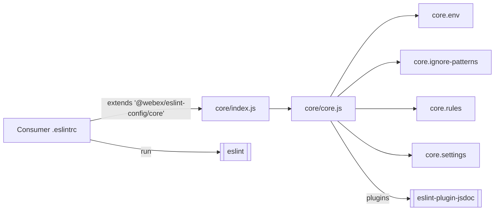
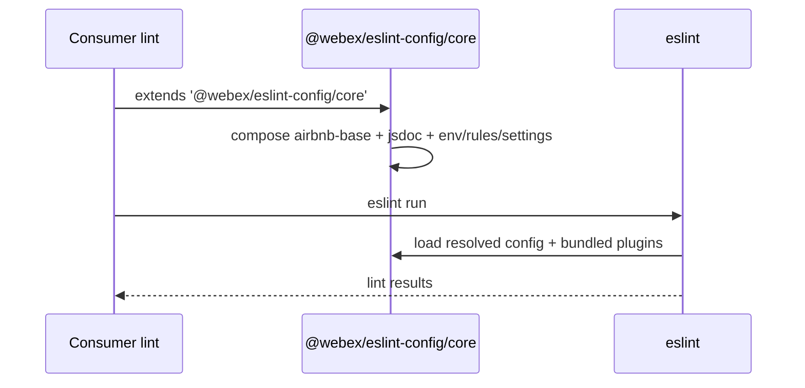
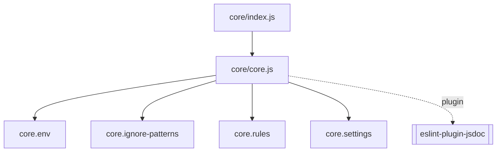

<!-- sdd-generated-metadata
generator: claude-cli
generator_model: us.anthropic.claude-opus-4-8
approved_by: pending-human-review
updated_at: 2026-08-06T00:00:00Z
validation_status: not-run
run_id: 51855eac-8de5-43a2-a3b6-dbcc55ebc91b
-->

# @webex/eslint-config — SPEC

> Start here → root [`AGENTS.md`](../../../../AGENTS.md) (agent entry) · router [`SPEC_INDEX.md`](../../../../ai-docs/SPEC_INDEX.md) · system [`ARCHITECTURE.md`](../../../../ai-docs/ARCHITECTURE.md). This is the module's canonical spec: orientation, requirements, design, flows, and tests.
> Context-efficiency: link to canonical docs — don't duplicate them. Load specs on demand per `SPEC_INDEX.md`.

## Metadata

| Field | Value |
|---|---|
| Module id | `eslint` (config/eslint) |
| Source path(s) | `packages/config/eslint/static/` |
| Parent spec | `—` (shared workspace lint-config package; part of the repo-standards substrate) |
| Doc kind | Module spec |
| Coverage score | Pending coverage assessment |
| Generated from | `module-spec` @ SDLC template library `0.2.2` |
| generated_by / approved_by / updated_at | claude-cli / pending-human-review / 2026-08-06 |
| Validation status | not-run, validator `pending`, assessed 2026-08-06 |

Coverage score is `Pending coverage assessment` until the first coverage review runs. Manifest coverage
state (`Partial`) is authoritative and kept in `.sdd/manifest.json`.

## Evidence Rules
Every requirement cites concrete source evidence using `file path`. This is a configuration package, so
requirements are grounded in `package.json` and the static ESLint config modules it ships.

## Source Material Register

| Source material | Scope | Decision | Detail location or disposition |
|---|---|---|---|
| `N/A` | none | none | No pre-existing SDD/AI-docs, architecture, or spec documents were routed to this module; content is derived from `package.json` and the shipped static config. |

## Overview

`@webex/eslint-config` is the workspace's **shared ESLint configuration package** and part of the
repo-standards substrate. It ships three named, subpath-exported configs — `./core`, `./jasmine`, and
`./typescript` — each backed by a `static/<name>/index.js` barrel that re-exports the concrete config
object. The `core` config extends `airbnb-base`, enables the `eslint-plugin-jsdoc` plugin, and composes
its `env`, `ignorePatterns`, `rules`, and `settings` from sibling `core.*` modules.

It is a code-free-at-runtime config package (no build step): consumers `extends` one of the exported
configs from their own ESLint config. The bundled ESLint plugin dependencies (airbnb-base/typescript,
import, jasmine, jsdoc, tsdoc) are shipped as `dependencies` so the shared config resolves them, while
`eslint` itself is a devDependency. A maintainer should start at `static/core/core.js` to see the
composition and at each subpath `index.js` for the export shape.

## Purpose / Responsibility

Owns the canonical, reusable ESLint configurations for the workspace: a `core` (airbnb-base + JSDoc)
config plus `jasmine` and `typescript` variants. It does NOT run ESLint or define package-specific rule
overrides — consuming packages `extends` these and layer their own overrides.

## Stack

JavaScript configuration only (`type: commonjs`). `packageManager: yarn@3.4.1`, `engines` Node `>=18`,
npm `>=8`, yarn `>=3`. Subpath exports: `./core`, `./jasmine`, `./typescript`; only `static/` is
published. Bundled `dependencies`: `@typescript-eslint/eslint-plugin` & `parser` (`^5.54.0`),
`eslint-config-airbnb-base` (`^15`), `eslint-config-airbnb-typescript` (`^17`), `eslint-plugin-import`,
`eslint-plugin-jasmine`, `eslint-plugin-jsdoc`, `eslint-plugin-tsdoc`. Dev: `@types/eslint`, `eslint`
(`^8.35.0`). No source app code, no tests, no build.

## Folder / Package Structure

```
packages/config/eslint/
├── package.json                 # name, exports (./core, ./jasmine, ./typescript), bundled plugin deps
└── static/
    ├── core/
    │   ├── index.js             # Barrel: re-exports ./core
    │   ├── core.js              # Composes extends airbnb-base + env/ignorePatterns/rules/settings + jsdoc plugin
    │   ├── core.env.js          # env block
    │   ├── core.ignore-patterns.js
    │   ├── core.rules.js
    │   └── core.settings.js
    ├── jasmine/
    │   └── index.js             # Barrel: re-exports ./jasmine
    └── typescript/
        └── index.js             # Barrel: re-exports ./typescript
```

## Key Files (source of truth)

| File | Holds |
|---|---|
| `packages/config/eslint/static/core/core.js` | The composed `core` config: `extends: ['airbnb-base']`, `plugins: ['eslint-plugin-jsdoc']`, and the `env`/`ignorePatterns`/`rules`/`settings` composition |
| `packages/config/eslint/static/core/core.rules.js` | The canonical `core` rule set (do not fork rules elsewhere) |
| `packages/config/eslint/package.json` | The `exports` subpaths and the bundled ESLint plugin `dependencies` the shared config relies on |

## Public Surface

Internal Surface — internal use only. Consumed as shareable ESLint configs by other workspace packages
via `extends`; it exports config objects, not a runtime API.

| Contract ID | Type | Surface | Purpose | Compatibility / deprecation | Schema / detail link | Root index |
|---|---|---|---|---|---|---|
| `eslint.core` | SDK | `require('@webex/eslint-config/core')` → ESLint config | airbnb-base + JSDoc base config with shared env/rules/settings | Config schema follows ESLint `^8`; rule changes affect all consumers | `packages/config/eslint/static/core/core.js` | `../../../../ai-docs/CONTRACTS.md` |
| `eslint.jasmine` | SDK | `require('@webex/eslint-config/jasmine')` → ESLint config | Jasmine-flavored config variant | Additive/rule changes affect Jasmine-test consumers | `packages/config/eslint/static/jasmine/index.js` | `../../../../ai-docs/CONTRACTS.md` |
| `eslint.typescript` | SDK | `require('@webex/eslint-config/typescript')` → ESLint config | TypeScript config variant | Rule changes affect TS consumers | `packages/config/eslint/static/typescript/index.js` | `../../../../ai-docs/CONTRACTS.md` |

Compatibility notes:
- The three subpaths are the semver surface. Adding or changing rules is a change every consumer of that
  subpath inherits; treat rule tightening as potentially breaking for lint-clean consumers.

## Requires (dependencies)

- `eslint` (`^8.35.0`, dev/peer-in-practice) — the linter that loads these configs in a consuming package.
- Bundled plugin/config deps resolved by the shared config: `@typescript-eslint/eslint-plugin` & `parser`,
  `eslint-config-airbnb-base`, `eslint-config-airbnb-typescript`, `eslint-plugin-import`,
  `eslint-plugin-jasmine`, `eslint-plugin-jsdoc`, `eslint-plugin-tsdoc`.
- A consumer ESLint config that `extends` one of the exported subpaths.

## Requirements

| ID | WHAT | WHY | Source Evidence | Test / Example Evidence | Assumptions / Gaps | Confidence |
|---|---|---|---|---|---|---|
| `ESLINT-R-001` | The package exposes three subpath exports — `./core`, `./jasmine`, `./typescript` — each via a `static/<name>/index.js` barrel, publishing only `static/`. | Give the workspace canonical, reusable lint configs with stable import subpaths. | `packages/config/eslint/package.json`, `packages/config/eslint/static/core/index.js` | None (config package) | none identified | PRESENT |
| `ESLINT-R-002` | The `core` config extends `airbnb-base`, registers the `eslint-plugin-jsdoc` plugin, and composes `env`, `ignorePatterns`, `rules`, and `settings` from sibling `core.*` modules. | Provide one base style/quality config for the workspace built on airbnb + JSDoc. | `packages/config/eslint/static/core/core.js` | None | Rule details live in `core.rules.js` | PRESENT |
| `ESLINT-R-003` | The plugin/config dependencies (airbnb-base/typescript, import, jasmine, jsdoc, tsdoc, `@typescript-eslint/*`) are shipped as package `dependencies` so the shared config can resolve them; `eslint` is a devDependency. | Ensure the shared config's plugins resolve for consumers without each package re-declaring them. | `packages/config/eslint/package.json` | None | Consumers still install/own their `eslint` version | PRESENT |

Rule contents and env/settings values are recorded as configuration facts in the sibling `core.*`
modules, not enumerated as behavioral requirements here.

## Design Overview

The package centralizes lint policy behind three named exports. Each subpath `index.js` is a thin barrel
that re-exports the concrete config (`core/index.js` → `core/core.js`), keeping the public import path
stable while the composition lives in `core.js`. `core.js` builds the config declaratively: it `extends`
airbnb-base, adds the JSDoc plugin, and pulls `env`, `ignorePatterns`, `rules`, and `settings` from
dedicated sibling files so each concern can evolve independently. Because plugins are bundled as
`dependencies`, a consumer only needs to install `eslint` and `extends` the subpath.

## Data Flow



## Sequence Diagram(s)

Configuration-only package with one operation group — a lint run consuming the config — so one sequence
is sufficient.

Sequence coverage:

| Operation group | Diagram | Failure / recovery coverage |
|---|---|---|
| Consumer lints with shared config | 1. ESLint resolves + runs config | Failure is owned by `eslint`/plugins (e.g. unresolved plugin), not this package |

### 1. ESLint resolves + runs config



## Class / Component Relationships



No runtime classes — the package relates to consumers as shared config modules plus bundled plugins.

## Use Cases

- **UC-1 Adopt the base config:** a workspace package `extends '@webex/eslint-config/core'` in its ESLint
  config to inherit the airbnb-base + JSDoc rules. Evidence: `packages/config/eslint/static/core/core.js`,
  `packages/config/eslint/package.json`.
- **UC-2 Lint TypeScript / Jasmine code:** a package `extends '@webex/eslint-config/typescript'` or
  `'/jasmine'` for those flavors. Evidence: `packages/config/eslint/static/typescript/index.js`,
  `packages/config/eslint/static/jasmine/index.js`.

## Module Do's / Don'ts

- DO change shared lint rules in the `core.*` modules here so every consumer inherits the update
  consistently.
- DON'T fork these rules into individual packages; layer package-specific overrides in the consumer's own
  config instead.

## Pitfalls

- Bundled plugins are `dependencies` of this package, but `eslint` itself is not — a consumer must install
  a compatible `eslint` (`^8`) or config loading fails.
- Tightening a `core` rule is inherited by every consumer of that subpath and can turn a previously
  lint-clean package red; treat rule changes as workspace-wide.
- The three subpaths are distinct configs; importing the wrong one (e.g. `core` for TS files) omits the
  TypeScript/Jasmine-specific settings.

## Test-Case Strategy (module)

No executable code to unit test. Validation is by consumption: assert each subpath (`./core`,
`./jasmine`, `./typescript`) `require`s to a valid ESLint config object (has `extends`/`rules`), and run
ESLint against a fixture file in a consuming package to confirm the expected rules fire. A shape check on
`core.js` (extends airbnb-base, includes the jsdoc plugin, composes env/rules/settings) is a good
smoke test.

| Behavior / Requirement | Existing test evidence | Gap |
|---|---|---|
| `ESLINT-R-001` | None found (config-only package) | Add a require-and-shape assertion per subpath |
| `ESLINT-R-002` | None found | Assert `core.js` extends airbnb-base and includes the jsdoc plugin + composed blocks |
| `ESLINT-R-003` | None found | Verify bundled plugin deps resolve for a consumer that only installs `eslint` |

## Traceability

- Repo architecture: [`ARCHITECTURE.md`](../../../../ai-docs/ARCHITECTURE.md) · Registry: [`SPEC_INDEX.md`](../../../../ai-docs/SPEC_INDEX.md)
- Contracts catalog: [`CONTRACTS.md`](../../../../ai-docs/CONTRACTS.md)
- Coverage state & contracts baseline: `.sdd/manifest.json`
