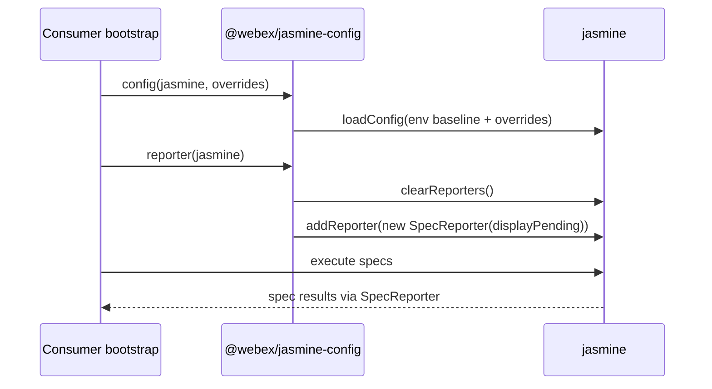
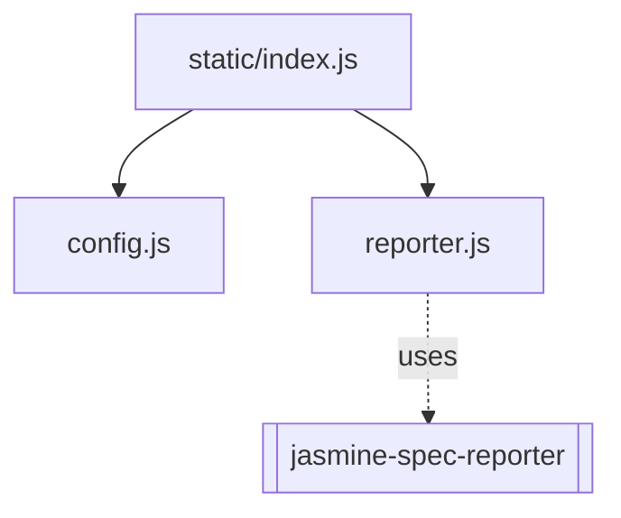

<!-- sdd-generated-metadata
generator: claude-cli
generator_model: us.anthropic.claude-opus-4-8
approved_by: pending-human-review
updated_at: 2026-08-06T00:00:00Z
validation_status: not-run
run_id: 51855eac-8de5-43a2-a3b6-dbcc55ebc91b
-->

# @webex/jasmine-config — SPEC

> Start here → root [`AGENTS.md`](../../../../AGENTS.md) (agent entry) · router [`SPEC_INDEX.md`](../../../../ai-docs/SPEC_INDEX.md) · system [`ARCHITECTURE.md`](../../../../ai-docs/ARCHITECTURE.md). This is the module's canonical spec: orientation, requirements, design, flows, and tests.
> Context-efficiency: link to canonical docs — don't duplicate them. Load specs on demand per `SPEC_INDEX.md`.

## Metadata

| Field | Value |
|---|---|
| Module id | `jasmine` (config/jasmine) |
| Source path(s) | `packages/config/jasmine/static/` |
| Parent spec | `—` (shared workspace test-config package) |
| Doc kind | Module spec |
| Coverage score | Pending coverage assessment |
| Generated from | `module-spec` @ SDLC template library `0.2.2` |
| generated_by / approved_by / updated_at | claude-cli / pending-human-review / 2026-08-06 |
| Validation status | not-run, validator `pending`, assessed 2026-08-06 |

Coverage score is `Pending coverage assessment` until the first coverage review runs. Manifest coverage
state (`Partial`) is authoritative and kept in `.sdd/manifest.json`.

## Evidence Rules
Every requirement cites concrete source evidence using `file path`. This is a configuration package, so
requirements are grounded in `package.json` and the static Jasmine helper modules it ships.

## Source Material Register

| Source material | Scope | Decision | Detail location or disposition |
|---|---|---|---|
| `N/A` | none | none | No pre-existing SDD/AI-docs, architecture, or spec documents were routed to this module; content is derived from `package.json` and the shipped static config. |

## Overview

`@webex/jasmine-config` is the workspace's **shared Jasmine test configuration package**. It ships a
single entry, `static/index.js`, that re-exports two helper functions: `config` (from
`static/config.js`) and `reporter` (from `static/reporter.js`). `config(jasmine, overrides)` calls
`jasmine.loadConfig(...)` with a fixed env baseline plus caller overrides; `reporter(jasmine)` clears
the default reporters and installs a `jasmine-spec-reporter` `SpecReporter`.

It is a code-free-at-runtime config package (no build step): consumers `require` the package inside
their own Jasmine bootstrap and pass their live `jasmine` object into `config` and/or `reporter`. The
package declares `jasmine` (`^4.5.0`) as a peer dependency and bundles `jasmine-spec-reporter`
(`^7.0.0`) as a runtime dependency so the reporter resolves for consumers. A maintainer should start at
`static/index.js` to see the export shape and at `static/config.js` for the env defaults.

## Purpose / Responsibility

Owns the canonical, reusable Jasmine env defaults and spec reporter wiring for the workspace. It does
NOT run Jasmine or define per-package specs — consuming packages call `config`/`reporter` from their own
Jasmine bootstrap and layer their own overrides.

## Stack

JavaScript configuration only (`type: commonjs`). `packageManager: yarn@3.4.1`, `engines` Node `>=18`,
npm `>=8`, yarn `>=3`. `main: ./static/index.js`; only `static/` is published. Runtime `dependencies`:
`jasmine-spec-reporter` (`^7.0.0`). `peerDependencies`: `jasmine` (`^4.5.0`). Dev: `@webex/eslint-config`
(workspace), `eslint` (`^8.35.0`). No source app code, no tests, no build.

## Folder / Package Structure

```
packages/config/jasmine/
├── package.json          # name, main (static/index.js), jasmine peer dep, jasmine-spec-reporter dep
└── static/
    ├── index.js          # Barrel: exports { config, reporter }
    ├── config.js         # config(jasmine, overrides) → jasmine.loadConfig(env baseline + overrides)
    └── reporter.js       # reporter(jasmine) → clearReporters + addReporter(new SpecReporter(...))
```

## Key Files (source of truth)

| File | Holds |
|---|---|
| `packages/config/jasmine/static/config.js` | The canonical Jasmine `env` baseline (`failSpecWithNoExpectations`, `stopSpecOnExpectationFailure`, `stopOnSpecFailure`, `random` all `false`) and the override merge |
| `packages/config/jasmine/static/reporter.js` | The `SpecReporter` wiring (`clearReporters` then `addReporter` with `spec.displayPending: true`) |
| `packages/config/jasmine/package.json` | The `main` entry, the `jasmine` peer floor, and the bundled `jasmine-spec-reporter` dependency |

## Public Surface

Internal Surface — internal use only. Consumed as a shareable Jasmine config helper by other workspace
packages via `require`; it exports two functions, not a network API.

| Contract ID | Type | Surface | Purpose | Compatibility / deprecation | Schema / detail link | Root index |
|---|---|---|---|---|---|---|
| `jasmine.config` | SDK | `require('@webex/jasmine-config').config(jasmine, overrides)` | Apply the shared env baseline via `jasmine.loadConfig`, merging caller overrides last | Changing env defaults affects every consuming test suite | `packages/config/jasmine/static/config.js` | `../../../../ai-docs/CONTRACTS.md` |
| `jasmine.reporter` | SDK | `require('@webex/jasmine-config').reporter(jasmine)` | Clear default reporters and install `jasmine-spec-reporter` with `displayPending` | Reporter output/format changes affect CI log parsing | `packages/config/jasmine/static/reporter.js` | `../../../../ai-docs/CONTRACTS.md` |

Compatibility notes:
- The `{ config, reporter }` export shape and their call signatures are the semver surface. Changing the
  env baseline or reporter is inherited by every consumer that calls these helpers.

## Requires (dependencies)

- `jasmine` (`^4.5.0`, peer) — the test framework whose `loadConfig`/reporter APIs the helpers drive; the
  live `jasmine` object is passed in by the consumer.
- `jasmine-spec-reporter` (`^7.0.0`, bundled dependency) — the `SpecReporter` installed by `reporter`.
- A consumer Jasmine bootstrap that `require`s the package and passes its `jasmine` object into the
  helpers.

## Requirements

| ID | WHAT | WHY | Source Evidence | Test / Example Evidence | Assumptions / Gaps | Confidence |
|---|---|---|---|---|---|---|
| `JASMINE-R-001` | The package exposes a single `main` barrel exporting `{ config, reporter }`, publishing only `static/`. | Give the workspace one canonical import for shared Jasmine env defaults and reporter wiring. | `packages/config/jasmine/static/index.js`, `packages/config/jasmine/package.json` | None (config package) | none identified | PRESENT |
| `JASMINE-R-002` | `config(jasmine, overrides)` calls `jasmine.loadConfig` with the env baseline (`failSpecWithNoExpectations`, `stopSpecOnExpectationFailure`, `stopOnSpecFailure`, `random` all `false`) and spreads `overrides` last. | Provide a consistent, non-random, non-fail-fast test env while still allowing per-suite overrides. | `packages/config/jasmine/static/config.js` | None | Overrides can replace the whole `env` block since they are spread at the top level | PRESENT |
| `JASMINE-R-003` | `reporter(jasmine)` clears existing reporters and adds a `jasmine-spec-reporter` `SpecReporter` configured with `spec.displayPending: true`. | Standardize spec output across suites/CI and surface pending specs. | `packages/config/jasmine/static/reporter.js` | None | Depends on the bundled `jasmine-spec-reporter` resolving | PRESENT |

Env values and reporter options are recorded as configuration facts in `config.js`/`reporter.js`, not
enumerated further as behavioral requirements here.

## Design Overview

The package centralizes Jasmine test env policy behind two small pure-ish helper functions and a barrel.
`config.js` builds the config declaratively — a fixed `env` object with `overrides` spread last so a
consumer can extend or replace defaults. `reporter.js` mutates the passed `jasmine` object: it clears
the default reporters, then registers a single `SpecReporter`. Keeping both concerns as functions that
receive the live `jasmine` object lets the consumer own the Jasmine lifecycle while inheriting shared
defaults.

## Data Flow

```mermaid
flowchart LR
  Boot[Consumer jasmine bootstrap] -->|require| Barrel[static/index.js]
  Barrel --> Config[config.js]
  Barrel --> Reporter[reporter.js]
  Boot -->|config(jasmine, overrides)| Config
  Config -->|loadConfig env+overrides| Jasmine[[jasmine]]
  Boot -->|reporter(jasmine)| Reporter
  Reporter -->|addReporter| Spec[[jasmine-spec-reporter SpecReporter]]
```

## Sequence Diagram(s)

Configuration-only package with one operation group — a consumer wiring Jasmine with the shared helpers.

Sequence coverage:

| Operation group | Diagram | Failure / recovery coverage |
|---|---|---|
| Consumer configures Jasmine | 1. Apply env + reporter | Failure is owned by `jasmine`/`jasmine-spec-reporter` (e.g. invalid override, unresolved reporter), not this package |

### 1. Apply env + reporter



## Class / Component Relationships



No runtime classes — the package relates to consumers as two shared helper functions plus the bundled
reporter.

## Use Cases

- **UC-1 Apply shared env defaults:** a workspace package calls
  `require('@webex/jasmine-config').config(jasmine, overrides)` in its Jasmine bootstrap to inherit the
  non-random, non-fail-fast env. Evidence: `packages/config/jasmine/static/config.js`.
- **UC-2 Standardize spec output:** a package calls `.reporter(jasmine)` to replace the default reporter
  with the shared `SpecReporter`. Evidence: `packages/config/jasmine/static/reporter.js`.

## Module Do's / Don'ts

- DO change shared Jasmine env defaults and reporter wiring here so every consumer inherits the update.
- DON'T fork these defaults into individual packages; pass per-suite `overrides` into `config` instead.

## Pitfalls

- `overrides` are spread at the top level of `loadConfig`, so passing an `env` key in `overrides`
  replaces the entire baseline `env` object rather than merging field-by-field.
- `reporter(jasmine)` calls `clearReporters()` first — any reporter registered before this call is
  removed.
- `jasmine` is a peer dependency, not bundled; a consumer must install a compatible `jasmine` (`^4.5.0`)
  or the helpers have nothing to configure.

## Test-Case Strategy (module)

No executable app code to unit test. Validation is by consumption: assert the barrel `require`s to an
object with `config` and `reporter` functions; call `config` with a fake `jasmine` and assert
`loadConfig` receives the baseline env and that overrides win; call `reporter` with a fake `jasmine` and
assert `clearReporters` then `addReporter` are invoked with a `SpecReporter`.

| Behavior / Requirement | Existing test evidence | Gap |
|---|---|---|
| `JASMINE-R-001` | None found (config-only package) | Add a require-and-shape assertion for the barrel |
| `JASMINE-R-002` | None found | Assert `config` calls `loadConfig` with the env baseline and that overrides are applied last |
| `JASMINE-R-003` | None found | Assert `reporter` clears reporters then adds a `SpecReporter` with `displayPending` |

## Traceability

- Repo architecture: [`ARCHITECTURE.md`](../../../../ai-docs/ARCHITECTURE.md) · Registry: [`SPEC_INDEX.md`](../../../../ai-docs/SPEC_INDEX.md)
- Contracts catalog: [`CONTRACTS.md`](../../../../ai-docs/CONTRACTS.md)
- Coverage state & contracts baseline: `.sdd/manifest.json`
