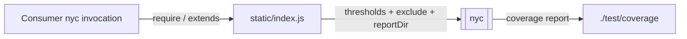
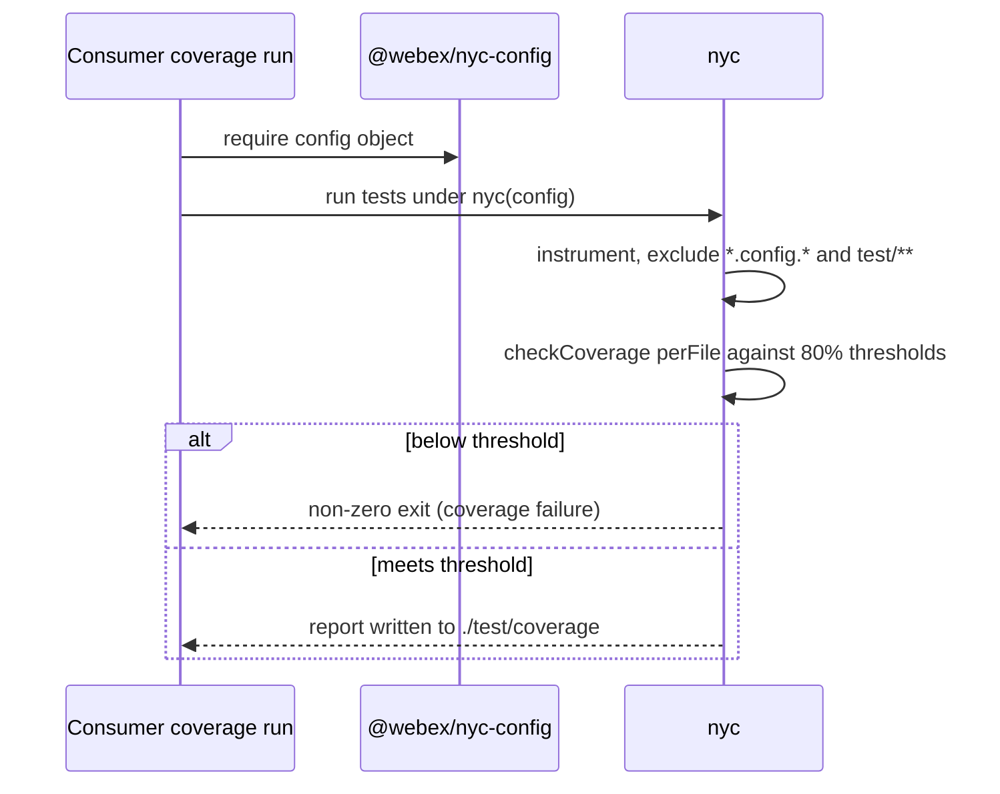
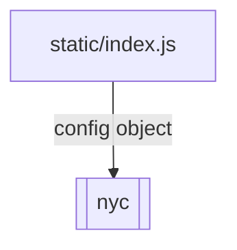

<!-- sdd-generated-metadata
generator: claude-cli
generator_model: us.anthropic.claude-opus-4-8
approved_by: pending-human-review
updated_at: 2026-08-06T00:00:00Z
validation_status: not-run
run_id: 51855eac-8de5-43a2-a3b6-dbcc55ebc91b
-->

# @webex/nyc-config — SPEC

> Start here → root [`AGENTS.md`](../../../../AGENTS.md) (agent entry) · router [`SPEC_INDEX.md`](../../../../ai-docs/SPEC_INDEX.md) · system [`ARCHITECTURE.md`](../../../../ai-docs/ARCHITECTURE.md). This is the module's canonical spec: orientation, requirements, design, flows, and tests.
> Context-efficiency: link to canonical docs — don't duplicate them. Load specs on demand per `SPEC_INDEX.md`.

## Metadata

| Field | Value |
|---|---|
| Module id | `nyc` (config/nyc) |
| Source path(s) | `packages/config/nyc/static/` |
| Parent spec | `—` (shared workspace coverage-config package) |
| Doc kind | Module spec |
| Coverage score | Pending coverage assessment |
| Generated from | `module-spec` @ SDLC template library `0.2.2` |
| generated_by / approved_by / updated_at | claude-cli / pending-human-review / 2026-08-06 |
| Validation status | not-run, validator `pending`, assessed 2026-08-06 |

Coverage score is `Pending coverage assessment` until the first coverage review runs. Manifest coverage
state (`Partial`) is authoritative and kept in `.sdd/manifest.json`.

## Evidence Rules
Every requirement cites concrete source evidence using `file path`. This is a configuration package, so
requirements are grounded in `package.json` and the single static nyc config object it ships.

## Source Material Register

| Source material | Scope | Decision | Detail location or disposition |
|---|---|---|---|
| `N/A` | none | none | No pre-existing SDD/AI-docs, architecture, or spec documents were routed to this module; content is derived from `package.json` and the shipped static config. |

## Overview

`@webex/nyc-config` is the workspace's **shared nyc (Istanbul) coverage configuration package**. It ships
a single entry, `static/index.js`, exporting one plain config object that sets the coverage thresholds
(`branches`, `functions`, `lines`, `statements` all `80`), turns coverage checking on (`checkCoverage`),
enforces the threshold per file (`perFile`), cleans previous data (`clean`), excludes config and test
files, and directs report/temp output under `./test/coverage`.

It is a code-free-at-runtime config package (no build step): consumers point nyc at this config (e.g. via
their nyc config `extends` or by requiring the object). The package declares `nyc` (`^15.1.0`),
`jasmine` (`^4.5.0`), and `@webex/jasmine-config` (workspace) as peer dependencies — it is meant to be
used alongside the shared Jasmine setup. A maintainer should start at `static/index.js` to see the full
threshold and exclude configuration.

## Purpose / Responsibility

Owns the canonical, reusable nyc coverage thresholds and reporting layout for the workspace. It does NOT
run nyc or the test runner — consuming packages apply this config when invoking nyc.

## Stack

JavaScript configuration only (`type: commonjs`). `packageManager: yarn@3.4.1`, `engines` Node `>=18`,
npm `>=8`, yarn `>=3`. `main: ./static/index.js`; only `static/` is published. `peerDependencies`:
`@webex/jasmine-config` (workspace), `jasmine` (`^4.5.0`), `nyc` (`^15.1.0`). Dev: `@webex/eslint-config`
(workspace), `eslint` (`^8.35.0`). No source app code, no tests, no build.

## Folder / Package Structure

```
packages/config/nyc/
├── package.json          # name, main (static/index.js), nyc/jasmine/jasmine-config peer deps
└── static/
    └── index.js          # The nyc config object (thresholds, checkCoverage, perFile, exclude, reportDir)
```

## Key Files (source of truth)

| File | Holds |
|---|---|
| `packages/config/nyc/static/index.js` | The canonical nyc config: `branches/functions/lines/statements: 80`, `checkCoverage`, `clean`, `perFile`, `exclude`, `reportDir: ./test/coverage`, `tempDir: ./test/coverage/temp` |
| `packages/config/nyc/package.json` | The `main` entry and the `nyc`/`jasmine`/`@webex/jasmine-config` peer floors |

## Public Surface

Internal Surface — internal use only. Consumed as a shareable nyc config object by other workspace
packages; it exports a config object, not a runtime API.

| Contract ID | Type | Surface | Purpose | Compatibility / deprecation | Schema / detail link | Root index |
|---|---|---|---|---|---|---|
| `nyc.config` | SDK | `require('@webex/nyc-config')` → nyc config object | Shared coverage thresholds (80% per file), exclude globs, and report/temp output layout | Raising thresholds or changing excludes affects every consuming package's coverage gate | `packages/config/nyc/static/index.js` | `../../../../ai-docs/CONTRACTS.md` |

Compatibility notes:
- The exported config object shape (nyc's schema) is the semver surface. Tightening thresholds or
  narrowing `exclude` is inherited by every consumer and can fail previously-passing coverage runs.

## Requires (dependencies)

- `nyc` (`^15.1.0`, peer) — the coverage tool that consumes this config object.
- `jasmine` (`^4.5.0`, peer) and `@webex/jasmine-config` (workspace, peer) — the shared test setup this
  coverage config is intended to pair with.
- A consumer that applies this config when running nyc.

## Requirements

| ID | WHAT | WHY | Source Evidence | Test / Example Evidence | Assumptions / Gaps | Confidence |
|---|---|---|---|---|---|---|
| `NYC-R-001` | The package exposes a single `main` entry exporting one nyc config object, publishing only `static/`. | Give the workspace one canonical, importable nyc coverage configuration. | `packages/config/nyc/static/index.js`, `packages/config/nyc/package.json` | None (config package) | none identified | PRESENT |
| `NYC-R-002` | The config sets `branches`, `functions`, `lines`, and `statements` to `80` with `checkCoverage: true` and `perFile: true`. | Enforce a consistent 80% per-file coverage gate across the workspace. | `packages/config/nyc/static/index.js` | None | Threshold is a workspace-wide gate; individual packages inherit it | PRESENT |
| `NYC-R-003` | The config excludes `*.config.*` and `**/test/**/*.*`, cleans prior data (`clean: true`), and writes reports to `./test/coverage` (temp under `./test/coverage/temp`). | Keep coverage measured on product code only and standardize the report/temp layout. | `packages/config/nyc/static/index.js` | None | Report/temp paths are relative to the consumer's working directory | PRESENT |

Threshold and path values are recorded as configuration facts in `static/index.js`, not enumerated
further as behavioral requirements here.

## Design Overview

The package centralizes coverage policy in a single exported object so every package inherits the same
thresholds, excludes, and output layout. There is no composition or logic — `static/index.js` defines
the object literal and exports it. Pairing with `@webex/jasmine-config` (declared as a peer) reflects the
intended usage: run Jasmine specs under nyc with these thresholds.

## Data Flow



## Sequence Diagram(s)

Configuration-only package with one operation group — a consumer running nyc with the shared config.

Sequence coverage:

| Operation group | Diagram | Failure / recovery coverage |
|---|---|---|
| Consumer runs coverage | 1. nyc applies config + checks thresholds | Below-threshold failure is raised by `nyc` (checkCoverage), not this package |

### 1. nyc applies config + checks thresholds



## Class / Component Relationships



No runtime classes — the package is a single shared config object consumed by nyc.

## Use Cases

- **UC-1 Enforce shared coverage thresholds:** a workspace package runs its tests under nyc using this
  config to require 80% per-file coverage. Evidence: `packages/config/nyc/static/index.js`.
- **UC-2 Standardize coverage output:** reports land under `./test/coverage` with a consistent temp
  directory across packages. Evidence: `packages/config/nyc/static/index.js`.

## Module Do's / Don'ts

- DO change shared coverage thresholds/excludes here so every consumer's gate moves together.
- DON'T hardcode divergent thresholds per package; inherit this config and justify any exception.

## Pitfalls

- `perFile: true` means the 80% thresholds apply to every file individually, not just the aggregate — a
  single low-coverage file fails the run.
- `reportDir`/`tempDir` are relative (`./test/coverage`), so output location depends on the consumer's
  working directory when nyc runs.
- The `exclude` globs (`*.config.*`, `**/test/**/*.*`) are the only files omitted; new non-product paths
  must be added here or they count against coverage.

## Test-Case Strategy (module)

No executable app code to unit test. Validation is by consumption: assert the export `require`s to an
object whose `branches/functions/lines/statements` equal `80`, `checkCoverage`/`perFile`/`clean` are
`true`, and `exclude`/`reportDir`/`tempDir` match the shipped values; then run nyc against a fixture
package to confirm a below-threshold file fails and output lands under `./test/coverage`.

| Behavior / Requirement | Existing test evidence | Gap |
|---|---|---|
| `NYC-R-001` | None found (config-only package) | Add a require-and-shape assertion for the exported object |
| `NYC-R-002` | None found | Assert all four thresholds are `80` and `checkCoverage`/`perFile` are `true` |
| `NYC-R-003` | None found | Assert the `exclude` globs and `reportDir`/`tempDir` values; verify an under-covered fixture fails |

## Traceability

- Repo architecture: [`ARCHITECTURE.md`](../../../../ai-docs/ARCHITECTURE.md) · Registry: [`SPEC_INDEX.md`](../../../../ai-docs/SPEC_INDEX.md)
- Contracts catalog: [`CONTRACTS.md`](../../../../ai-docs/CONTRACTS.md)
- Coverage state & contracts baseline: `.sdd/manifest.json`
