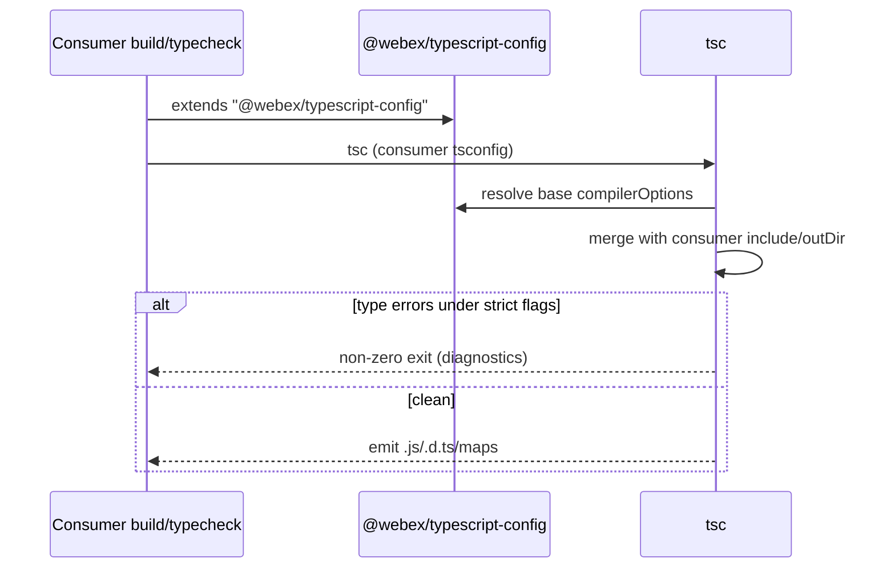
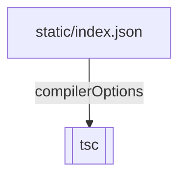

<!-- sdd-generated-metadata
generator: claude-cli
generator_model: us.anthropic.claude-opus-4-8
approved_by: pending-human-review
updated_at: 2026-08-06T00:00:00Z
validation_status: not-run
run_id: 51855eac-8de5-43a2-a3b6-dbcc55ebc91b
-->

# @webex/typescript-config — SPEC

> Start here → root [`AGENTS.md`](../../../../AGENTS.md) (agent entry) · router [`SPEC_INDEX.md`](../../../../ai-docs/SPEC_INDEX.md) · system [`ARCHITECTURE.md`](../../../../ai-docs/ARCHITECTURE.md). This is the module's canonical spec: orientation, requirements, design, flows, and tests.
> Context-efficiency: link to canonical docs — don't duplicate them. Load specs on demand per `SPEC_INDEX.md`.

## Metadata

| Field | Value |
|---|---|
| Module id | `typescript` (config/typescript) |
| Source path(s) | `packages/config/typescript/static/` |
| Parent spec | `—` (shared workspace tsconfig-base package) |
| Doc kind | Module spec |
| Coverage score | Pending coverage assessment |
| Generated from | `module-spec` @ SDLC template library `0.2.2` |
| generated_by / approved_by / updated_at | claude-cli / pending-human-review / 2026-08-06 |
| Validation status | not-run, validator `pending`, assessed 2026-08-06 |

Coverage score is `Pending coverage assessment` until the first coverage review runs. Manifest coverage
state (`Partial`) is authoritative and kept in `.sdd/manifest.json`.

## Evidence Rules
Every requirement cites concrete source evidence using `file path`. This is a configuration package, so
requirements are grounded in `package.json` and the single static `compilerOptions` JSON it ships.

## Source Material Register

| Source material | Scope | Decision | Detail location or disposition |
|---|---|---|---|
| `N/A` | none | none | No pre-existing SDD/AI-docs, architecture, or spec documents were routed to this module; content is derived from `package.json` and the shipped static tsconfig JSON. |

## Overview

`@webex/typescript-config` is the workspace's **shared base TypeScript configuration package**. It ships
a single JSON file, `static/index.json`, exported through the package's `exports["."]` map. The JSON is a
partial tsconfig containing a `compilerOptions` block that turns on `strict` mode, declaration + source
map emission, decorator metadata, and a broad set of `noImplicit*`/`noUnused*` safety flags, targeting
`ES6`/`CommonJS` with `ES2022` + `DOM` libs.

It is a code-free config package (no build step, no runtime code): consuming packages reference this JSON
via `extends` in their own `tsconfig.json`. The package publishes only `static/` and exposes the JSON
through the `.` export. A maintainer should start at `static/index.json` to see the full compiler option
set.

## Purpose / Responsibility

Owns the canonical, reusable base `compilerOptions` for the workspace's TypeScript builds/typechecks. It
does NOT compile code or define per-package `include`/`paths` — consuming `tsconfig.json` files `extend`
this and add their own file globs and output settings.

## Stack

JSON configuration only (`type: commonjs`, but no runtime JS). `packageManager: yarn@3.4.1`, `engines`
Node `>=18`, npm `>=8`, yarn `>=3`. `exports["."]: ./static/index.json`; only `static/` is published. No
dependencies, no tests, no build.

## Folder / Package Structure

```
packages/config/typescript/
├── package.json          # name, exports["."] → static/index.json
└── static/
    └── index.json        # Base compilerOptions (strict, declaration, sourceMap, noImplicit*, target/module/lib)
```

## Key Files (source of truth)

| File | Holds |
|---|---|
| `packages/config/typescript/static/index.json` | The canonical base `compilerOptions` (strict, declaration/declarationMap, source maps, decorators + metadata, `noImplicitAny/Override/Returns/This`, `noUnusedLocals/Parameters`, `target: ES6`, `module: CommonJS`, `lib: [ES2022, DOM]`) |
| `packages/config/typescript/package.json` | The `exports["."]` map that publishes the JSON at the package root import |

## Public Surface

Internal Surface — internal use only. Consumed as a shareable base tsconfig by other workspace packages
via `extends`; it exports a JSON config, not a runtime API.

| Contract ID | Type | Surface | Purpose | Compatibility / deprecation | Schema / detail link | Root index |
|---|---|---|---|---|---|---|
| `typescript.base` | SDK | `"extends": "@webex/typescript-config"` in a consumer `tsconfig.json` | Shared strict base `compilerOptions` for workspace TS compilation/typecheck | Tightening a compiler flag can break previously-compiling consumers | `packages/config/typescript/static/index.json` | `../../../../ai-docs/CONTRACTS.md` |

Compatibility notes:
- The `compilerOptions` in the exported JSON are the semver surface. Enabling a stricter flag (e.g. a new
  `noImplicit*`) is inherited by every consumer that `extends` this base and may surface new type errors.

## Requires (dependencies)

- TypeScript (`tsc`, provided by consuming packages) — the compiler that reads the extended config; this
  package declares no `typescript` dependency itself.
- A consumer `tsconfig.json` that `extends` `@webex/typescript-config` and supplies `include`/`outDir`.

## Requirements

| ID | WHAT | WHY | Source Evidence | Test / Example Evidence | Assumptions / Gaps | Confidence |
|---|---|---|---|---|---|---|
| `TYPESCRIPT-R-001` | The package exposes its base tsconfig JSON via `exports["."] = ./static/index.json`, publishing only `static/`. | Give the workspace one canonical, `extends`-able base TypeScript config. | `packages/config/typescript/package.json`, `packages/config/typescript/static/index.json` | None (config package) | none identified | PRESENT |
| `TYPESCRIPT-R-002` | The base config enables `strict` plus the `noImplicitAny/Override/Returns/This`, `noUnusedLocals`, `noUnusedParameters`, and `noFallthroughCasesInSwitch` safety flags. | Enforce a consistent strict type-safety baseline across all workspace TypeScript. | `packages/config/typescript/static/index.json` | None | Consumers can relax flags by overriding in their own config | PRESENT |
| `TYPESCRIPT-R-003` | The base config emits declarations + declaration maps and source maps, enables decorators (`experimentalDecorators` + `emitDecoratorMetadata`), and targets `ES6`/`CommonJS` with `lib: [ES2022, DOM]`. | Support the workspace's decorator-based plugins, typed consumers, and debuggable output. | `packages/config/typescript/static/index.json` | None | `outDir`/`rootDir` are supplied by each consumer, not the base | PRESENT |

Individual compiler flag values are recorded as configuration facts in `static/index.json`, not
enumerated further as behavioral requirements here.

## Design Overview

The package centralizes TypeScript compiler policy in one JSON file exported at the package root. There
is no logic or composition — `static/index.json` is a partial tsconfig (only `compilerOptions`) that
consumers layer their own `include`, `outDir`, and `rootDir` on top of via `extends`. Keeping only
`compilerOptions` here (no file globs) makes the base reusable across packages with different layouts.

## Data Flow


## Sequence Diagram(s)

Configuration-only package with one operation group — a consumer compiling/typechecking with the
extended base.

Sequence coverage:

| Operation group | Diagram | Failure / recovery coverage |
|---|---|---|
| Consumer compiles TS | 1. tsc resolves extended config + compiles | Type errors from stricter flags are raised by `tsc`, not this package |

### 1. tsc resolves extended config + compiles



## Class / Component Relationships



No runtime classes — the package is a single shared JSON config consumed by `tsc`.

## Use Cases

- **UC-1 Adopt the strict base:** a workspace package `extends "@webex/typescript-config"` in its
  `tsconfig.json` to inherit the strict `compilerOptions`. Evidence:
  `packages/config/typescript/static/index.json`, `packages/config/typescript/package.json`.
- **UC-2 Emit typed, debuggable output:** consumers get `.d.ts` + declaration/source maps and decorator
  metadata without re-specifying those flags. Evidence: `packages/config/typescript/static/index.json`.

## Module Do's / Don'ts

- DO change shared compiler flags here so every consumer's typecheck/build moves together.
- DON'T add `include`/`files`/`outDir` to the base — those are per-consumer and belong in the consuming
  `tsconfig.json`.

## Pitfalls

- Enabling a new strict/`noImplicit*` flag here is inherited by every consumer and can turn a
  previously-compiling package red.
- The base is `compilerOptions`-only; a consumer that forgets its own `include`/`outDir` will not compile
  the intended files or emit to the expected location.
- `target: ES6` + `module: CommonJS` are baked in; a consumer needing ESM output or a newer target must
  override these explicitly.

## Test-Case Strategy (module)

No executable code to unit test. Validation is by consumption: parse `static/index.json` and assert the
key flags (`strict`, the `noImplicit*`/`noUnused*` set, `declaration`, `sourceMap`,
`experimentalDecorators`, `target`, `module`, `lib`) match the shipped values; then compile a fixture
package that `extends` the base to confirm strict diagnostics fire and declarations/maps are emitted.

| Behavior / Requirement | Existing test evidence | Gap |
|---|---|---|
| `TYPESCRIPT-R-001` | None found (config-only package) | Add an assertion that `exports["."]` resolves the JSON and it parses |
| `TYPESCRIPT-R-002` | None found | Assert `strict` and each `noImplicit*`/`noUnused*` flag is enabled |
| `TYPESCRIPT-R-003` | None found | Assert declaration/sourceMap/decorator flags and `target`/`module`/`lib`; compile a fixture |

## Traceability

- Repo architecture: [`ARCHITECTURE.md`](../../../../ai-docs/ARCHITECTURE.md) · Registry: [`SPEC_INDEX.md`](../../../../ai-docs/SPEC_INDEX.md)
- Contracts catalog: [`CONTRACTS.md`](../../../../ai-docs/CONTRACTS.md)
- Coverage state & contracts baseline: `.sdd/manifest.json`
