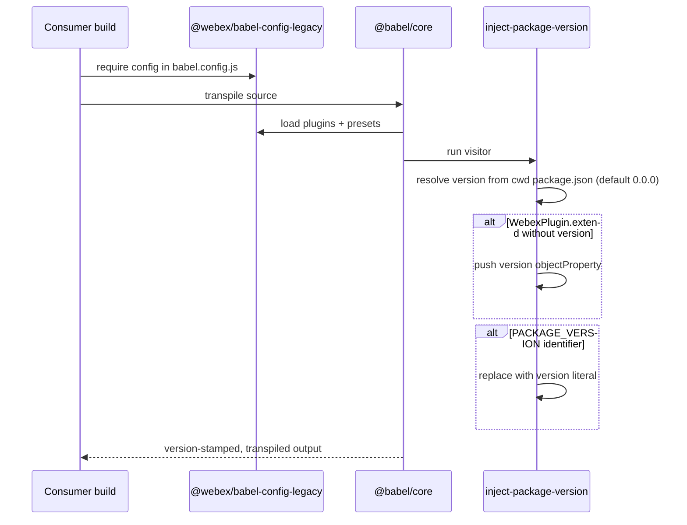

<!-- sdd-generated-metadata
generator: claude-cli
generator_model: us.anthropic.claude-opus-4-8
approved_by: pending-human-review
updated_at: 2026-08-06T00:00:00Z
validation_status: not-run
run_id: 51855eac-8de5-43a2-a3b6-dbcc55ebc91b
-->

# @webex/babel-config-legacy — SPEC

> Start here → root [`AGENTS.md`](../../../../AGENTS.md) (agent entry) · router [`SPEC_INDEX.md`](../../../../ai-docs/SPEC_INDEX.md) · system [`ARCHITECTURE.md`](../../../../ai-docs/ARCHITECTURE.md). This is the module's canonical spec: orientation, requirements, design, flows, and tests.
> Context-efficiency: link to canonical docs — don't duplicate them. Load specs on demand per `SPEC_INDEX.md`.

## Metadata

| Field | Value |
|---|---|
| Module id | `babel` (legacy/babel) |
| Source path(s) | `packages/legacy/babel/static/` |
| Parent spec | `—` (shared legacy Babel-config package) |
| Doc kind | Module spec |
| Coverage score | Pending coverage assessment |
| Generated from | `module-spec` @ SDLC template library `0.2.2` |
| generated_by / approved_by / updated_at | claude-cli / pending-human-review / 2026-08-06 |
| Validation status | not-run, validator `pending`, assessed 2026-08-06 |

Coverage score is `Pending coverage assessment` until the first coverage review runs. Manifest coverage
state (`Partial`) is authoritative and kept in `.sdd/manifest.json`.

## Evidence Rules
Every requirement cites concrete source evidence using `file path`. This is a configuration/tooling
package, so requirements are grounded in `package.json` and the static Babel config plus the shipped
plugin.

## Source Material Register

| Source material | Scope | Decision | Detail location or disposition |
|---|---|---|---|
| `N/A` | none | none | No pre-existing SDD/AI-docs, architecture, or spec documents were routed to this module; content is derived from `package.json` and the shipped static config/plugin. |

## Overview

`@webex/babel-config-legacy` is the workspace's **shared Babel configuration package for legacy
packages**. Its `main`/`.` export, `static/index.js`, is a Babel config object that composes a plugin
list (runtime with corejs 2, legacy decorators, class properties, the package's own
`inject-package-version` transform, several proposal/syntax plugins) and presets (`@babel/preset-env`
with an explicit browserslist target list plus `maintained node versions`, and
`@babel/preset-typescript`), with `sourceMaps: true`.

It also ships a second subpath export, `./inject-package-version`
(`static/plugins/inject-package-version.js`) — a custom Babel plugin that reads the consuming package's
`package.json` version and (a) adds a `version` property to every `WebexPlugin.extend(...)` call that
lacks one and (b) replaces the `PACKAGE_VERSION` identifier with the version string.

It is a code-free-at-build config package (no build step): consumers `require` it from their own
`babel.config.js`. `@babel/core` is a peer dependency; the many `@babel/*` transforms/presets it composes
are bundled as `dependencies`. A maintainer should start at `static/index.js` for the composition and at
`static/plugins/inject-package-version.js` for the custom transform.

## Purpose / Responsibility

Owns the canonical, reusable Babel config (plugins + presets + the version-injection transform) for the
workspace's legacy packages. It does NOT run Babel — consuming legacy packages `require` this config from
their own `babel.config.js`.

## Stack

JavaScript configuration + one Babel plugin (`type: commonjs`). `packageManager: yarn@3.4.1`, `engines`
Node `>=18`, npm `>=8`, yarn `>=3`. Exports: `.` → `static/index.js`, `./inject-package-version` →
`static/plugins/inject-package-version.js`; only `static/` is published. Peer: `@babel/core`
(`^7.17.10`). Bundled `@babel/*` transforms/presets/proposals plus `babel-plugin-lodash`,
`babel-plugin-module-resolver`, `babelify`. No tests, no build.

## Folder / Package Structure

```
packages/legacy/babel/
├── package.json          # name, exports (., ./inject-package-version), bundled @babel/* deps, @babel/core peer
└── static/
    ├── index.js          # Babel config: plugins list + presets (preset-env targets, preset-typescript) + sourceMaps
    └── plugins/
        └── inject-package-version.js  # Custom transform: adds version to WebexPlugin.extend + replaces PACKAGE_VERSION
```

## Key Files (source of truth)

| File | Holds |
|---|---|
| `packages/legacy/babel/static/index.js` | The composed legacy Babel config: the plugin list (runtime/corejs2, legacy decorators, class properties, `inject-package-version`, transform-classes, proposals, async-generators) and presets (`@babel/preset-env` targets, `@babel/preset-typescript`), `sourceMaps: true` |
| `packages/legacy/babel/static/plugins/inject-package-version.js` | The custom Babel visitor that injects `version` into `WebexPlugin.extend(...)` and replaces the `PACKAGE_VERSION` identifier |
| `packages/legacy/babel/package.json` | The `exports` subpaths, bundled `@babel/*` deps, and the `@babel/core` peer floor |

## Public Surface

Internal Surface — internal use only. Consumed as a shareable Babel config and plugin by other workspace
packages via `require`; it exports a config object and a Babel plugin factory, not a network API.

| Contract ID | Type | Surface | Purpose | Compatibility / deprecation | Schema / detail link | Root index |
|---|---|---|---|---|---|---|
| `babel.config` | SDK | `require('@webex/babel-config-legacy')` → Babel config object | Shared legacy plugin/preset composition (proposals, decorators, preset-env targets, preset-typescript) | Adding/removing a plugin or changing preset-env targets affects every legacy build's output | `packages/legacy/babel/static/index.js` | `../../../../ai-docs/CONTRACTS.md` |
| `babel.inject-package-version` | SDK | `require('@webex/babel-config-legacy/inject-package-version')` → Babel plugin | Inject the package `version` into `WebexPlugin.extend(...)` and replace `PACKAGE_VERSION` | Changing detection (callee/identifier names) affects version stamping across plugins | `packages/legacy/babel/static/plugins/inject-package-version.js` | `../../../../ai-docs/CONTRACTS.md` |

Compatibility notes:
- The exported config object and the `./inject-package-version` plugin are the semver surface. Plugin/
  preset list changes are inherited by every consuming legacy build.

## Requires (dependencies)

- `@babel/core` (`^7.17.10`, peer) — the Babel engine that loads this config in a consuming package.
- Bundled `@babel/*` plugins/presets/proposals plus `babel-plugin-lodash`, `babel-plugin-module-resolver`,
  `babelify` — resolved by this package so the shared config's plugins are available to consumers.
- A consumer `babel.config.js` that `require`s this package.

## Requirements

| ID | WHAT | WHY | Source Evidence | Test / Example Evidence | Assumptions / Gaps | Confidence |
|---|---|---|---|---|---|---|
| `BABEL-R-001` | The package exports a Babel config object at `.` and the `inject-package-version` plugin at `./inject-package-version`, publishing only `static/`. | Give the workspace's legacy packages one canonical Babel config plus the shared version-injection plugin. | `packages/legacy/babel/package.json`, `packages/legacy/babel/static/index.js` | None (config package) | none identified | PRESENT |
| `BABEL-R-002` | The config composes the legacy plugin list (runtime with `corejs: 2`, legacy decorators, class properties, `inject-package-version`, transform-classes, export/nullish/spread/optional-chaining/async-generator proposals) and presets (`@babel/preset-env` with the explicit browserslist targets + `@babel/preset-typescript`), with `sourceMaps: true`. | Transpile legacy TS/JS to the supported browser/node target matrix consistently. | `packages/legacy/babel/static/index.js` | None | Plugin/preset order matters and is fixed in the config | PRESENT |
| `BABEL-R-003` | `inject-package-version` reads the consuming package's `package.json` version (default `0.0.0`), pushes a `version` object property onto any `WebexPlugin.extend(...)` argument lacking one, and replaces the `PACKAGE_VERSION` identifier with the version literal. | Ensure every `WebexPlugin`/`WebexCore` and `PACKAGE_VERSION` reference carries the correct build version. | `packages/legacy/babel/static/plugins/inject-package-version.js` | None | Version is resolved from `process.cwd()/package.json` at transform time | PRESENT |

Individual plugin/preset options are recorded as configuration facts in `static/index.js`, not
enumerated further as behavioral requirements here.

## Design Overview

The package centralizes legacy Babel policy in one config object plus a small custom transform.
`static/index.js` declares the plugin list and presets in a fixed order — the `inject-package-version`
plugin runs alongside the standard transforms so version stamping happens during the same pass.
`inject-package-version.js` resolves the version once (from the consumer's `package.json` at
`process.cwd()`) and exposes a Babel `visitor` with `CallExpression` (for `WebexPlugin.extend`) and
`Identifier` (for `PACKAGE_VERSION`) handlers. Because the `@babel/*` plugins are bundled as
`dependencies`, a consumer only needs `@babel/core` and a `babel.config.js` that requires this package.

## Data Flow

```mermaid
flowchart LR
  Consumer[Consumer babel.config.js] -->|require| Cfg[static/index.js]
  Cfg -->|plugins + presets| Babel[[@babel/core]]
  Cfg -->|inject-package-version| Plugin[inject-package-version.js]
  Plugin -->|read version| Pkg[consumer package.json]
  Babel -->|transpiled + version-stamped code| Out[Consumer output]
```

## Sequence Diagram(s)

Tooling package with one primary operation group — a consumer transpiling with the shared config,
including the version-injection transform's two AST branches.

Sequence coverage:

| Operation group | Diagram | Failure / recovery coverage |
|---|---|---|
| Consumer transpiles with config | 1. Babel loads config + runs version injection | Missing consumer `package.json` → version defaults to `0.0.0`; other failures owned by `@babel/core` |

### 1. Babel loads config + runs version injection



## Class / Component Relationships

```mermaid
flowchart TB
  Index[static/index.js config] -->|references plugin| Inj[inject-package-version.js]
  Index -->|plugins/presets| Babel[[@babel/core]]
  Inj -->|@babel/types AST| Babel
```

No runtime app classes — the package relates to consumers as a shared Babel config object plus one plugin
factory that returns a `visitor`.

## Use Cases

- **UC-1 Transpile a legacy package:** a legacy package `require`s this config in `babel.config.js` to
  inherit the shared plugin/preset matrix. Evidence: `packages/legacy/babel/static/index.js`,
  `packages/legacy/babel/package.json`.
- **UC-2 Stamp the build version:** during transpile, `inject-package-version` fills `version` on
  `WebexPlugin.extend(...)` and inlines `PACKAGE_VERSION`. Evidence:
  `packages/legacy/babel/static/plugins/inject-package-version.js`.

## Module Do's / Don'ts

- DO change the shared plugin/preset list here so every legacy build transpiles consistently.
- DON'T fork the version-injection logic; import `./inject-package-version` so version stamping stays
  uniform.

## Pitfalls

- `inject-package-version` resolves the version from `process.cwd()/package.json`; running Babel from an
  unexpected working directory can stamp the wrong version or fall back to `0.0.0`.
- The plugin only augments `WebexPlugin.extend(...)` calls detected as a member expression with that
  exact object/property naming — renamed wrappers won't be stamped.
- `@babel/core` is a peer, not bundled; a consumer must install a compatible `@babel/core` (`^7.17.10`).
- Preset/plugin order is significant; reordering entries in `static/index.js` can change transform output.

## Test-Case Strategy (module)

Validation combines shape checks and transform tests. Assert `require('@webex/babel-config-legacy')`
returns a config with the expected `plugins`/`presets` and `sourceMaps: true`, and that
`./inject-package-version` returns a plugin exposing a `visitor`. For the transform, run Babel over
fixtures: a `WebexPlugin.extend({...})` without `version` gains it; one that already has `version` is
untouched (negative case); a `PACKAGE_VERSION` reference is replaced with the version literal; and a
missing `package.json` yields `0.0.0`.

| Behavior / Requirement | Existing test evidence | Gap |
|---|---|---|
| `BABEL-R-001` | None found (config-only package) | Add require-and-shape assertions for both exports |
| `BABEL-R-002` | None found | Assert the plugin/preset list and preset-env targets match the shipped config |
| `BABEL-R-003` | None found | Transform fixtures: version added/left-intact, `PACKAGE_VERSION` replaced, default `0.0.0` |

## Traceability

- Repo architecture: [`ARCHITECTURE.md`](../../../../ai-docs/ARCHITECTURE.md) · Registry: [`SPEC_INDEX.md`](../../../../ai-docs/SPEC_INDEX.md)
- Contracts catalog: [`CONTRACTS.md`](../../../../ai-docs/CONTRACTS.md)
- Coverage state & contracts baseline: `.sdd/manifest.json`
