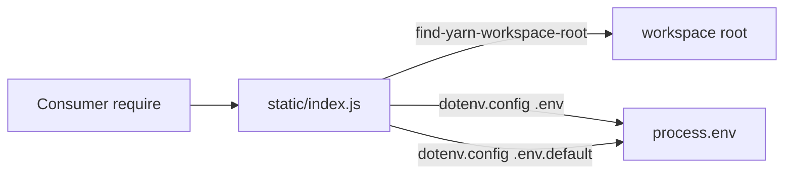
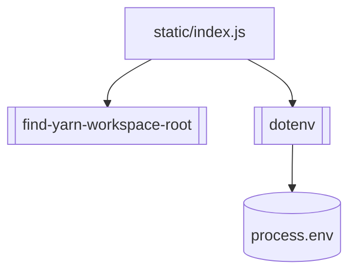

<!-- sdd-generated-metadata
generator: claude-cli
generator_model: us.anthropic.claude-opus-4-8
approved_by: pending-human-review
updated_at: 2026-08-06T00:00:00Z
validation_status: not-run
run_id: 51855eac-8de5-43a2-a3b6-dbcc55ebc91b
-->

# @webex/env-config-legacy — SPEC

> Start here → root [`AGENTS.md`](../../../../AGENTS.md) (agent entry) · router [`SPEC_INDEX.md`](../../../../ai-docs/SPEC_INDEX.md) · system [`ARCHITECTURE.md`](../../../../ai-docs/ARCHITECTURE.md). This is the module's canonical spec: orientation, requirements, design, flows, and tests.
> Context-efficiency: link to canonical docs — don't duplicate them. Load specs on demand per `SPEC_INDEX.md`.

## Metadata

| Field | Value |
|---|---|
| Module id | `env` (legacy/env) |
| Source path(s) | `packages/legacy/env/static/` |
| Parent spec | `—` (shared legacy environment-config package) |
| Doc kind | Module spec |
| Coverage score | Pending coverage assessment |
| Generated from | `module-spec` @ SDLC template library `0.2.2` |
| generated_by / approved_by / updated_at | claude-cli / pending-human-review / 2026-08-06 |
| Validation status | not-run, validator `pending`, assessed 2026-08-06 |

Coverage score is `Pending coverage assessment` until the first coverage review runs. Manifest coverage
state (`Partial`) is authoritative and kept in `.sdd/manifest.json`.

## Evidence Rules
Every requirement cites concrete source evidence using `file path`. This is a small tooling package, so
requirements are grounded in `package.json` and the single static loader module.

## Source Material Register

| Source material | Scope | Decision | Detail location or disposition |
|---|---|---|---|
| `N/A` | none | none | No pre-existing SDD/AI-docs, architecture, or spec documents were routed to this module; content is derived from `package.json` and the shipped static loader. |

## Overview

`@webex/env-config-legacy` is the workspace's **shared environment-variable loader for legacy packages**.
Its single entry, `static/index.js`, resolves the yarn workspace root via `find-yarn-workspace-root`,
then calls `dotenv`'s `config()` twice: first for `${root}/.env`, then for `${root}/.env.default`. The
module runs its side effects at import time — `require`ing the package loads both env files into
`process.env`.

It is a tiny side-effecting module (no build step, no exported API): consumers `require` or `import` it
early (e.g. at the top of a test runner) so environment variables are populated before other code reads
them. It bundles `dotenv` (`^16.0.3`) and `find-yarn-workspace-root` (`^2.0.0`) as runtime dependencies.

## Purpose / Responsibility

Owns loading the workspace-root `.env` and `.env.default` files into `process.env` for legacy packages.
It does NOT define which variables exist or validate them — it only loads the two files, in order, from
the resolved workspace root.

## Stack

JavaScript module with import-time side effects (`type: commonjs`). `packageManager: yarn@3.4.1`,
`engines` Node `>=18`, npm `>=8`, yarn `>=3`. `main: ./static/index.js`; only `static/` is published.
Runtime `dependencies`: `dotenv` (`^16.0.3`), `find-yarn-workspace-root` (`^2.0.0`). No tests, no build.

## Folder / Package Structure

```
packages/legacy/env/
├── package.json          # name, main (static/index.js), dotenv + find-yarn-workspace-root deps
└── static/
    └── index.js          # Resolves workspace root, dotenv.config(.env) then dotenv.config(.env.default)
```

## Key Files (source of truth)

| File | Holds |
|---|---|
| `packages/legacy/env/static/index.js` | The load order: resolve workspace root, then `config({path: root/.env})` followed by `config({path: root/.env.default})` |
| `packages/legacy/env/package.json` | The `main` entry and the `dotenv` / `find-yarn-workspace-root` dependencies |

## Public Surface

Internal Surface — internal use only. Consumed for its import-time side effect (loading env files); it
exports no API.

| Contract ID | Type | Surface | Purpose | Compatibility / deprecation | Schema / detail link | Root index |
|---|---|---|---|---|---|---|
| `env.load` | SDK | `require('@webex/env-config-legacy')` (side effect) | Load `${workspaceRoot}/.env` then `${workspaceRoot}/.env.default` into `process.env` | Changing file order/paths affects which values win in every consumer | `packages/legacy/env/static/index.js` | `../../../../ai-docs/CONTRACTS.md` |

Compatibility notes:
- The import-time side effect and the two-file load order are the semver surface. Consumers rely on the
  variables being present after `require`, and on `.env` winning over `.env.default` (dotenv does not
  overwrite already-set keys).

## Requires (dependencies)

- `dotenv` (`^16.0.3`) — parses and loads the `.env` files into `process.env`.
- `find-yarn-workspace-root` (`^2.0.0`) — resolves the workspace root the `.env` files live in.
- A workspace with `.env` and/or `.env.default` at its root (files may be absent; dotenv is a no-op then).

## Requirements

| ID | WHAT | WHY | Source Evidence | Test / Example Evidence | Assumptions / Gaps | Confidence |
|---|---|---|---|---|---|---|
| `ENV-R-001` | The package's `main` module loads env at import time (side effect) and exports no API, publishing only `static/`. | Let legacy code populate `process.env` simply by requiring the package early. | `packages/legacy/env/static/index.js`, `packages/legacy/env/package.json` | None (side-effect module) | none identified | PRESENT |
| `ENV-R-002` | It resolves the yarn workspace root via `find-yarn-workspace-root`, then calls `dotenv.config` for `${root}/.env` and `${root}/.env.default`, in that order. | Load workspace-level env consistently regardless of the consumer's package directory, with `.env` taking precedence. | `packages/legacy/env/static/index.js` | None | dotenv does not overwrite variables already set in `process.env`, so `.env` (loaded first) wins over `.env.default` | PRESENT |

## Design Overview

The module is intentionally minimal: it centralizes "load the workspace `.env` files" so every legacy
consumer does it identically. It resolves the workspace root once, then loads `.env` before
`.env.default`. Because `dotenv` does not overwrite keys already present in `process.env`, values in
`.env` take precedence over the defaults, and real environment variables take precedence over both. All
work happens as an import-time side effect, so ordering (require it early) is the only usage contract.

## Data Flow



## Sequence Diagram(s)

Side-effect module with one operation group — loading env at import.

Sequence coverage:

| Operation group | Diagram | Failure / recovery coverage |
|---|---|---|
| Load env on import | 1. Resolve root + load two files | `find-yarn-workspace-root` throwing when no workspace is found; missing `.env` files are a dotenv no-op |

### 1. Resolve root + load two files

```mermaid
sequenceDiagram
    participant Dev as Consumer (require early)
    participant Env as @webex/env-config-legacy
    participant WS as find-yarn-workspace-root
    participant DE as dotenv
    participant P as process.env

    Dev->>Env: require('@webex/env-config-legacy')
    Env->>WS: resolve workspace root
    WS-->>Env: root path
    Env->>DE: config({path: root/.env})
    DE->>P: set unset keys from .env
    Env->>DE: config({path: root/.env.default})
    DE->>P: set still-unset keys from .env.default
    Env-->>Dev: (env populated; no export)
```

## Class / Component Relationships



No runtime classes — the module composes two libraries to produce an import-time side effect.

## Use Cases

- **UC-1 Populate env for legacy tooling:** a legacy test runner or build script `require`s this package
  first so `process.env` is populated from the workspace `.env`/`.env.default`. Evidence:
  `packages/legacy/env/static/index.js` (imported, e.g., by `@webex/legacy-tools` Karma/Mocha runners).

## Module Do's / Don'ts

- DO require this module early, before any code that reads the affected `process.env` variables.
- DON'T rely on `.env.default` to override a value in `.env` — the first-loaded `.env` wins because dotenv
  never overwrites already-set keys.

## Pitfalls

- Load order matters: `.env` is loaded before `.env.default`, and dotenv does not overwrite existing keys,
  so defaults only fill gaps.
- `find-yarn-workspace-root` throws/returns based on locating the workspace; running outside a workspace
  can change or break root resolution.
- Effects happen at import time — importing lazily (after code has already read env) misses the values.

## Test-Case Strategy (module)

Validation is by behavior around the side effect: with a fixture workspace containing `.env` and
`.env.default`, require the module and assert that keys from `.env` are present and that a key defined in
both resolves to the `.env` value (precedence). A negative case: with no `.env` files, requiring the
module does not throw and leaves unrelated `process.env` untouched.

| Behavior / Requirement | Existing test evidence | Gap |
|---|---|---|
| `ENV-R-001` | None found | Assert requiring the module loads env and exports nothing meaningful |
| `ENV-R-002` | None found | Assert `.env` precedence over `.env.default` and root resolution via a fixture workspace |

## Traceability

- Repo architecture: [`ARCHITECTURE.md`](../../../../ai-docs/ARCHITECTURE.md) · Registry: [`SPEC_INDEX.md`](../../../../ai-docs/SPEC_INDEX.md)
- Contracts catalog: [`CONTRACTS.md`](../../../../ai-docs/CONTRACTS.md)
- Coverage state & contracts baseline: `.sdd/manifest.json`
