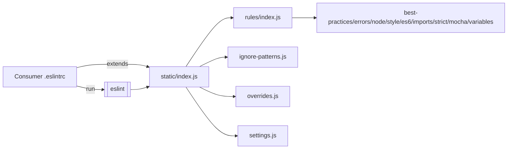
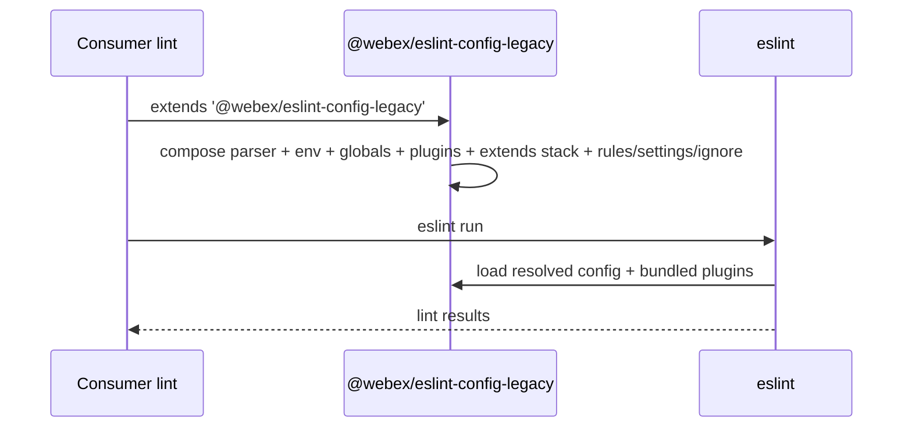
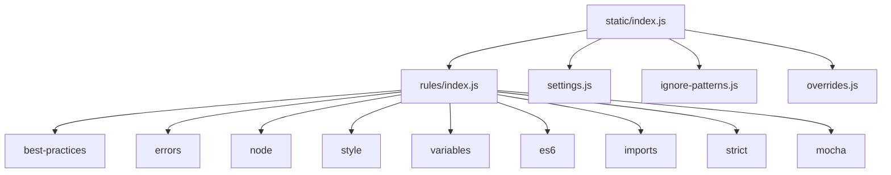

<!-- sdd-generated-metadata
generator: claude-cli
generator_model: us.anthropic.claude-opus-4-8
approved_by: pending-human-review
updated_at: 2026-08-06T00:00:00Z
validation_status: not-run
run_id: 51855eac-8de5-43a2-a3b6-dbcc55ebc91b
-->

# @webex/eslint-config-legacy — SPEC

> Start here → root [`AGENTS.md`](../../../../AGENTS.md) (agent entry) · router [`SPEC_INDEX.md`](../../../../ai-docs/SPEC_INDEX.md) · system [`ARCHITECTURE.md`](../../../../ai-docs/ARCHITECTURE.md). This is the module's canonical spec: orientation, requirements, design, flows, and tests.
> Context-efficiency: link to canonical docs — don't duplicate them. Load specs on demand per `SPEC_INDEX.md`.

## Metadata

| Field | Value |
|---|---|
| Module id | `eslint` (legacy/eslint) |
| Source path(s) | `packages/legacy/eslint/static/` |
| Parent spec | `—` (shared legacy ESLint-config package) |
| Doc kind | Module spec |
| Coverage score | Pending coverage assessment |
| Generated from | `module-spec` @ SDLC template library `0.2.2` |
| generated_by / approved_by / updated_at | claude-cli / pending-human-review / 2026-08-06 |
| Validation status | not-run, validator `pending`, assessed 2026-08-06 |

Coverage score is `Pending coverage assessment` until the first coverage review runs. Manifest coverage
state (`Partial`) is authoritative and kept in `.sdd/manifest.json`.

## Evidence Rules
Every requirement cites concrete source evidence using `file path`. This is a configuration package, so
requirements are grounded in `package.json` and the static ESLint config modules it ships.

## Source Material Register

| Source material | Scope | Decision | Detail location or disposition |
|---|---|---|---|
| `N/A` | none | none | No pre-existing SDD/AI-docs, architecture, or spec documents were routed to this module; content is derived from `package.json` and the shipped static config modules. |

## Overview

`@webex/eslint-config-legacy` is the workspace's **shared ESLint configuration package for legacy
packages**. Its `main`, `static/index.js`, exports a root ESLint config that uses the
`@babel/eslint-parser`, enables the browser/node/jest envs, declares `PACKAGE_VERSION` and `WebSocket`
globals, registers the `import`, `tsdoc`, `jest`, `prettier`, and `chai-friendly` plugins, and `extends`
a stack of `eslint:recommended`, the package's own `./rules/index.js`, `airbnb-base`, the import
typescript/recommended configs, and `plugin:prettier/recommended`. It also composes `ignorePatterns`,
`overrides`, `rules`, and `settings` from sibling static modules.

The `./rules/index.js` sub-config `extends` a set of concern-specific rule files (`best-practices`,
`errors`, `node`, `style`, `variables`, `es6`, `imports`, `strict`, `mocha`) and turns `strict` on;
`settings.js` wires the import resolver (node + typescript, `src` paths) and `ignore-patterns.js` lists
build/dist/docs/test and decorator-file exclusions.

It is a code-free-at-runtime config package (no build step): consumers `extends` this config from their
own ESLint config. Bundled `dependencies` include the airbnb-base config, the TypeScript ESLint plugin/
parser, and the import/jest/mocha/prettier/tsdoc/json/chai-friendly plugins; `eslint`, `@babel/core`, and
`prettier` are peer dependencies. A maintainer should start at `static/index.js` for the composition and
at `static/rules/index.js` for the rule set.

## Purpose / Responsibility

Owns the canonical, reusable ESLint configuration for the workspace's legacy packages (airbnb-base +
prettier + the concern-specific rule set, with legacy globals and ignore patterns). It does NOT run
ESLint or define per-package overrides beyond the shared `overrides` module — consuming packages
`extends` this and layer their own.

## Stack

JavaScript configuration only (`type: commonjs`). `packageManager: yarn@3.4.1`, `engines` Node `>=18`,
npm `>=8`, yarn `>=3`. `main: ./static/index.js`; only `static/` is published. Bundled `dependencies`:
`@babel/eslint-parser`, `@typescript-eslint/eslint-plugin` & `parser` (`^5.38.1`),
`eslint-config-airbnb-base` (`^15`), `eslint-config-prettier`, `eslint-import-resolver-typescript`,
`eslint-plugin-chai-friendly`, `eslint-plugin-import`, `eslint-plugin-jest`, `eslint-plugin-json`,
`eslint-plugin-mocha`, `eslint-plugin-prettier`, `eslint-plugin-tsdoc`. Peer: `@babel/core`
(`^7.17.10`), `eslint` (`^8.24.0`), `prettier` (`^2.7.1`). No source app code, no tests, no build.

## Folder / Package Structure

```
packages/legacy/eslint/
├── package.json          # name, main (static/index.js), bundled plugin deps, eslint/babel/prettier peers
└── static/
    ├── index.js          # Root config: parser, env, globals, plugins, extends stack, ignorePatterns/overrides/rules/settings
    ├── ignore-patterns.js# Build/dist/docs/test + decorator-file ignore globs
    ├── overrides.js      # File-scoped rule overrides
    ├── rules.js          # Top-level rule overrides applied on the root config
    ├── settings.js       # import/core-modules + import/resolver (node + typescript, src paths)
    └── rules/
        ├── index.js      # extends best-practices/errors/node/style/variables/es6/imports/strict/mocha; strict: error
        └── best-practices.js / errors.js / node.js / style.js / variables.js / es6.js / imports.js / strict.js / mocha.js
```

## Key Files (source of truth)

| File | Holds |
|---|---|
| `packages/legacy/eslint/static/index.js` | The root config: `@babel/eslint-parser`, browser/node/jest env, `PACKAGE_VERSION`/`WebSocket` globals, plugin list, the `extends` stack, and the composed `ignorePatterns`/`overrides`/`rules`/`settings` |
| `packages/legacy/eslint/static/rules/index.js` | The canonical concern-split rule set and `strict: 'error'` (do not fork rules elsewhere) |
| `packages/legacy/eslint/static/settings.js` | The import resolver settings (`import/core-modules`, node + typescript resolver, `src` paths) |
| `packages/legacy/eslint/static/ignore-patterns.js` | The build/dist/docs/test and decorator-file ignore globs |
| `packages/legacy/eslint/package.json` | The `main` entry, bundled plugin `dependencies`, and the `eslint`/`@babel/core`/`prettier` peer floors |

## Public Surface

Internal Surface — internal use only. Consumed as a shareable ESLint config by other workspace packages
via `extends`; it exports a config object, not a runtime API.

| Contract ID | Type | Surface | Purpose | Compatibility / deprecation | Schema / detail link | Root index |
|---|---|---|---|---|---|---|
| `eslint.config` | SDK | `require('@webex/eslint-config-legacy')` / `extends` in a consumer config | Root legacy ESLint config (babel parser, airbnb-base + prettier + concern-split rules, legacy globals, ignore patterns) | Rule/plugin changes affect every consuming legacy package | `packages/legacy/eslint/static/index.js` | `../../../../ai-docs/CONTRACTS.md` |

Compatibility notes:
- The exported root config (its `extends` stack, plugins, rules, and settings) is the semver surface.
  Tightening a rule or adding a plugin is inherited by every consumer and can turn lint-clean packages
  red.

## Requires (dependencies)

- `eslint` (`^8.24.0`, peer), `@babel/core` (`^7.17.10`, peer), `prettier` (`^2.7.1`, peer) — the linter,
  the parser's Babel core, and the formatter the config integrates with.
- Bundled plugin/config deps resolved by this config: airbnb-base, `@typescript-eslint/*`, the import
  resolver + plugin, chai-friendly, jest, json, mocha, prettier, tsdoc.
- A consumer ESLint config that `extends` this package.

## Requirements

| ID | WHAT | WHY | Source Evidence | Test / Example Evidence | Assumptions / Gaps | Confidence |
|---|---|---|---|---|---|---|
| `ESLINT-R-001` | The package exposes a single `main` root config (`root: true`) and publishes only `static/`. | Give the workspace's legacy packages one canonical, `extends`-able ESLint config. | `packages/legacy/eslint/static/index.js`, `packages/legacy/eslint/package.json` | None (config package) | none identified | PRESENT |
| `ESLINT-R-002` | The root config sets the `@babel/eslint-parser`, browser/node/jest envs, the `PACKAGE_VERSION`/`WebSocket` globals, the plugin list (`import`, `tsdoc`, `jest`, `prettier`, `chai-friendly`), and the `extends` stack (`eslint:recommended`, `./rules/index.js`, `airbnb-base`, `plugin:import/typescript`, `plugin:import/recommended`, `plugin:prettier/recommended`). | Lint legacy JS/TS with a consistent airbnb-base + prettier baseline and the workspace's legacy globals. | `packages/legacy/eslint/static/index.js` | None | Rule bodies live in the `rules/` modules | PRESENT |
| `ESLINT-R-003` | It composes `ignorePatterns`, `overrides`, `rules`, and `settings` from sibling modules — including the import resolver settings (node + typescript, `src` paths) and the build/dist/docs/test + decorator-file ignore globs. | Keep ignore/override/resolver policy centralized and consistent across legacy consumers. | `packages/legacy/eslint/static/settings.js`, `packages/legacy/eslint/static/ignore-patterns.js`, `packages/legacy/eslint/static/rules/index.js` | None | Concern-split rule files hold the detailed rules | PRESENT |

Rule contents, ignore globs, and resolver values are recorded as configuration facts in the sibling
static modules, not enumerated further as behavioral requirements here.

## Design Overview

The package centralizes legacy lint policy behind one root config that composes concern-specific
modules. `index.js` sets the parser, envs, globals, and plugins, then `extends` a stack that layers
`eslint:recommended`, the package's own concern-split `rules/index.js`, `airbnb-base`, the import configs,
and prettier. Splitting rules into `best-practices`/`errors`/`node`/`style`/`variables`/`es6`/`imports`/
`strict`/`mocha` lets each concern evolve independently while `strict: 'error'` is enforced. Because the
plugins are bundled as `dependencies`, a consumer only installs the `eslint`/`@babel/core`/`prettier`
peers and `extends` the package.

## Data Flow



## Sequence Diagram(s)

Configuration-only package with one operation group — a lint run consuming the config.

Sequence coverage:

| Operation group | Diagram | Failure / recovery coverage |
|---|---|---|
| Consumer lints with shared config | 1. ESLint resolves + runs config | Failure (unresolved plugin, missing peer) is owned by `eslint`/plugins, not this package |

### 1. ESLint resolves + runs config



## Class / Component Relationships



No runtime classes — the package relates to consumers as a shared config module tree plus bundled
plugins.

## Use Cases

- **UC-1 Adopt the legacy lint config:** a legacy package `extends '@webex/eslint-config-legacy'` in its
  ESLint config to inherit the airbnb-base + prettier + concern-split rules. Evidence:
  `packages/legacy/eslint/static/index.js`, `packages/legacy/eslint/package.json`.
- **UC-2 Resolve TS/`src` imports:** the shared `settings` module configures the node + typescript import
  resolver so `src`-relative imports lint cleanly. Evidence: `packages/legacy/eslint/static/settings.js`.

## Module Do's / Don'ts

- DO change shared legacy lint rules in the `rules/` modules here so every consumer inherits the update.
- DON'T fork these rules into individual packages; layer package-specific overrides in the consumer's own
  config instead.

## Pitfalls

- Bundled plugins are `dependencies`, but `eslint`, `@babel/core`, and `prettier` are peers — a consumer
  must install compatible versions or config loading fails.
- Tightening a rule in the `rules/` modules is inherited by every consumer of this config and can turn a
  previously lint-clean package red.
- `ignore-patterns.js` includes specific decorator files and broad `*.md`/`*.json`/`*.config.*` globs;
  files matching these are silently skipped by ESLint.

## Test-Case Strategy (module)

No executable code to unit test. Validation is by consumption: assert `require('@webex/eslint-config-legacy')`
returns a config with `root: true`, the expected parser/plugins/`extends` stack, and composed
`ignorePatterns`/`overrides`/`rules`/`settings`; then run ESLint against fixture files in a consuming
package to confirm the expected rules fire and the ignore globs skip the right paths.

| Behavior / Requirement | Existing test evidence | Gap |
|---|---|---|
| `ESLINT-R-001` | None found (config-only package) | Add a require-and-shape assertion for the root config |
| `ESLINT-R-002` | None found | Assert parser, envs, globals, plugin list, and the `extends` stack match the shipped config |
| `ESLINT-R-003` | None found | Assert the composed `settings` resolver and `ignore-patterns` globs; lint a fixture to confirm |

## Traceability

- Repo architecture: [`ARCHITECTURE.md`](../../../../ai-docs/ARCHITECTURE.md) · Registry: [`SPEC_INDEX.md`](../../../../ai-docs/SPEC_INDEX.md)
- Contracts catalog: [`CONTRACTS.md`](../../../../ai-docs/CONTRACTS.md)
- Coverage state & contracts baseline: `.sdd/manifest.json`
