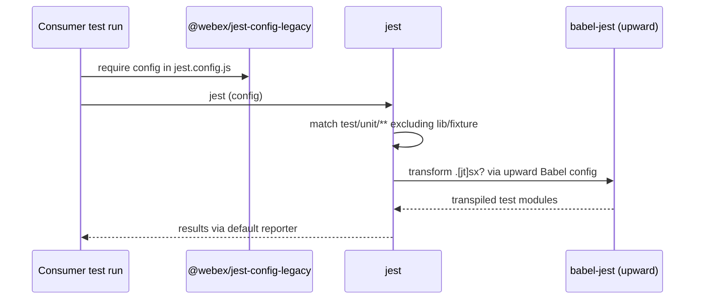
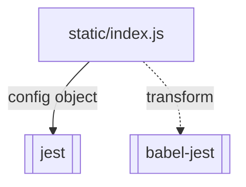

<!-- sdd-generated-metadata
generator: claude-cli
generator_model: us.anthropic.claude-opus-4-8
approved_by: pending-human-review
updated_at: 2026-08-06T00:00:00Z
validation_status: not-run
run_id: 51855eac-8de5-43a2-a3b6-dbcc55ebc91b
-->

# @webex/jest-config-legacy — SPEC

> Start here → root [`AGENTS.md`](../../../../AGENTS.md) (agent entry) · router [`SPEC_INDEX.md`](../../../../ai-docs/SPEC_INDEX.md) · system [`ARCHITECTURE.md`](../../../../ai-docs/ARCHITECTURE.md). This is the module's canonical spec: orientation, requirements, design, flows, and tests.
> Context-efficiency: link to canonical docs — don't duplicate them. Load specs on demand per `SPEC_INDEX.md`.

## Metadata

| Field | Value |
|---|---|
| Module id | `jest` (legacy/jest) |
| Source path(s) | `packages/legacy/jest/static/` |
| Parent spec | `—` (shared legacy Jest-config package) |
| Doc kind | Module spec |
| Coverage score | Pending coverage assessment |
| Generated from | `module-spec` @ SDLC template library `0.2.2` |
| generated_by / approved_by / updated_at | claude-cli / pending-human-review / 2026-08-06 |
| Validation status | not-run, validator `pending`, assessed 2026-08-06 |

Coverage score is `Pending coverage assessment` until the first coverage review runs. Manifest coverage
state (`Partial`) is authoritative and kept in `.sdd/manifest.json`.

## Evidence Rules
Every requirement cites concrete source evidence using `file path`. This is a configuration package, so
requirements are grounded in `package.json` and the single static Jest config object it ships.

## Source Material Register

| Source material | Scope | Decision | Detail location or disposition |
|---|---|---|---|
| `N/A` | none | none | No pre-existing SDD/AI-docs, architecture, or spec documents were routed to this module; content is derived from `package.json` and the shipped static config. |

## Overview

`@webex/jest-config-legacy` is the workspace's **shared Jest configuration package for legacy packages**.
It ships a single entry, `static/index.js`, exporting one Jest config object: `clearMocks`, `rootDir:
'./'`, the `node` test environment, coverage off by default with the `text` reporter and the `v8`
coverage provider, a `babel-jest` transform (with `rootMode: 'upward'`) for `.js`/`.ts`/`.jsx`/`.tsx`,
the `default` reporter, a `testMatch` of `<rootDir>/test/unit/**/!(lib|fixture)/*.[jt]s`, and
`testPathIgnorePatterns` for `node_modules`/`dist`.

It is a code-free-at-runtime config package (no build step): consumers `require` it from their own
`jest.config.js`. It bundles `jest`, `jest-environment-jsdom`, `ts-jest`, and `typescript` as runtime
dependencies. A maintainer should start at `static/index.js` to see the full config.

## Purpose / Responsibility

Owns the canonical, reusable Jest configuration (env, transform, test match/ignore, coverage defaults)
for the workspace's legacy unit tests. It does NOT run Jest or define individual tests — consuming
packages `require` this config from their own `jest.config.js`.

## Stack

JavaScript configuration only (`type: commonjs`). `packageManager: yarn@3.4.1`, `engines` Node `>=18`,
npm `>=8`, yarn `>=3`. `main: ./static/index.js`; only `static/` is published. Runtime `dependencies`:
`jest` (`^29.3.1`), `jest-environment-jsdom` (`^29.1.2`), `ts-jest` (`^29.0.3`), `typescript` (`^5.0.4`).
No source app code, no tests, no build.

## Folder / Package Structure

```
packages/legacy/jest/
├── package.json          # name, main (static/index.js), jest/jest-environment-jsdom/ts-jest/typescript deps
└── static/
    └── index.js          # The Jest config (clearMocks, node env, babel-jest transform, testMatch, ignore patterns)
```

## Key Files (source of truth)

| File | Holds |
|---|---|
| `packages/legacy/jest/static/index.js` | The canonical Jest config: `clearMocks`, `rootDir: ./`, `testEnvironment: node`, `collectCoverage: false`, `coverageReporters: [text]`, `coverageProvider: v8`, the `babel-jest` transform (`rootMode: upward`), `reporters: [default]`, `testMatch`, and `testPathIgnorePatterns` |
| `packages/legacy/jest/package.json` | The `main` entry and the bundled `jest`/`jest-environment-jsdom`/`ts-jest`/`typescript` dependencies |

## Public Surface

Internal Surface — internal use only. Consumed as a shareable Jest config object by other workspace
packages; it exports a config object, not a runtime API.

| Contract ID | Type | Surface | Purpose | Compatibility / deprecation | Schema / detail link | Root index |
|---|---|---|---|---|---|---|
| `jest.config` | SDK | `require('@webex/jest-config-legacy')` → Jest config object | Shared Jest env/transform/testMatch/coverage defaults for legacy unit tests | Changing `testMatch`, transform, or env affects every consuming test suite | `packages/legacy/jest/static/index.js` | `../../../../ai-docs/CONTRACTS.md` |

Compatibility notes:
- The exported config object (Jest's schema) is the semver surface. Changing `testMatch`, the transform,
  or the environment is inherited by every consumer that requires this config.

## Requires (dependencies)

- `jest` (`^29.3.1`) — the test runner that consumes this config.
- `jest-environment-jsdom` (`^29.1.2`) — available for consumers that need a jsdom env (the default here
  is `node`).
- `ts-jest` (`^29.0.3`), `typescript` (`^5.0.4`) — TypeScript support; note the default transform is
  `babel-jest` (`rootMode: upward`), so TS is transpiled via the consumer's Babel config.
- A consumer `jest.config.js` that `require`s this package.

## Requirements

| ID | WHAT | WHY | Source Evidence | Test / Example Evidence | Assumptions / Gaps | Confidence |
|---|---|---|---|---|---|---|
| `JEST-R-001` | The package exposes a single `main` entry exporting one Jest config object, publishing only `static/`. | Give the workspace's legacy packages one canonical, importable Jest configuration. | `packages/legacy/jest/static/index.js`, `packages/legacy/jest/package.json` | None (config package) | none identified | PRESENT |
| `JEST-R-002` | The config sets `clearMocks: true`, `rootDir: './'`, `testEnvironment: 'node'`, transforms `.[jt]sx?` with `babel-jest` using `rootMode: 'upward'`, and uses the `default` reporter. | Run legacy unit tests in a consistent node env, transpiling via the upward-resolved Babel config, with mocks cleared between tests. | `packages/legacy/jest/static/index.js` | None | `rootMode: upward` requires a Babel config resolvable above the consumer package | PRESENT |
| `JEST-R-003` | The config matches tests at `<rootDir>/test/unit/**/!(lib\|fixture)/*.[jt]s`, ignores `node_modules`/`dist`, and defaults coverage off (`collectCoverage: false`, `text` reporter, `v8` provider). | Target only unit specs (excluding lib/fixture dirs) and keep coverage opt-in for legacy suites. | `packages/legacy/jest/static/index.js` | None | Coverage is enabled by the consumer/CLI, not this base | PRESENT |

Individual config values are recorded as configuration facts in `static/index.js`, not enumerated
further as behavioral requirements here.

## Design Overview

The package centralizes legacy Jest policy in a single exported object so every legacy package runs unit
tests identically. There is no logic — `static/index.js` defines the config literal. The `babel-jest`
transform with `rootMode: 'upward'` intentionally defers transpilation to the consumer's Babel config
(pairing with `@webex/babel-config-legacy`), and the `testMatch` narrows to `test/unit/**` while
excluding `lib`/`fixture` directories.

## Data Flow


## Sequence Diagram(s)

Configuration-only package with one operation group — a consumer running Jest with the shared config.

Sequence coverage:

| Operation group | Diagram | Failure / recovery coverage |
|---|---|---|
| Consumer runs unit tests | 1. Jest applies config + transforms + runs | Missing upward Babel config or unmatched tests are surfaced by `jest`, not this package |

### 1. Jest applies config + transforms + runs



## Class / Component Relationships



No runtime classes — the package is a single shared config object consumed by Jest.

## Use Cases

- **UC-1 Run legacy unit tests:** a legacy package `require`s this config in its `jest.config.js` to run
  `test/unit/**` specs in a node env. Evidence: `packages/legacy/jest/static/index.js`,
  `packages/legacy/jest/package.json`.
- **UC-2 Transpile via shared Babel:** the `babel-jest` (`rootMode: upward`) transform uses the
  consumer's Babel config so TS/JS tests run consistently with the build. Evidence:
  `packages/legacy/jest/static/index.js`.

## Module Do's / Don'ts

- DO change shared Jest test-match/transform/env here so every legacy suite runs consistently.
- DON'T hardcode divergent `testMatch`/env per package; inherit this config and override intentionally.

## Pitfalls

- `rootMode: 'upward'` requires a Babel config resolvable above the consumer package; without it the
  transform fails to transpile TS/JSX.
- The `testMatch` only picks up `test/unit/**` and excludes `lib`/`fixture` directories — specs placed
  elsewhere are silently not run.
- Coverage is off by default; consumers must enable `collectCoverage` (or run via a coverage command) to
  get coverage output.

## Test-Case Strategy (module)

No executable app code to unit test. Validation is by consumption: assert the export `require`s to an
object whose `clearMocks`, `testEnvironment`, `transform`, `testMatch`, and `testPathIgnorePatterns`
match the shipped values; then run Jest in a fixture package to confirm `test/unit` specs run,
`lib`/`fixture` are excluded, and the `babel-jest` upward transform transpiles a TS test.

| Behavior / Requirement | Existing test evidence | Gap |
|---|---|---|
| `JEST-R-001` | None found (config-only package) | Add a require-and-shape assertion for the exported object |
| `JEST-R-002` | None found | Assert `clearMocks`/env/transform (`babel-jest`, `rootMode: upward`)/reporters |
| `JEST-R-003` | None found | Assert `testMatch`/ignore patterns and coverage defaults; run a fixture suite |

## Traceability

- Repo architecture: [`ARCHITECTURE.md`](../../../../ai-docs/ARCHITECTURE.md) · Registry: [`SPEC_INDEX.md`](../../../../ai-docs/SPEC_INDEX.md)
- Contracts catalog: [`CONTRACTS.md`](../../../../ai-docs/CONTRACTS.md)
- Coverage state & contracts baseline: `.sdd/manifest.json`
