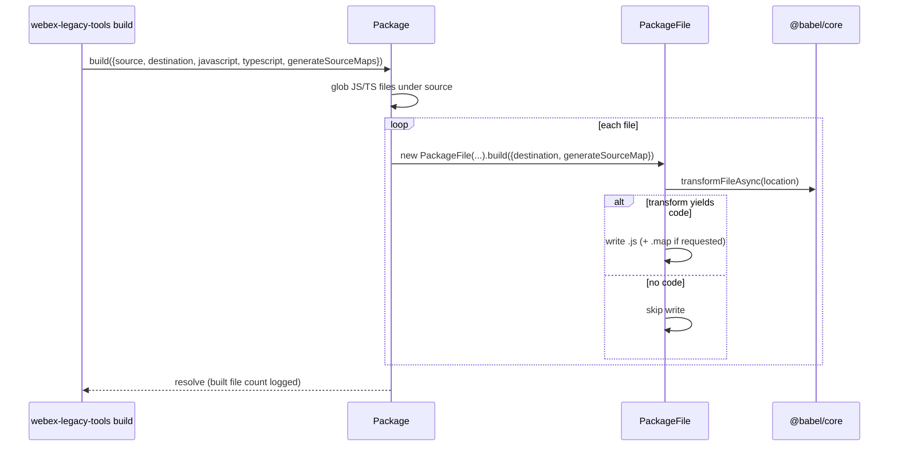
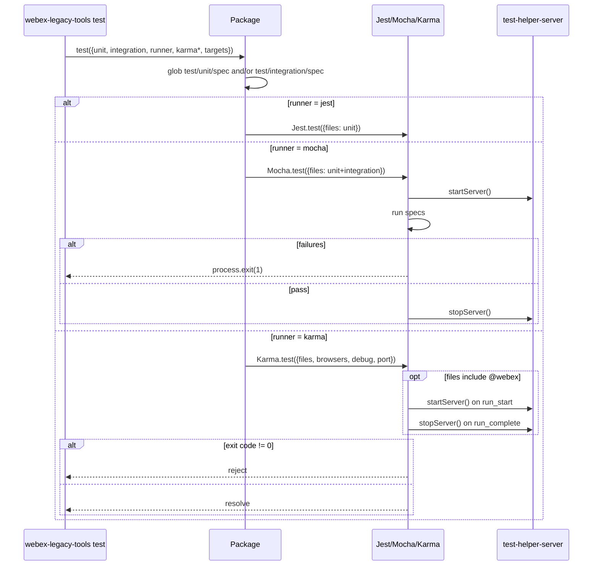
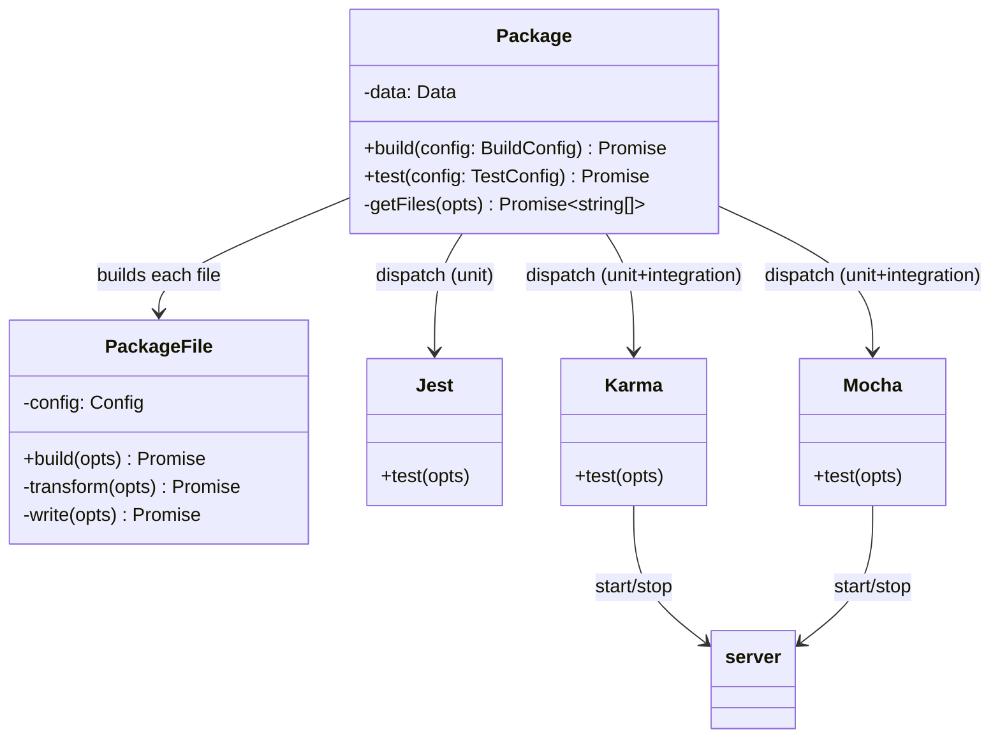

<!-- sdd-generated-metadata
generator: claude-cli
generator_model: us.anthropic.claude-opus-4-8
approved_by: pending-human-review
updated_at: 2026-08-06T00:00:00Z
validation_status: not-run
run_id: 51855eac-8de5-43a2-a3b6-dbcc55ebc91b
-->

# @webex/legacy-tools — SPEC

> Start here → root [`AGENTS.md`](../../../../AGENTS.md) (agent entry) · router [`SPEC_INDEX.md`](../../../../ai-docs/SPEC_INDEX.md) · system [`ARCHITECTURE.md`](../../../../ai-docs/ARCHITECTURE.md). This is the module's canonical spec: orientation, requirements, design, flows, and tests.
> Context-efficiency: link to canonical docs — don't duplicate them. Load specs on demand per `SPEC_INDEX.md`.

## Metadata

| Field | Value |
|---|---|
| Module id | `tools` (legacy/tools) |
| Source path(s) | `packages/legacy/tools/src/` |
| Parent spec | `—` (shared legacy build/test tooling package) |
| Doc kind | Module spec |
| Coverage score | Pending coverage assessment |
| Generated from | `module-spec` @ SDLC template library `0.2.2` |
| generated_by / approved_by / updated_at | claude-cli / pending-human-review / 2026-08-06 |
| Validation status | not-run, validator `pending`, assessed 2026-08-06 |

Coverage score is `Pending coverage assessment` until the first coverage review runs. Manifest coverage
state (`Partial`) is authoritative and kept in `.sdd/manifest.json`.

## Evidence Rules
Every requirement cites concrete source evidence using `file path`. Requirements are grounded in the
TypeScript sources under `src/` and the `package.json` build/test wiring. The package README is
consumer-facing documentation and is treated as reference, not primary behavioral evidence.

## Source Material Register

| Source material | Scope | Decision | Detail location or disposition |
|---|---|---|---|
| `packages/legacy/tools/README.md` | overview / consumer usage | reference-only | Consumer install/usage guide; behavior documented here is derived from `src/` |
| `N/A` (SDD docs) | none | none | No pre-existing SDD/AI-docs, architecture, or spec documents were routed to this module; content is code-derived. |

## Overview

`@webex/legacy-tools` is an internal, private package that provides a **shared build and test tooling
workflow for legacy packages** in the monorepo. It is consumed both as a CLI (`webex-legacy-tools`) and
as a library. The public entry `src/index.ts` re-exports two command handlers (`build`, `runTests`), the
`Package` and `PackageFile` model classes, the `Jest`/`Karma`/`Mocha` runner utilities, and the test
server helpers (`startServer`, `stopServer`, `findWorkspaceRoot`, `getServerPath`), plus the related
config types.

The core model is `Package`: `build(config)` globs JavaScript/TypeScript source files from a source
directory and transpiles each through `PackageFile` (via `@babel/core`'s `transformFileAsync`), writing
`.js` output (and optional source maps) to a destination; `test(config)` globs unit/integration spec
files and dispatches them to the selected runner (`jest`, `mocha`, or `karma`). The CLI wraps these as
`@webex/cli-tools` commands.

The package has a real build pipeline (`tsc` for the module + `esbuild` for the CLI + api-extractor/
api-documenter for docs) and its own test suite (style/syntax/integration/coverage). A maintainer should
start at `src/index.ts` for the export surface and `src/models/package/package.ts` for the central
build/test logic.

## Purpose / Responsibility

Owns the reusable build-and-test orchestration for legacy packages: file collection, per-file Babel
transpilation with optional source maps, and dispatch of unit/integration specs to Jest, Mocha, or
Karma. It does NOT own the Babel/Jest/Karma configs themselves (those live in the sibling
`@webex/babel-config-legacy`, `@webex/jest-config-legacy`, etc.) — it drives them.

## Stack

TypeScript (`typescript ^4.9.5`) compiled with `tsc` to `dist/module` (+ `dist/types`), CLI bundled with
`esbuild` to `dist/cli`. `type: commonjs`; `main: ./dist/module/index.js`, `types:
./dist/types/index.d.ts`, `bin: webex-legacy-tools`. Exports: `.`, `./cli`, `./docs`. Test stack: ESLint
(`test:style`), `tsc --noEmit` (`test:syntax`), Jasmine integration (`test:integration`), and nyc
coverage (`test:coverage`). Key runtime deps: `@babel/core`, `@babel/register`, `glob`, `fs-extra`,
`mocha`, `jest`, `karma` (+ launchers), `chai`, `browserify`, `yargs`, `@webex/cli-tools`,
`@webex/babel-config-legacy`, `@webex/env-config-legacy`.

## Folder / Package Structure

```
packages/legacy/tools/
├── package.json                 # bin, exports (., ./cli, ./docs), build/test scripts, deps
├── src/
│   ├── index.ts                 # Public barrel: build, runTests, Package, PackageFile, runner utils, server helpers, types
│   ├── commands/
│   │   ├── index.ts             # exports { build, runTests }
│   │   ├── build/               # build command config + handler (delegates to Package.build)
│   │   └── run-tests/           # run-tests command config + handler (delegates to Package.test)
│   ├── models/
│   │   ├── index.ts             # exports { Package, PackageFile } + config types
│   │   ├── package/             # Package class, constants (glob patterns, test dirs), types
│   │   └── package-file/        # PackageFile class (Babel transform + write), types
│   └── utils/
│       ├── index.ts             # exports Jest, Karma, Mocha, server helpers
│       ├── jest/                # Jest runner wrapper
│       ├── karma/               # Karma runner + browsers + config constants
│       ├── mocha/               # Mocha runner + config constants
│       └── server.ts            # findWorkspaceRoot, getServerPath, startServer, stopServer
```

## Key Files (source of truth)

| File | Holds |
|---|---|
| `packages/legacy/tools/src/index.ts` | The public export surface (what the CLI and library consumers may use) |
| `packages/legacy/tools/src/models/package/package.ts` | The central `Package.build`/`Package.test` logic and file collection (`getFiles`) |
| `packages/legacy/tools/src/models/package/package.constants.ts` | The glob `PATTERNS` (JS/TS/test) and `TEST_DIRECTORIES` (`test`, `unit/spec`, `integration/spec`) |
| `packages/legacy/tools/src/models/package-file/package-file.ts` | Per-file Babel transform (`transformFileAsync`) and `.js`/`.map` write logic |
| `packages/legacy/tools/src/utils/server.ts` | Workspace-root resolution and the spawn/stop lifecycle of the test-helper server |
| `packages/legacy/tools/src/utils/karma/karma.constants.ts` | The Karma base config (frameworks, browserify+babelify/envify, timeouts, proxies) |
| `packages/legacy/tools/package.json` | The `bin`, `exports`, and the build/test script pipeline |

## Public Surface

Internal Surface — internal use only (`private` package). Consumed as a CLI (`webex-legacy-tools`) and as
a library import.

| Contract ID | Type | Surface | Purpose | Compatibility / deprecation | Schema / detail link | Root index |
|---|---|---|---|---|---|---|
| `tools.cli.build` | CLI | `webex-legacy-tools build [--source --destination --javascript --typescript --generate-source-maps]` | Build a legacy package's source to a destination via Babel | Option changes affect consuming package scripts | `packages/legacy/tools/src/commands/build/` | `../../../../ai-docs/CONTRACTS.md` |
| `tools.cli.test` | CLI | `webex-legacy-tools test [--unit --integration --runner --karma-browsers --karma-debug --karma-port --targets]` | Test a legacy package with the selected runner | Option changes affect consuming package scripts | `packages/legacy/tools/src/commands/run-tests/run-tests.constants.ts` | `../../../../ai-docs/CONTRACTS.md` |
| `tools.Package` | SDK | `import { Package } from '@webex/legacy-tools'` → `build(config)`, `test(config)` | Programmatic build/test of a package | Method signatures/config types are the semver surface | `packages/legacy/tools/src/models/package/package.ts` | `../../../../ai-docs/CONTRACTS.md` |
| `tools.PackageFile` | SDK | `import { PackageFile } from '@webex/legacy-tools'` → `build({destination, generateSourceMap})` | Transpile and write a single file | Method signature is the semver surface | `packages/legacy/tools/src/models/package-file/package-file.ts` | `../../../../ai-docs/CONTRACTS.md` |
| `tools.runners` | SDK | `import { Jest, Karma, Mocha } from '@webex/legacy-tools'` → `.test({files, ...})` | Run collected spec files with a chosen runner | Runner option shapes are the semver surface | `packages/legacy/tools/src/utils/` | `../../../../ai-docs/CONTRACTS.md` |
| `tools.server` | SDK | `import { startServer, stopServer, findWorkspaceRoot, getServerPath } from '@webex/legacy-tools'` | Manage the test-helper fixture server + resolve workspace paths | Function signatures are the semver surface | `packages/legacy/tools/src/utils/server.ts` | `../../../../ai-docs/CONTRACTS.md` |

Compatibility notes:
- CLI option names and the exported class/function signatures + config types (`PackageBuildConfig`,
  `PackageTestConfig`, `PackageFileConfig`, etc.) are the semver surface consumed by legacy packages.

## Requires (dependencies)

- `@babel/core` (peer, `^7.17.10`) + `@babel/register` — transpiling source and registering the runtime
  loader for Mocha/Karma; the actual Babel config comes from `@webex/babel-config-legacy`.
- `@webex/cli-tools` (workspace) — the `Commands` framework the CLI mounts `build`/`runTests` onto.
- `@webex/env-config-legacy` (workspace) — loads workspace `.env` before Mocha/Karma runs.
- `glob`, `fs-extra` — file collection and output writing.
- `jest`, `mocha`, `karma` (+ launchers), `chai`, `browserify`/`babelify`/`envify` — the test runners and
  browser test pipeline.
- The `@webex/test-helper-server` package at the workspace root (resolved by `getServerPath`) for
  integration/browser fixtures.

## Requirements

| ID | WHAT | WHY | Source Evidence | Test / Example Evidence | Assumptions / Gaps | Confidence |
|---|---|---|---|---|---|---|
| `TOOLS-R-001` | The public entry re-exports `build`, `runTests`, `Package`, `PackageFile`, `Jest`, `Karma`, `Mocha`, and the server helpers (`startServer`, `stopServer`, `findWorkspaceRoot`, `getServerPath`) plus the config types. | Give legacy packages one stable import/CLI surface for build+test tooling. | `packages/legacy/tools/src/index.ts` | None found in provided `src/` tree | Executable characterization tests are not visible in the read sources | WEAK |
| `TOOLS-R-002` | `Package.build(config)` collects JS and/or TS files (per `javascript`/`typescript` flags) from `source` under the package root, wraps each in a `PackageFile`, and builds them to `destination`, optionally emitting source maps. | Provide consistent Babel-based building of legacy source trees. | `packages/legacy/tools/src/models/package/package.ts`, `packages/legacy/tools/src/models/package/package.constants.ts` | None found | Build resolves the package root from `process.cwd()` | WEAK |
| `TOOLS-R-003` | `PackageFile.build(...)` transpiles a file via `@babel/core` `transformFileAsync`, writes the result to `destination` with the `.ts`→`.js` extension swap, and appends a `sourceMappingURL` + writes a `.map` file when `generateSourceMap` is set. | Produce distributable `.js` (and maps) from legacy source without a per-package build script. | `packages/legacy/tools/src/models/package-file/package-file.ts` | None found | Only files whose transform yields `code` are written | WEAK |
| `TOOLS-R-004` | `Package.test(config)` collects unit specs from `test/unit/spec` and integration specs from `test/integration/spec` (per the `unit`/`integration` flags and optional `targets`) and dispatches them to the runner selected by `config.runner`: Jest (unit only), Mocha (unit+integration), or Karma (unit+integration). | Route legacy specs to the appropriate runner with a single command. | `packages/legacy/tools/src/models/package/package.ts`, `packages/legacy/tools/src/models/package/package.constants.ts` | None found | Jest path uses only unit files; Mocha/Karma combine unit+integration | WEAK |
| `TOOLS-R-005` | The Karma runner builds its config from the base constants (browserify + babelify/envify, mocha/chai frameworks, timeouts), maps requested browsers to launchers, sets `singleRun`/watch from `debug`, wires fixture proxies to `port-1`, and starts/stops the test-helper server around runs when spec paths include `@webex`. | Support browser-based legacy integration tests with fixtures and configurable browsers/ports. | `packages/legacy/tools/src/utils/karma/karma.ts`, `packages/legacy/tools/src/utils/karma/karma.constants.ts` | None found | Server start/stop is gated on the first file path containing `@webex` | WEAK |
| `TOOLS-R-006` | `findWorkspaceRoot` walks up from a start path to the first `package.json` declaring `workspaces` (throwing if none is found); `getServerPath` returns `<root>/packages/@webex/test-helper-server`; `startServer`/`stopServer` spawn and `SIGTERM` that server process. | Resolve the monorepo test server location independent of the consuming package's directory. | `packages/legacy/tools/src/utils/server.ts` | None found | Throws when run outside a yarn workspace | WEAK |

Confidence is WEAK where behavior is code-clear but no executable tests were visible in the read sources;
characterization tests are the primary gap.

## Design Overview

The package is organized into three layers: **commands** (`build`, `runTests`) are thin `@webex/cli-tools`
adapters that construct a `Package` and delegate to `build`/`test`; **models** (`Package`, `PackageFile`)
hold the orchestration and per-file transform logic; **utils** (`Jest`/`Karma`/`Mocha`, `server`) wrap
the concrete runners and the fixture server. `Package` uses `glob` with the constants' `PATTERNS` and
`TEST_DIRECTORIES` to collect files, then either maps each source file through `PackageFile.build`
(transpile + write) or forwards collected spec files to the chosen runner. Mocha/Karma register
`@babel/register` and load `@webex/env-config-legacy` so specs run against transpiled source with the
workspace env; both coordinate the shared test-helper server via the `server` utilities.

## Data Flow

```mermaid
flowchart LR
  CLI[webex-legacy-tools] --> Cmd[commands: build / run-tests]
  Cmd --> Pkg[Package]
  Pkg -->|glob source| Files[source files]
  Files --> PF[PackageFile.build]
  PF -->|@babel/core transformFileAsync| Out[dist .js + .map]
  Pkg -->|glob test/unit + test/integration| Specs[spec files]
  Specs --> Runner{runner}
  Runner -->|jest| Jest[Jest.test]
  Runner -->|mocha| Mocha[Mocha.test]
  Runner -->|karma| Karma[Karma.test]
  Karma --> Srv[test-helper-server]
  Mocha --> Srv
```

## Sequence Diagram(s)

Two distinct operation groups — building files and running tests — differ in actors, transport, and
failure behavior, so each gets its own diagram. The Karma/Mocha test path additionally covers the fixture
server lifecycle and process-exit failure.

Sequence coverage:

| Operation group | Diagram | Failure / recovery coverage |
|---|---|---|
| Build package | 1. Build sources | Only files producing `code` are written; empty transforms are skipped |
| Run tests (Jest/Mocha/Karma) | 2. Test dispatch | Mocha exits `process.exit(1)` on failures; Karma rejects on non-zero exit code; server stopped on completion |

### 1. Build a package



### 2. Run tests



## Class / Component Relationships



`Package` is the orchestrator; `PackageFile` owns single-file transpilation; the runner utilities are
static classes wrapping Jest/Mocha/Karma; `server` is a module of functions shared by Mocha and Karma.

## Use Cases

- **UC-1 Build a legacy package:** a consumer runs `webex-legacy-tools build --source src --destination
  dist --typescript` (or calls `Package.build`) to transpile source to `dist`. Evidence:
  `packages/legacy/tools/src/commands/build/build.ts`, `packages/legacy/tools/src/models/package/package.ts`.
- **UC-2 Run unit tests with Jest:** `webex-legacy-tools test --unit --runner jest` collects
  `test/unit/spec` files and runs them with Jest. Evidence:
  `packages/legacy/tools/src/models/package/package.ts`, `packages/legacy/tools/src/utils/jest/jest.ts`.
- **UC-3 Run browser integration tests with Karma:** `webex-legacy-tools test --integration --runner
  karma --karma-browsers chrome firefox` runs specs in browsers with the fixture server. Evidence:
  `packages/legacy/tools/src/utils/karma/karma.ts`.

## Concurrency & Reactive Flow

`Package.build` collects JS and TS files with two parallel `getFiles` promises (`Promise.all`) and builds
each file concurrently via `Promise.all(files.map(...))`. Test dispatch is sequential per run. The Karma
and Mocha runners manage a single shared child-process test server (`server.ts`): `startServer` stops any
existing child before spawning a new one, and the process `exit` handler is wired to `stopServer`, so the
fixture server lifecycle is coordinated around a run rather than per-spec. Karma resolves/rejects based on
the server exit code; Mocha calls `process.exit(1)` on failures.

## Error Handling & Failure Modes

| Condition | Signal (error/code/result) | Caller recovery |
|---|---|---|
| Run outside a yarn workspace | `findWorkspaceRoot` throws `Error('Could not find workspace root...')` | Run from within the monorepo workspace |
| Babel transform yields no `code` | file write is skipped (no output for that file) | Verify source is transpilable / has content |
| Mocha spec failures | `Mocha.test` calls `process.exit(1)` after stopping the server | Fix failing specs; non-zero exit fails CI |
| Karma non-zero exit code | the run Promise rejects | Inspect browser/test logs; fix failures |
| Empty Karma/Jest/Mocha file set | runner is not invoked (guarded by `files.length > 0`) | Ensure specs exist under `test/unit/spec` / `test/integration/spec` |

## Pitfalls

- `Package` resolves the package root from `process.cwd()`; running the CLI from the wrong directory
  builds/tests the wrong package.
- Test directory layout is fixed by constants (`test/unit/spec`, `test/integration/spec`); specs outside
  these paths are not collected.
- Only the Jest path is unit-only; Mocha and Karma combine unit **and** integration specs, so `--runner`
  choice changes which specs run.
- The Karma server start/stop is gated on the first spec path containing `@webex`; renaming paths can
  disable the fixture server unexpectedly.
- `PackageFile` swaps only `.ts`→`.js` in the output path; other extensions pass through unchanged.

## Export Stability

The package is `private` and internal, but it is imported across legacy packages, so its exported
surface behaves like an internal semver contract: the `.`, `./cli`, and `./docs` export map, the
`webex-legacy-tools` bin, the class/function signatures, and the exported config types
(`PackageBuildConfig`, `PackageTestConfig`, `PackageTestRunner`, `PackageTestBrowser`, `PackageData`,
`PackageFileConfig`). Adding an optional field/option is additive; removing or renaming an export, CLI
option, or type is breaking for consuming legacy packages.

## Test-Case Strategy (module)

The package defines its own test pipeline in `package.json` (`test:style`, `test:syntax`,
`test:integration`, `test:coverage` via Jasmine + nyc), but no executable characterization tests for the
`Package`/`PackageFile`/runner logic were visible in the read `src/` tree. Recommended characterization:
`Package.build` collects the expected files and writes transpiled output (positive) and skips files with
no `code` (negative); `PackageFile.build` swaps `.ts`→`.js` and emits a `.map` only when requested;
`Package.test` routes unit-only to Jest and unit+integration to Mocha/Karma; `findWorkspaceRoot` throws
outside a workspace.

| Behavior / Requirement | Existing test evidence | Gap |
|---|---|---|
| `TOOLS-R-001` | None found in read sources | Add an export-surface assertion |
| `TOOLS-R-002` | None found | Build a fixture package; assert collected + written files |
| `TOOLS-R-003` | None found | Assert `.ts`→`.js` swap and conditional `.map` emission |
| `TOOLS-R-004` | None found | Assert runner routing for jest/mocha/karma and unit/integration selection |
| `TOOLS-R-005` | None found | Assert Karma config assembly, browser mapping, and server gating |
| `TOOLS-R-006` | None found | Assert workspace-root resolution and server path/lifecycle |

## Traceability

- Repo architecture: [`ARCHITECTURE.md`](../../../../ai-docs/ARCHITECTURE.md) · Registry: [`SPEC_INDEX.md`](../../../../ai-docs/SPEC_INDEX.md)
- Contracts catalog: [`CONTRACTS.md`](../../../../ai-docs/CONTRACTS.md)
- Coverage state & contracts baseline: `.sdd/manifest.json`
