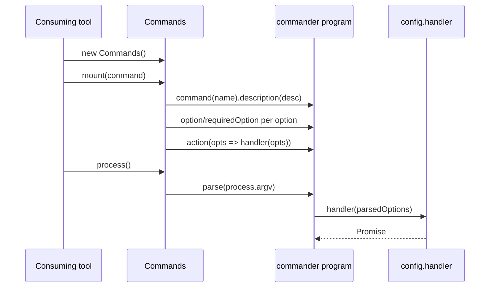
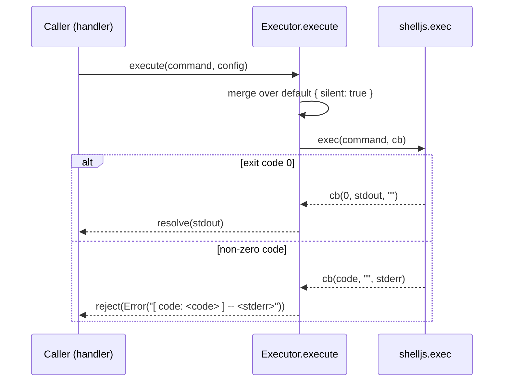
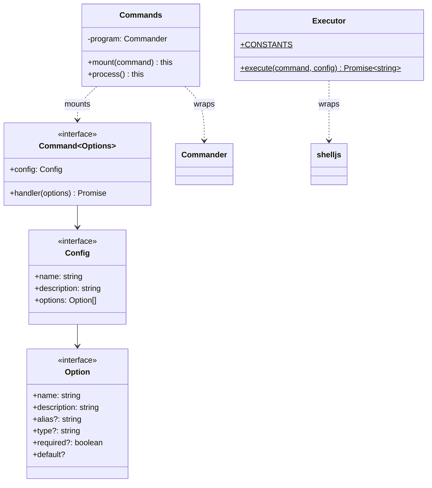

<!-- sdd-generated-metadata
generator: claude-cli
generator_model: us.anthropic.claude-opus-4-8
approved_by: pending-human-review
updated_at: 2026-08-06T00:00:00Z
validation_status: not-run
run_id: 51855eac-8de5-43a2-a3b6-dbcc55ebc91b
-->

# @webex/cli-tools — SPEC

> Start here → root [`AGENTS.md`](../../../../AGENTS.md) (agent entry) · router [`SPEC_INDEX.md`](../../../../ai-docs/SPEC_INDEX.md) · system [`ARCHITECTURE.md`](../../../../ai-docs/ARCHITECTURE.md). This is the module's canonical spec: orientation, requirements, design, flows, and tests.
> Context-efficiency: link to canonical docs — don't duplicate them. Load specs on demand per `SPEC_INDEX.md`.

## Metadata

| Field | Value |
|---|---|
| Module id | `cli-tools` |
| Source path(s) | `packages/tools/cli/src/` |
| Parent spec | `—` (build-time developer tooling package; no parent module) |
| Doc kind | Module spec |
| Coverage score | Pending coverage assessment |
| Generated from | `module-spec` @ SDLC template library `0.2.2` |
| generated_by / approved_by / updated_at | claude-cli / pending-human-review / 2026-08-06 |
| Validation status | not-run, validator `pending`, assessed 2026-08-06 |

Coverage score is `Pending coverage assessment` until the first coverage review runs. Manifest coverage
state is authoritative and kept in `.sdd/manifest.json`.

## Evidence Rules
Every requirement cites concrete source evidence using `file path`. Test evidence is preferred for WHY.
Requirements are grounded in the current TypeScript implementation under `src/` and the package's Jest
integration suite (`test:integration`), which enforces 100% coverage via the shared modern Jest config.

## Source Material Register

| Source material | Scope | Decision | Detail location or disposition |
|---|---|---|---|
| `N/A` | none | none | No pre-existing SDD/AI-docs, architecture, or spec documents were routed to this module; content is derived from source, package config, and the shared Jest config. |

## Overview

`@webex/cli-tools` is a small, reusable foundation library for building command-line tools inside the
Webex JS SDK monorepo. It publishes two independent building blocks through its barrel
(`src/index.ts`): a `Commands` class that wraps [`commander`](https://www.npmjs.com/package/commander)
to register and dispatch CLI sub-commands from plain configuration objects, and an `Executor` class that
runs arbitrary shell commands cross-platform via [`shelljs`](https://www.npmjs.com/package/shelljs) and
resolves/rejects a `Promise` based on the exit code.

The package is intentionally domain-agnostic: it knows nothing about packages, versions, or Yarn. It
exists so consuming tools (notably `@webex/package-tools`) can declare a command as a `{ config, handler }`
object and mount it, without each tool re-implementing argument parsing or shell execution. A maintainer
should start at `src/index.ts` to see the exported surface, then read `src/models/commands/commands.ts`
and `src/utils/executor/executor.ts`.

The build compiles TypeScript to both a CommonJS module (`dist/module`) and type declarations
(`dist/types`), and generates API documentation via `api-extractor`/`api-documenter`.

## Purpose / Responsibility

Owns the reusable CLI primitives for the monorepo's build tooling: declarative command registration and
dispatch (`Commands`) and promise-wrapped cross-platform shell execution (`Executor`). It does NOT own any
package/version/workspace logic — that lives in `@webex/package-tools`.

## Stack

TypeScript `5.3.3` compiled with `tsc` (CommonJS output to `dist/module`, declarations to `dist/types`),
Node `>=18`, Yarn `3.4.1`. Runtime dependencies: `commander@11.1.0`, `shelljs@^0.8.5`. Tested with
`jest@29.7.0` (`test:integration`), linted with ESLint (airbnb-base/airbnb-typescript), type-checked with
`tsc --noEmit` (`test:syntax`). API docs via `@microsoft/api-extractor` + `@microsoft/api-documenter`.

## Folder / Package Structure

```
packages/tools/cli/src/
├── index.ts                          # Barrel: exports Commands, Executor, and their config types
├── models/
│   ├── index.ts                      # Re-exports Commands + Command/Config/Option types
│   └── commands/
│       ├── commands.ts               # Commands class (commander wrapper: mount/process)
│       └── commands.types.ts         # Option, Config, Command interfaces
└── utils/
    ├── index.ts                      # Re-exports Executor + ExecutorConfig type
    └── executor/
        ├── executor.ts               # Executor class (shelljs wrapper: static execute)
        ├── executor.constants.ts     # Default CONFIG ({ silent: true })
        └── executor.types.ts         # Config type for Executor
```

## Key Files (source of truth)

| File | Holds |
|---|---|
| `packages/tools/cli/src/index.ts` | The authoritative public export list; import from here, not deep paths |
| `packages/tools/cli/src/models/commands/commands.types.ts` | The `Command`/`Config`/`Option` shapes consumers must satisfy to mount a command |
| `packages/tools/cli/src/utils/executor/executor.constants.ts` | The default `Executor` config (`silent: true`); do not hardcode the default elsewhere |

## Public Surface

Published, imported SDK/code API — no network, event-bus, or self-owned CLI binary. The exports are
classes and TypeScript types re-exported from `src/index.ts`.

| Contract ID | Type | Surface | Purpose | Compatibility / deprecation | Schema / detail link | Root index |
|---|---|---|---|---|---|---|
| `cli-tools.Commands` | SDK | `new Commands().mount(command).process()` | Register declarative sub-command configs and dispatch to their handlers via `commander` | Stable named export; method contract is semver-controlled | `packages/tools/cli/src/models/commands/commands.ts` | `../../../../ai-docs/CONTRACTS.md` |
| `cli-tools.Executor` | SDK | `Executor.execute(command, config?) -> Promise<string>` | Run a shell command cross-platform; resolve stdout on exit 0, reject with `Error` otherwise | Stable named export; static `CONSTANTS` accessor exposed | `packages/tools/cli/src/utils/executor/executor.ts` | `../../../../ai-docs/CONTRACTS.md` |
| `cli-tools.types` | SDK | `CommandsCommand`, `CommandsConfig`, `CommandsOption`, `ExecutorConfig` | Types consumers implement to define mountable commands and executor config | Stable type exports; adding optional fields is additive | `packages/tools/cli/src/index.ts` | `../../../../ai-docs/CONTRACTS.md` |

Compatibility notes:
- The `src/index.ts` barrel is the semver-controlled surface; deep imports are not part of the contract.
- Adding a new optional `Option`/`Config` field is a minor change; removing or renaming an exported
  member, or changing `execute`'s resolve/reject contract, is a major (breaking) change.

## Requires (dependencies)

- `commander` (`11.1.0`) — underlies `Commands`; each mounted config becomes a `commander` sub-command.
- `shelljs` (`^0.8.5`) — underlies `Executor.execute` for cross-platform shell invocation.
- Node `>=18` runtime (`engines`), Yarn `3.4.1` for workspace resolution.

## Requirements

| ID | WHAT | WHY | Source Evidence | Test / Example Evidence | Assumptions / Gaps | Confidence |
|---|---|---|---|---|---|---|
| `CLI-TOOLS-R-001` | `src/index.ts` re-exports `Commands`, `Executor`, and the `CommandsCommand`/`CommandsConfig`/`CommandsOption`/`ExecutorConfig` types as the sole public surface. | A single barrel gives consumers one canonical import path and hides internal file layout. | `packages/tools/cli/src/index.ts` | Package `test:integration` (jest) | none identified | PRESENT |
| `CLI-TOOLS-R-002` | `Commands.mount(command)` registers a `commander` sub-command from `command.config` (name, description, options), wiring each option as required/optional with alias, `<type>` placeholder, and default, then binds `command.handler` as the action; returns `this` for chaining. | Tools should declare commands as plain data and mount them without touching `commander` directly. | `packages/tools/cli/src/models/commands/commands.ts` | Package `test:integration` (jest) | Non-boolean typed options render `--name <type>`; boolean options render `--name` | PRESENT |
| `CLI-TOOLS-R-003` | `Commands.process()` calls `commander.parse()` to read `process.argv` and dispatch the matched command, returning `this`. | A single entry point triggers parsing after all commands are mounted. | `packages/tools/cli/src/models/commands/commands.ts` | Package `test:integration` (jest) | none identified | PRESENT |
| `CLI-TOOLS-R-004` | `Executor.execute(command, config?)` merges `config` over the default `{ silent: true }`, runs the command via `shelljs.exec`, resolves with stdout on exit code 0, and rejects with `Error("[ code: <code> ] -- <stderr>")` on any non-zero exit. | Callers need a promise-based, cross-platform shell runner with predictable success/failure semantics. | `packages/tools/cli/src/utils/executor/executor.ts` | Package `test:integration` (jest) | Restores `shell.config.silent = false` after a silent run | PRESENT |
| `CLI-TOOLS-R-005` | `Executor.CONSTANTS` exposes the default executor config (`{ silent: true }`) as a read-only static accessor. | Consumers/tests can reference the default without duplicating the literal. | `packages/tools/cli/src/utils/executor/executor.constants.ts` | Package `test:integration` (jest) | none identified | PRESENT |

Do not record raw type inventory as requirements; the `Option`/`Config`/`Command` shapes are documented
in Class / Component Relationships and the Key Files table.

## Design Overview

The package is two independent single-responsibility units joined only by the barrel. `Commands` holds a
private `commander` `program` instance; `mount` translates a declarative `Command` config into
`commander` calls — it maps each `Option` to either `requiredOption` or `option`, building the flag string
(`-alias, --name <type>` for typed options, `--name` for booleans) and passing the description and
default. The action callback simply forwards parsed options to the config's `handler`. `process` defers to
`commander.parse()`.

`Executor` is stateless and static. `execute` spreads the caller config over the module default, toggles
`shell.config.silent`, and wraps `shell.exec`'s node-style `(code, stdout, stderr)` callback in a
`Promise`: non-zero codes reject with a formatted `Error`, zero resolves with stdout. This keeps every
consuming tool free of direct `shelljs` and callback handling.

## Data Flow

```mermaid
flowchart TB
  Consumer[Consuming tool] -->|mount(config)| Commands[Commands class]
  Commands -->|command/option/action| Commander[(commander program)]
  Consumer -->|process()| Commands
  Commander -->|parse process.argv| Handler[config.handler]
  Handler -->|execute(cmd, config)| Executor[Executor class]
  Executor -->|exec + callback| Shell[(shelljs)]
  Shell -->|code/stdout/stderr| Executor
  Executor -->|resolve stdout / reject Error| Handler
```

## Sequence Diagram(s)

Sequence coverage:

| Operation group | Diagram | Failure / recovery coverage |
|---|---|---|
| Command registration + dispatch (`Commands`) | 1. mount → process → handler | Handler rejection propagates to `commander`'s action promise |
| Shell execution (`Executor`) | 2. execute → shelljs callback | `alt` covers non-zero exit → reject vs. zero exit → resolve |

### 1. mount → process → handler



### 2. execute → shelljs callback



## Class / Component Relationships



`Commands` composes a `commander` program and consumes `Command`/`Config`/`Option` interfaces supplied by
callers. `Executor` is a static utility over `shelljs`. The two classes do not depend on each other.

## Use Cases

- **UC-1 Define and run a CLI tool:** a consumer builds a `Command` config, calls
  `new Commands().mount(cmd).process()`, and `commander` dispatches parsed options to the handler.
  Evidence: `packages/tools/cli/src/models/commands/commands.ts`, `packages/tools/package/index.js`.
- **UC-2 Run a shell command from a handler:** a handler calls `Executor.execute('yarn ...')` and
  awaits stdout, handling rejection on non-zero exit. Evidence:
  `packages/tools/cli/src/utils/executor/executor.ts`, `packages/tools/package/src/utils/yarn/yarn.ts`.

## Error Handling & Failure Modes

| Condition | Signal (error/code/result) | Caller recovery |
|---|---|---|
| Shell command exits non-zero | `reject(new Error("[ code: <code> ] -- <stderr>"))` | Catch the rejection; inspect the embedded code/stderr and retry or surface the failure |
| Missing required option at parse time | `commander` prints an error and exits the process | Provide the required option; handled by `commander`, not this module |

## Pitfalls

- `Executor.execute` mutates the global `shell.config.silent`; it resets it to `false` after a silent
  run, so interleaving concurrent executes with differing `silent` settings can race on that global.
- `mount` builds the flag string from `option.type`: any non-`boolean` truthy `type` (including
  `string...` used by `@webex/package-tools`) yields a `--name <type>` value flag — a `boolean` (or unset
  type) yields a valueless `--name` flag. Set `type` intentionally.
- `Commands.process()` reads `process.argv` directly via `commander.parse()`; there is no injected argv,
  so tests must arrange `process.argv` or mock `commander`.

## Module Do's / Don'ts

- DO define commands as declarative `{ config, handler }` objects and mount them; let `Commands` own the
  `commander` wiring.
- DO reference `Executor.CONSTANTS` for the default config instead of re-declaring `{ silent: true }`.
- DON'T call `shelljs` or `commander` directly from a consuming tool; go through `Executor`/`Commands`.

## Export Stability

The `src/index.ts` barrel is the semver surface. Adding a new named export or a new optional field on
`Option`/`Config` is a minor change; removing/renaming an export or changing `execute`'s resolve/reject
contract is a major (breaking) change. The build emits `.d.ts` declarations to `dist/types` for typed
consumption.

## Test-Case Strategy (module)

Unit/integration tests run through `yarn test:integration` (Jest, shared modern config) with a 100%
coverage threshold on `dist/module`. Tests should assert both a positive and a negative path per unit:
`Commands.mount` wires required vs. optional and typed vs. boolean options and binds the handler;
`Commands.process` triggers parsing; `Executor.execute` resolves stdout on exit 0 and rejects with the
formatted `Error` on non-zero exit, and restores `shell.config.silent`.

| Behavior / Requirement | Existing test evidence | Gap |
|---|---|---|
| `CLI-TOOLS-R-001` | Package `test:integration` (jest) | Confirm the barrel export list is asserted during validation |
| `CLI-TOOLS-R-002` | Package `test:integration` (jest) | Re-check alias, `<type>` placeholder, and default rendering for every option branch |
| `CLI-TOOLS-R-003` | Package `test:integration` (jest) | Re-check that `process()` invokes `commander.parse()` |
| `CLI-TOOLS-R-004` | Package `test:integration` (jest) | Re-check the non-zero-exit reject message format and silent-flag reset |
| `CLI-TOOLS-R-005` | Package `test:integration` (jest) | none identified |

## Traceability

- Repo architecture: [`ARCHITECTURE.md`](../../../../ai-docs/ARCHITECTURE.md) · Registry: [`SPEC_INDEX.md`](../../../../ai-docs/SPEC_INDEX.md)
- Contracts catalog: [`CONTRACTS.md`](../../../../ai-docs/CONTRACTS.md)
- Coverage state & contracts baseline: `.sdd/manifest.json`
