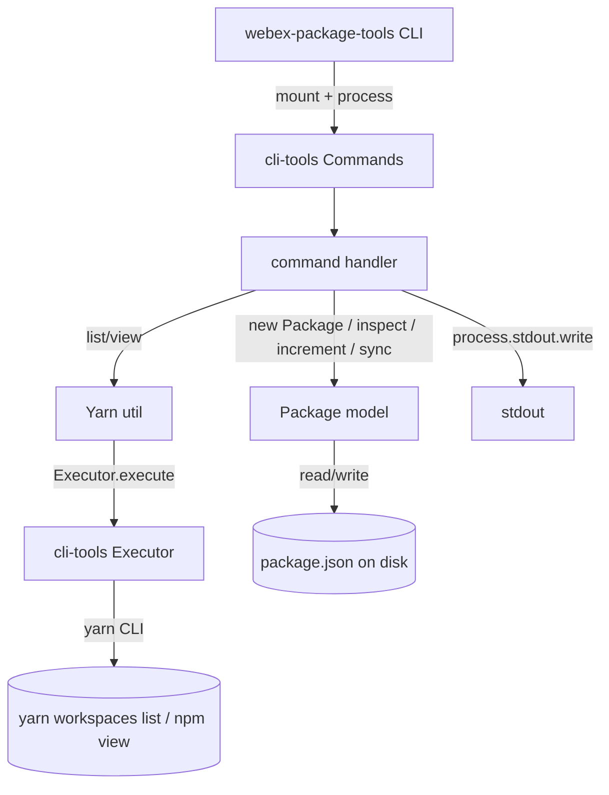
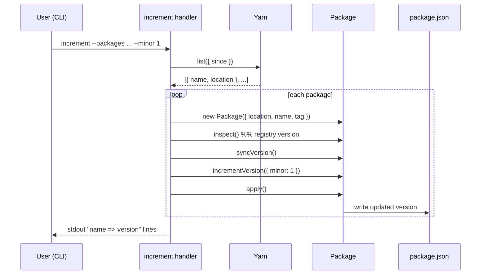
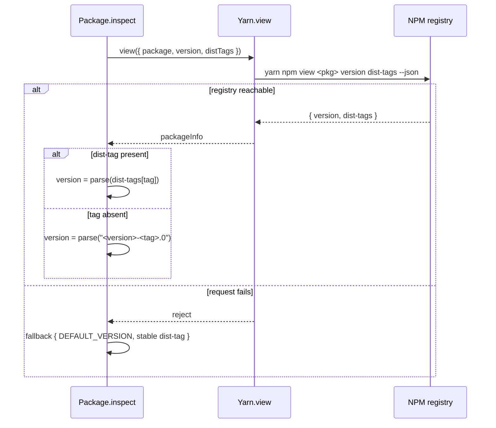
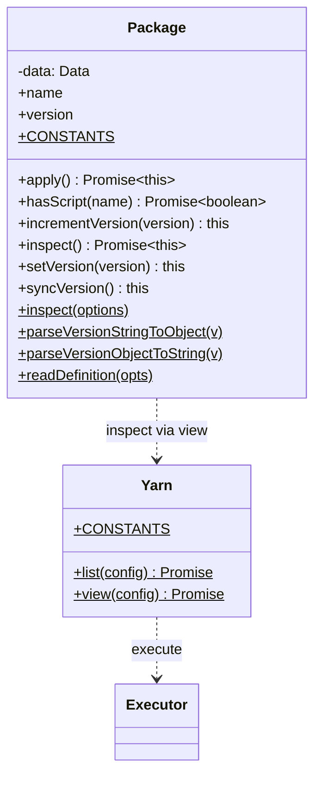

<!-- sdd-generated-metadata
generator: claude-cli
generator_model: us.anthropic.claude-opus-4-8
approved_by: pending-human-review
updated_at: 2026-08-06T00:00:00Z
validation_status: not-run
run_id: 51855eac-8de5-43a2-a3b6-dbcc55ebc91b
-->

# @webex/package-tools — SPEC

> Start here → root [`AGENTS.md`](../../../../AGENTS.md) (agent entry) · router [`SPEC_INDEX.md`](../../../../ai-docs/SPEC_INDEX.md) · system [`ARCHITECTURE.md`](../../../../ai-docs/ARCHITECTURE.md). This is the module's canonical spec: orientation, requirements, design, flows, and tests.
> Context-efficiency: link to canonical docs — don't duplicate them. Load specs on demand per `SPEC_INDEX.md`.

## Metadata

| Field | Value |
|---|---|
| Module id | `package-tools` |
| Source path(s) | `packages/tools/package/src/` (CLI entry `packages/tools/package/index.js`) |
| Parent spec | `—` (build-time workspace tooling; depends on `@webex/cli-tools`) |
| Doc kind | Module spec |
| Coverage score | Pending coverage assessment |
| Generated from | `module-spec` @ SDLC template library `0.2.2` |
| generated_by / approved_by / updated_at | claude-cli / pending-human-review / 2026-08-06 |
| Validation status | not-run, validator `pending`, assessed 2026-08-06 |

Coverage score is `Pending coverage assessment` until the first coverage review runs. Manifest coverage
state is authoritative and kept in `.sdd/manifest.json`.

## Evidence Rules
Every requirement cites concrete source evidence using `file path`. Test evidence is preferred for WHY.
Requirements are grounded in the current TypeScript implementation under `src/` and the package's Jest
unit suite (`test:unit`), which enforces 100% coverage via the shared modern Jest config.

## Source Material Register

| Source material | Scope | Decision | Detail location or disposition |
|---|---|---|---|
| `N/A` | none | none | No pre-existing SDD/AI-docs, architecture, or spec documents were routed to this module; content is derived from source, package config, and the shared Jest config. |

## Overview

`@webex/package-tools` is the monorepo's package-management CLI, published as the `webex-package-tools`
binary. It manages versions, listing, script validation, dependency synchronization/updating, and
changelog generation across the Yarn Workspaces project. It is built on top of `@webex/cli-tools`: the
CLI entry (`index.js`) constructs a `Commands` instance and mounts each command
(`increment`, `list`, `scripts`, `sync`, `update`, `changelog`) exported from `src/commands`.

Internally it is organized into three layers: **commands** (`src/commands/*`) that adapt CLI options into
work, a **`Package` model** (`src/models/package`) that owns version parsing/incrementing/synchronization
and reads/writes each package's `package.json`, and a **`Yarn` util** (`src/utils/yarn`) that shells out
to the Yarn CLI (`yarn workspaces list`, `yarn npm view`) through `@webex/cli-tools`' `Executor`. A
maintainer should start at `index.js`, then `src/commands/index.ts`, then the `Package` and `Yarn`
classes.

The build compiles TypeScript to a CommonJS module (`dist/module`) plus declarations (`dist/types`), and
`index.js` requires `./dist/module` at runtime.

## Purpose / Responsibility

Owns workspace package operations for the SDK monorepo: version increment/sync/update, package listing,
script existence checks, and changelog generation. It does NOT own the CLI/shell primitives (those are
`@webex/cli-tools`) or the actual publish step (that is each package's `deploy:npm`).

## Stack

TypeScript `5.3.3` compiled with `tsc` (CommonJS to `dist/module`, declarations to `dist/types`), Node
`>=18`, Yarn `>=3.0.0` (`3.4.1`). Runtime dependency: `@webex/cli-tools` (`workspace:*`). Tested with
`jest@29.7.0` (`test:unit`), linted with ESLint, type-checked with `tsc --noEmit` (`test:syntax`). Uses
Node `fs/promises` and `path` for `package.json` I/O. API docs via `api-extractor` + `api-documenter`.

## Folder / Package Structure

```
packages/tools/package/
├── index.js                          # CLI entry: mounts all commands onto a cli-tools Commands instance
└── src/
    ├── index.ts                      # Library barrel: commands, Package, Yarn, and their types
    ├── commands/
    │   ├── index.ts                  # Re-exports increment/list/scripts/sync/update/changelog + option types
    │   ├── increment/                # increment command (bump versions by major/minor/patch/release)
    │   ├── list/                     # list command (workspace package names; node/yarn output modes)
    │   ├── scripts/                  # scripts command (check a package has a named script)
    │   ├── sync/                     # sync command (align pre-release versions to registry)
    │   ├── update/                   # update command (bump named dependency versions in a package.json)
    │   └── changelog/                # changelog command (generate/update changelog logs from commits)
    ├── models/
    │   └── package/                  # Package class: version parse/increment/sync, read/apply package.json
    └── utils/
        └── yarn/                     # Yarn class: yarn workspaces list / yarn npm view via Executor
```

## Sub-modules

This package is documented as a single module; its `commands`, `models`, and `utils` directories are
internal layers without their own routed specs and are covered here rather than in child specs.

## Key Files (source of truth)

| File | Holds |
|---|---|
| `packages/tools/package/index.js` | The CLI entry that mounts every command; authoritative command set for the `webex-package-tools` binary |
| `packages/tools/package/src/models/package/package.ts` | The canonical version-string parsing, increment, and sync rules; do not re-implement version math elsewhere |
| `packages/tools/package/src/utils/yarn/yarn.ts` | The exact Yarn CLI invocations and flag mapping (`list`, `view`) |
| `packages/tools/package/src/commands/index.ts` | The authoritative list of exported commands and option types |

## Public Surface

Two surfaces: (1) a **CLI** (`webex-package-tools` binary via `index.js`) exposing sub-commands, and (2)
a **library API** re-exported from `src/index.ts` for programmatic use.

| Contract ID | Type | Surface | Purpose | Compatibility / deprecation | Schema / detail link | Root index |
|---|---|---|---|---|---|---|
| `package-tools.increment` | CLI | `webex-package-tools increment [--major --minor --patch --release --packages --since --tag]` | Increment filtered workspace package versions and write them back | Stable command; options additive | `packages/tools/package/src/commands/increment/increment.constants.ts` | `../../../../ai-docs/CONTRACTS.md` |
| `package-tools.list` | CLI | `webex-package-tools list [--mode --private --recursive --since]` | List workspace package names in node- or yarn-glob output form | Stable command | `packages/tools/package/src/commands/list/list.ts` | `../../../../ai-docs/CONTRACTS.md` |
| `package-tools.scripts` | CLI | `webex-package-tools scripts [--package --script]` | Report whether a package defines a named script | Stable command | `packages/tools/package/src/commands/scripts/scripts.ts` | `../../../../ai-docs/CONTRACTS.md` |
| `package-tools.sync` | CLI | `webex-package-tools sync [--tag --packages]` | Align pre-release package versions to the registry's stable version | Stable command | `packages/tools/package/src/commands/sync/sync.ts` | `../../../../ai-docs/CONTRACTS.md` |
| `package-tools.update` | CLI | `webex-package-tools update [--packages --tag]` | Update named dependency versions in the current package.json to the registry tag | Stable command | `packages/tools/package/src/commands/update/update.ts` | `../../../../ai-docs/CONTRACTS.md` |
| `package-tools.changelog` | CLI | `webex-package-tools changelog [--packages --commit --tag]` | Generate/update changelog log files for modified packages | Stable command | `packages/tools/package/src/commands/changelog/changelog.ts` | `../../../../ai-docs/CONTRACTS.md` |
| `package-tools.Package` | SDK | `new Package(config)` + version methods | Programmatic version parse/increment/sync and package.json apply | Stable named export | `packages/tools/package/src/models/package/package.ts` | `../../../../ai-docs/CONTRACTS.md` |
| `package-tools.Yarn` | SDK | `Yarn.list(config)` / `Yarn.view(config)` | Programmatic Yarn CLI wrappers returning parsed JSON | Stable named export | `packages/tools/package/src/utils/yarn/yarn.ts` | `../../../../ai-docs/CONTRACTS.md` |

Compatibility notes:
- The `src/index.ts` barrel and the CLI command names/options are the semver-controlled surfaces.
- Adding a command or an optional option is additive (minor); removing/renaming a command, option, or
  exported member is breaking (major).

## Requires (dependencies)

- `@webex/cli-tools` (`workspace:*`) — provides `Commands` (mounting in `index.js`) and `Executor`
  (used by `Yarn` to run the Yarn CLI).
- The Yarn CLI (`yarn workspaces list`, `yarn npm view`) available on `PATH` — invoked via `Executor`.
- Node `fs/promises` + `path` — read/write each package's `package.json` and resolve locations.
- A reachable NPM registry — `Package.inspect`/`update` call `yarn npm view`; failures fall back to the
  default version.

## Requirements

| ID | WHAT | WHY | Source Evidence | Test / Example Evidence | Assumptions / Gaps | Confidence |
|---|---|---|---|---|---|---|
| `PACKAGE-TOOLS-R-001` | `index.js` builds a `cli-tools` `Commands` instance and mounts `increment`, `list`, `scripts`, `sync`, `update`, and `changelog`, then calls `process()`. | The `webex-package-tools` binary must expose exactly these sub-commands. | `packages/tools/package/index.js` | Package `test:unit` (jest) | none identified | PRESENT |
| `PACKAGE-TOOLS-R-002` | `increment` lists changed packages (optionally `--since`), filters by `--packages`, inspects registry versions, syncs, then increments by the most-significant provided level and writes each `package.json`. | Release tooling needs deterministic, filtered version bumps applied back to disk. | `packages/tools/package/src/commands/increment/increment.ts` | Package `test:unit` (jest) | Uses `Yarn.list`, `Package.inspect/syncVersion/incrementVersion/apply` | PRESENT |
| `PACKAGE-TOOLS-R-003` | `Package.incrementVersion` applies only the highest provided level (major→minor→patch→release), zeroing lower levels; with no level it bumps `release` for non-stable tags or `patch` for the stable tag. | Semantic-version bumps must zero less-significant fields and default sensibly by tag. | `packages/tools/package/src/models/package/package.ts` | Package `test:unit` (jest) | Positive: `major` zeros minor/patch/release; negative default: stable tag → patch | PRESENT |
| `PACKAGE-TOOLS-R-004` | `Package.parseVersionStringToObject` / `parseVersionObjectToString` round-trip `major.minor.patch[-tag.release]`, defaulting non-integers to `0` and empty tag to the stable tag. | Version strings and structured versions must convert losslessly and safely. | `packages/tools/package/src/models/package/package.ts` | Package `test:unit` (jest) | Round-trips `1.2.3-beta-branch.50`; omits `-tag.release` for stable | PRESENT |
| `PACKAGE-TOOLS-R-005` | `Package.syncVersion` is a no-op for the stable tag; for pre-release tags it aligns major/minor/patch to the registry `latest` dist-tag and zeroes `release` when any changed. | Pre-release versions must track the current stable line without drifting. | `packages/tools/package/src/models/package/package.ts` | Package `test:unit` (jest) | none identified | PRESENT |
| `PACKAGE-TOOLS-R-006` | `Package.inspect` reads `yarn npm view` dist-tags/version and sets the instance version to the tag's version, or to `<version>-<tag>.0` when the tag is absent; registry failure falls back to the default version. | Version decisions must reflect what is actually published, degrading gracefully offline. | `packages/tools/package/src/models/package/package.ts` | Package `test:unit` (jest) | `Package.inspect` catch returns default version + stable dist-tag | PRESENT |
| `PACKAGE-TOOLS-R-007` | `Yarn.list` runs the workspace list command with mapped flags (`--json`, `--no-private`, `--recursive`, `--since`, `--verbose`) and parses newline-delimited JSON into an array; `Yarn.view` runs `yarn npm view` with `version`/`dist-tags`/`--json` and parses the JSON result. | Commands need structured workspace and registry data from the Yarn CLI. | `packages/tools/package/src/utils/yarn/yarn.ts` | Package `test:unit` (jest) | `list` wraps results as `[a,b,...]` before `JSON.parse` | PRESENT |
| `PACKAGE-TOOLS-R-008` | `list` outputs package names as space-separated (`node` mode) or a Yarn glob (`{a,b}`, or the single name) otherwise; `scripts` writes `true`/`false` for whether the named package defines the named script. | Downstream shell scripts consume these exact output shapes. | `packages/tools/package/src/commands/list/list.ts`, `packages/tools/package/src/commands/scripts/scripts.ts` | Package `test:unit` (jest) | Single package in yarn mode prints the bare name | PRESENT |
| `PACKAGE-TOOLS-R-009` | `update` reads the current `package.json`, resolves the registry version for named dependencies across all dependency groups at the given tag, writes updated versions back, and prints `name: prev => next` lines. | Dependency bumps must be applied to the manifest and reported. | `packages/tools/package/src/commands/update/update.ts` | Package `test:unit` (jest) | Covers dependencies/devDependencies/peer/bundle/optional groups | PRESENT |
| `PACKAGE-TOOLS-R-010` | `changelog` returns early when `--packages` is absent; otherwise it lists+filters packages, inspects them, and calls `createOrUpdateChangelog(packs, --commit)` to write per-version changelog JSON logs. | Changelog generation is opt-in per package set and derives from commit history. | `packages/tools/package/src/commands/changelog/changelog.ts`, `packages/tools/package/src/commands/changelog/changelog.utils.ts` | Package `test:unit` (jest) | Early `Promise.resolve({})` when no packages provided | PRESENT |

Do not merge unrelated command behaviors into one requirement; each command's contract is listed
separately above.

## Design Overview

The package follows a command → model/util layering. Each command in `src/commands/*` is a
`CommandsCommand<Options>` object: a `config` (name/description/options, defined in the command's
`*.constants.ts`) plus a `handler` that turns parsed CLI options into work. Handlers do not shell out
directly; they use the `Yarn` util (which uses `cli-tools` `Executor`) for workspace/registry data and the
`Package` model for version logic and `package.json` I/O.

The `Package` model is the heart of version semantics: it holds a structured `Version`
(`major/minor/patch/release/tag`), parses to/from the `x.y.z[-tag.release]` string form,
increments by the most-significant provided level, and synchronizes pre-release lines to the registry
`latest`. `apply()` reads the on-disk `package.json`, overwrites its `version`, and rewrites the file with
two-space JSON. `Yarn` centralizes the exact Yarn CLI invocations and their flag mapping so commands stay
declarative.

## Data Flow



## Sequence Diagram(s)

Sequence coverage:

| Operation group | Diagram | Failure / recovery coverage |
|---|---|---|
| Version increment (`increment`/`sync`) | 1. increment flow | `Package.inspect` registry failure → default-version fallback |
| Registry inspect (`Package.inspect`) | 2. inspect fallback | `alt` covers tag hit vs. missing tag vs. `yarn npm view` failure |

### 1. increment flow



### 2. Package.inspect fallback



## Class / Component Relationships



Commands consume both `Package` and `Yarn`; `Package.inspect` delegates to `Yarn.view`, and `Yarn`
delegates shell execution to `cli-tools` `Executor`.

## Use Cases

- **UC-1 Increment release versions:** `webex-package-tools increment --packages a b --minor 1` lists,
  inspects, syncs, increments, and writes each `package.json`. Evidence:
  `packages/tools/package/src/commands/increment/increment.ts`.
- **UC-2 List workspace packages for a shell script:** `list --mode node` prints space-separated names.
  Evidence: `packages/tools/package/src/commands/list/list.ts`.
- **UC-3 Update dependency versions:** `update --packages x --tag latest` rewrites matching dependency
  versions in the current `package.json`. Evidence: `packages/tools/package/src/commands/update/update.ts`.

## Business Rules & Invariants

- Incrementing applies only the most-significant provided level and zeroes all less-significant fields —
  enforced in `Package.incrementVersion` (`src/models/package/package.ts`).
- `syncVersion` never mutates a stable-tagged version — enforced by the early return in
  `Package.syncVersion`.
- Version parsing defaults any non-integer segment to `0` and an empty tag to the stable tag — enforced
  in `Package.parseVersionStringToObject`.
- `changelog` does nothing without an explicit `--packages` list — enforced by the early
  `Promise.resolve({})` in the `changelog` handler.

## Error Handling & Failure Modes

| Condition | Signal (error/code/result) | Caller recovery |
|---|---|---|
| `yarn npm view` fails / package unpublished | `Package.inspect` static catch returns `{ DEFAULT_VERSION, stable dist-tag }` | Proceeds with the default version; no throw |
| `scripts` target package not found | Handler resolves `false` and writes `false` | Caller treats `false` as "script absent" |
| Underlying shell command exits non-zero | `Executor` rejects with a formatted `Error` (see `@webex/cli-tools`) | Command promise rejects; surfaced by the CLI |

## Pitfalls

- `increment`/`sync` filter by `options.packages` only when provided; with no `--packages` they operate on
  every listed package — scope the flag intentionally in release scripts.
- `Package.apply()` rewrites the whole `package.json` with two-space JSON and a trailing newline; formatting
  differences from other tooling can appear as diffs.
- `Yarn.list` parses results by wrapping newline-joined lines as a JSON array (`[a,b,...]`); non-JSON or
  unexpected Yarn output will fail `JSON.parse`.
- `sync`'s handler reads `options.tag.split('/').pop()`, so `--tag` is required for `sync` (unlike the
  optional `tag` on `increment`).

## Module Do's / Don'ts

- DO route all version math through the `Package` model and all Yarn calls through the `Yarn` util.
- DO define each command's options in its `*.constants.ts` `CONFIG` and keep handlers declarative.
- DON'T shell out to Yarn or edit `package.json` directly from a command handler; use `Yarn`/`Package`.

## Export Stability

The `src/index.ts` barrel plus the CLI command/option names are the semver surface. Adding a command,
export, or optional option is a minor change; removing/renaming a command, export, or option, or changing
version-string parsing/formatting, is a major (breaking) change. Declarations are emitted to `dist/types`.

## Test-Case Strategy (module)

Unit tests run through `yarn test:unit` (Jest, shared modern config) with a 100% coverage threshold on
`dist/module`. Tests assert positive and negative paths per unit: version parse/format round-trips and
non-integer/empty-tag defaults; `incrementVersion` level precedence and stable/pre-release defaults;
`syncVersion` stable no-op vs. pre-release alignment; `inspect` tag-hit/tag-miss/registry-failure branches;
`Yarn.list/view` flag mapping and JSON parsing; and each command handler's output/early-return behavior.

| Behavior / Requirement | Existing test evidence | Gap |
|---|---|---|
| `PACKAGE-TOOLS-R-001` | Package `test:unit` (jest) | Confirm all six commands are mounted |
| `PACKAGE-TOOLS-R-002` | Package `test:unit` (jest) | Re-check `--since`/`--packages` filtering paths |
| `PACKAGE-TOOLS-R-003` | Package `test:unit` (jest) | Re-check each level-precedence and default branch |
| `PACKAGE-TOOLS-R-004` | Package `test:unit` (jest) | Re-check non-integer and empty-tag defaults |
| `PACKAGE-TOOLS-R-005` | Package `test:unit` (jest) | Re-check release-zeroing on change |
| `PACKAGE-TOOLS-R-006` | Package `test:unit` (jest) | Re-check the registry-failure fallback |
| `PACKAGE-TOOLS-R-007` | Package `test:unit` (jest) | Re-check every flag mapping and the list JSON wrapping |
| `PACKAGE-TOOLS-R-008` | Package `test:unit` (jest) | Re-check single-package yarn-mode output |
| `PACKAGE-TOOLS-R-009` | Package `test:unit` (jest) | Re-check all five dependency groups |
| `PACKAGE-TOOLS-R-010` | Package `test:unit` (jest) | Re-check the no-packages early return |

## Traceability

- Repo architecture: [`ARCHITECTURE.md`](../../../../ai-docs/ARCHITECTURE.md) · Registry: [`SPEC_INDEX.md`](../../../../ai-docs/SPEC_INDEX.md)
- Contracts catalog: [`CONTRACTS.md`](../../../../ai-docs/CONTRACTS.md)
- Coverage state & contracts baseline: `.sdd/manifest.json`
