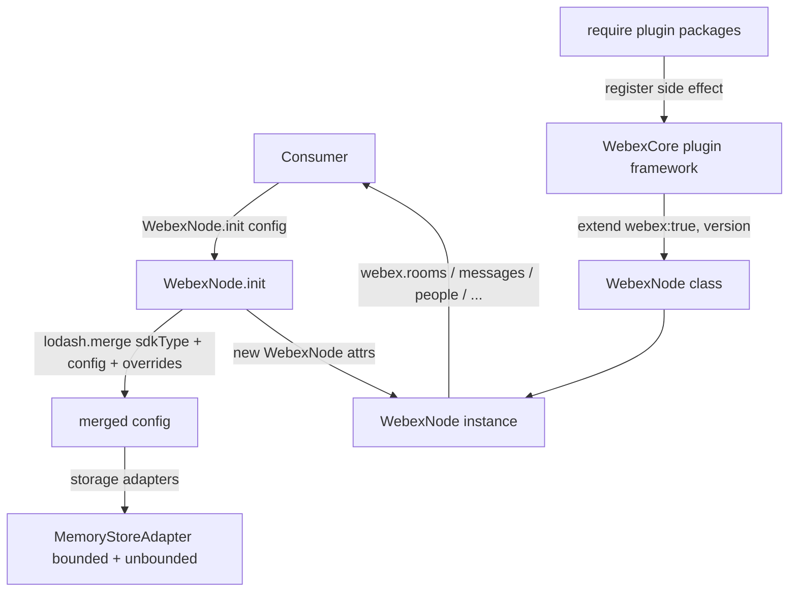
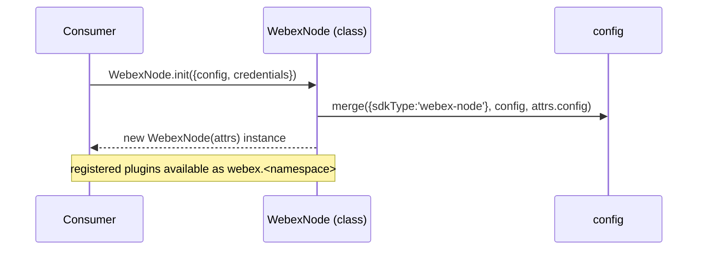
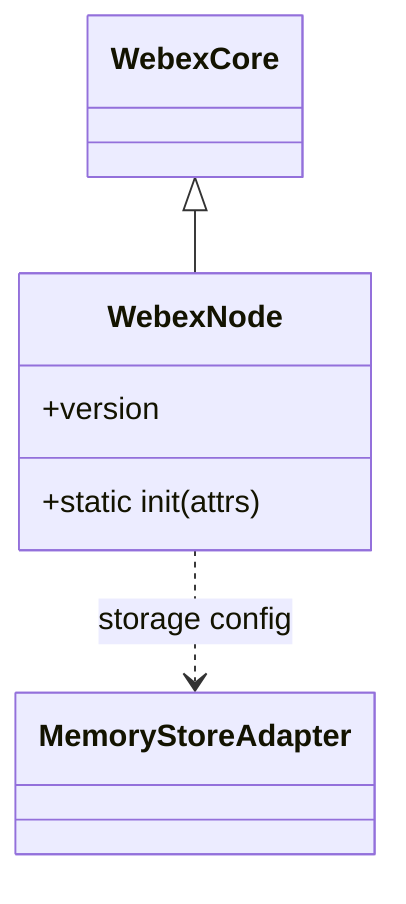

# webex-node — SPEC

> Start here → root [`AGENTS.md`](../../../AGENTS.md) (agent entry) · router [`SPEC_INDEX.md`](../../../ai-docs/SPEC_INDEX.md) · system [`ARCHITECTURE.md`](../../../ai-docs/ARCHITECTURE.md). This is the module's canonical spec: orientation, requirements, design, flows, state, protocol, UI, data, and tests.
> Context-efficiency: link to canonical docs — don't duplicate them. Load specs on demand per `SPEC_INDEX.md`.

## Metadata
| Field | Value |
|---|---|
| Module id | `webex-node` |
| Source path(s) | `packages/webex-node/src/` |
| Parent spec | `—` (top-level Node aggregate SDK package; composed from workspace plugins, no parent module) |
| Doc kind | Module spec |
| Coverage score | Pending coverage assessment |
| Generated from | `module-spec` @ SDLC template library `0.2.2` |
| generated_by / approved_by / updated_at | claude-cli / pending-human-review / 2026-08-06 |
| Validation status | not-run, validator `pending`, assessed 2026-08-06 |

Coverage score is `Pending coverage assessment` until the first coverage review runs. Manifest coverage
state (`Partial`) is authoritative and kept in `.sdd/manifest.json`.

## Evidence Rules
Every requirement below cites concrete source evidence using `file path`. Test evidence is preferred for
WHY. Requirements are grounded in the current implementation under `packages/webex-node/src/` and its
package configuration.

## Source Material Register
| Source material | Scope | Decision | Detail location or disposition |
|---|---|---|---|
| N/A — code-grounded generation | none | none | No routed source spec for this module (`source_paths` empty in the completion plan). All content derived from `packages/webex-node/src/` and `packages/webex-node/package.json`. |

## Overview

`webex-node` is the top-level, Node.js-facing aggregate package of the Cisco Webex JS SDK. Like the
browser `webex` package it implements no domain behavior; it composes a curated set of public and internal
Webex plugins into a single `WebexNode` class by extending `WebexCore` and registering plugins as an
import side effect. It targets server/Node runtimes and is explicitly not intended for browser use
(`packages/webex-node/README.md`).

Structure: `src/index.js` is the CommonJS entry that loads `@babel/polyfill` (unless already present) and
re-exports `src/webex-node.js`. `src/webex-node.js` `require`s each plugin package for its registration
side effect, builds `WebexNode = WebexCore.extend({webex: true, version: PACKAGE_VERSION})`, and defines
`WebexNode.init(attrs)` which merges a default `{sdkType: 'webex-node'}` config with the package `config`
and caller overrides. Storage defaults come from `src/config-storage.js`, which selects
`MemoryStoreAdapter` for both bounded and unbounded stores — appropriate for a Node process.

Compared to the browser `webex` package, `webex-node` registers a smaller plugin set (notably it does not
require `internal-plugin-dss`, `internal-plugin-task`, `plugin-meetings`, `plugin-rooms`/`teams` presence
differs, or `contact-center`), uses a Node-only memory storage default, and its default Hydra endpoint is
`https://api.ciscospark.com/v1`.

A maintainer should start at `packages/webex-node/src/webex-node.js` (the composition and `init`) and
`packages/webex-node/package.json` (the `exports` map and plugin dependency set).

## Purpose / Responsibility

Owns the Node aggregate composition of the Webex SDK: which plugins are registered for a Node runtime, the
Node-appropriate defaults (`sdkType: 'webex-node'`, memory storage, `api.ciscospark.com` Hydra URL), and
the `WebexNode.init` factory. It does NOT own plugin behavior, the core plugin framework
(`@webex/webex-core`), or the browser aggregate composition (`webex`).

## Stack

JavaScript (CommonJS entry files authored as `require`/`module.exports`, ES-module config files),
Node `>=18` (`packages/webex-node/package.json` `engines`). Built with `webex-legacy-tools build`
producing `dist/` from `src/` with JS, TS declarations, and source maps. Tests run `test:style` (ESLint)
and `test:unit` (Jest via `webex-legacy-tools test --unit --runner jest`); there is no integration test
script in this package. Test helpers include `@webex/test-helper-chai`, `@webex/test-helper-mock-webex`,
`@webex/test-helper-test-users`, and `sinon`.

## Folder / Package Structure

```
packages/webex-node/src/
├── index.js            # CommonJS entry: load polyfill, re-export ./webex-node
├── webex-node.js       # Composition: require plugins, extend WebexCore, WebexNode.init({sdkType:'webex-node'})
├── config.js           # Default config: hydra/hydraServiceUrl, credentials, device, storage adapters
└── config-storage.js   # Storage adapters: MemoryStoreAdapter for bounded + unbounded (Node default)
```

## Key Files (source of truth)

| File | Holds |
|---|---|
| `packages/webex-node/src/webex-node.js` | The plugin registration list, `WebexCore.extend`, and `WebexNode.init` default config merge (`sdkType: 'webex-node'`) |
| `packages/webex-node/src/config.js` | Default `hydra`/`hydraServiceUrl` (`https://api.ciscospark.com/v1`), `credentials.clientType`, `device`, `storage` |
| `packages/webex-node/src/config-storage.js` | Node storage adapter selection (`MemoryStoreAdapter` for bounded and unbounded) |
| `packages/webex-node/package.json` | `exports` map (`.`, `./package`) and the composed plugin dependency set |

## Public Surface

Consumed as an npm package (`webex-node`) for Node runtimes. It exposes a `WebexNode` class with a static
`init` factory via the `package.json` `exports` map.

| Contract ID | Type | Surface | Purpose | Compatibility / deprecation | Schema / detail link | Root index |
|---|---|---|---|---|---|---|
| `webex-node.default` | SDK | `require('webex-node')` / `import Webex from 'webex-node'` → `WebexNode` | Node aggregate SDK class | Stable package entry (`exports["."]`) | `packages/webex-node/src/webex-node.js` | `../../../ai-docs/CONTRACTS.md` |
| `webex-node.init` | SDK | `WebexNode.init({config?, credentials?})` → `WebexNode` | Create a configured instance; merges `sdkType:'webex-node'` + package config + overrides | Stable factory | `packages/webex-node/src/webex-node.js` | `../../../ai-docs/CONTRACTS.md` |
| `webex-node.version` | SDK | `WebexNode.version` / `instance.version` | Package version injected at build as `PACKAGE_VERSION` | Stable read-only property | `packages/webex-node/src/webex-node.js` | `../../../ai-docs/CONTRACTS.md` |

Compatibility notes:
- The `exports` map (`.`, `./package`) is the semver-controlled entry surface; removing or renaming an
  entry is a breaking change.
- The composed plugin set in `package.json` `dependencies` determines which `webex.<plugin>` namespaces
  exist on an instance; individual plugin contracts live in each plugin's own spec and root `CONTRACTS.md`.

## Requires (dependencies)

- `@webex/webex-core` — provides `WebexCore` (the base class this package extends) and `MemoryStoreAdapter`
  used by the storage config.
- Registered plugin packages (import side effect in `src/webex-node.js`): `@webex/plugin-authorization`,
  `@webex/internal-plugin-calendar`, `@webex/internal-plugin-device`, `@webex/internal-plugin-presence`,
  `@webex/internal-plugin-support`, `@webex/internal-plugin-llm`, `@webex/plugin-attachment-actions`,
  `@webex/plugin-device-manager`, `@webex/plugin-logger`, `@webex/plugin-messages`,
  `@webex/plugin-memberships`, `@webex/plugin-people`, `@webex/plugin-rooms`, `@webex/plugin-teams`,
  `@webex/plugin-team-memberships`, `@webex/plugin-webhooks`, `@webex/plugin-encryption`.
- `lodash` (`merge` for config composition). Additional workspace dependencies are declared in
  `package.json` (e.g. `@webex/internal-plugin-voicea`, `@webex/plugin-authorization`,
  `@webex/storage-adapter-local-storage`). Evidence: `packages/webex-node/src/webex-node.js`,
  `packages/webex-node/package.json`.

## Requirements

| ID | WHAT | WHY | Source Evidence | Test / Example Evidence | Assumptions / Gaps | Confidence |
|---|---|---|---|---|---|---|
| `WEBEX-NODE-R-001` | The entry composes a `WebexNode` class by `require`-ing the Node plugin set for their registration side effect and extending `WebexCore` with `{webex: true, version: PACKAGE_VERSION}`. | Node consumers get the bundled Node plugins pre-wired from a single import. | `packages/webex-node/src/webex-node.js` | `packages/webex-node/test/unit/` | Plugin list is maintained by hand in `src/webex-node.js` | PRESENT |
| `WEBEX-NODE-R-002` | `WebexNode.init(attrs = {})` merges (via `lodash/merge`) a default `{sdkType: 'webex-node'}`, the package `config`, and `attrs.config`, then returns `new WebexNode(attrs)`. | Callers can override config while inheriting Node defaults and the correct `sdkType`. | `packages/webex-node/src/webex-node.js`, `packages/webex-node/src/config.js` | `packages/webex-node/test/unit/` | none identified | PRESENT |
| `WEBEX-NODE-R-003` | `WebexNode.version` and `instance.version` expose the build-injected `PACKAGE_VERSION`. | Consumers and telemetry need a reliable SDK version. | `packages/webex-node/src/webex-node.js` | `packages/webex-node/test/unit/` | Version resolved at build time | PRESENT |
| `WEBEX-NODE-R-004` | The package exposes exactly the entry points `.` and `./package` through the `exports` map, mapping to `dist/index.js` and `package.json`. | A stable, enumerated public entry surface for Node consumers. | `packages/webex-node/package.json` | `packages/webex-node/test/unit/` | none identified | PRESENT |
| `WEBEX-NODE-R-005` | Storage defaults use `MemoryStoreAdapter` for both bounded and unbounded stores. | A Node process has no browser `localStorage`; in-memory storage is the correct default. | `packages/webex-node/src/config-storage.js`, `packages/webex-node/src/config.js` | `packages/webex-node/test/unit/` | none identified | PRESENT |
| `WEBEX-NODE-R-006` | Default config sets `hydra`/`hydraServiceUrl` to `process.env.HYDRA_SERVICE_URL || 'https://api.ciscospark.com/v1'`, `credentials.clientType: 'confidential'`, and `device: {validateDomains: true, ephemeral: true}`. | Provide correct service endpoints and secure device defaults for Node out of the box. | `packages/webex-node/src/config.js` | `packages/webex-node/test/unit/` | Endpoint differs from browser `webex` (`webexapis.com`) | PRESENT |

## Design Overview

`webex-node` is a thin composition layer over the `@webex/webex-core` plugin framework. Each plugin
package registers itself when `require`d, so `src/webex-node.js` lists its `require` statements before
calling `WebexCore.extend(...)`; the resulting `WebexNode` class then carries every registered plugin
namespace. `WebexNode.init` applies config precedence: hardcoded `sdkType` default < package `config` <
caller `attrs.config`, merged deeply with `lodash/merge`.

The design intentionally mirrors the browser `webex` package but is tuned for Node: a smaller registered
plugin set (no browser-only or meetings-heavy plugins by default), a memory-only storage default (no
`localStorage`), and a distinct default Hydra endpoint. Keeping this as a separate package lets Node and
browser consumers pull only the composition and defaults appropriate to their runtime while sharing the
same underlying plugin implementations.

## Data Flow



## Sequence Diagram(s)

This is a single-operation-group composition module: the only public operation is instance construction
via `WebexNode.init`. One sequence diagram is therefore sufficient.

Sequence coverage:

| Operation group | Diagram | Failure / recovery coverage |
|---|---|---|
| Initialize Node SDK | 1. WebexNode.init | Config merge is synchronous; no network occurs in `init` itself |

### 1. WebexNode.init



## Class / Component Relationships



`WebexNode` extends `WebexCore` and references `MemoryStoreAdapter` (from `@webex/webex-core`) through its
storage config.

## Use Cases

- **UC-1 Initialize the Node SDK:** consumer calls `WebexNode.init({credentials:{access_token}})` → merged config → `new WebexNode` → uses `webex.rooms`/`webex.messages`/`webex.people`/etc. Evidence: `packages/webex-node/src/webex-node.js`, `packages/webex-node/README.md`.
- **UC-2 Bot usage:** consumer initializes with a bot token to drive messaging/membership operations from a Node service. Evidence: `packages/webex-node/README.md`, `packages/webex-node/src/webex-node.js`.

## Pitfalls

- Plugin availability is determined by the `require` list in `src/webex-node.js` (and `package.json`
  `dependencies`); a namespace missing at runtime usually means the plugin was not required/registered.
- The Node plugin set is smaller than the browser `webex` set — do not assume parity of namespaces between
  `webex-node` and `webex` (e.g. meetings/DSS/task/contact-center are not registered here by default).
- The default Hydra endpoint is `https://api.ciscospark.com/v1` (not `webexapis.com` as in the browser
  package); it is overridable via `HYDRA_SERVICE_URL`. Do not hardcode endpoints elsewhere.
- Storage is memory-only; state does not persist across process restarts.
- This package is not meant for browsers (`README.md`); use `webex` for browser/UMD consumers.

## Export Stability

Published as `webex-node` with `main: dist/index.js` and the `exports` map `.` and `./package`. Adding a
new subpath export is additive (minor); removing/renaming an existing subpath or changing
`WebexNode.init`'s signature/config-merge semantics is breaking (major). `WebexNode.version` is a
read-only build-injected value. Evidence: `packages/webex-node/package.json`,
`packages/webex-node/src/webex-node.js`.

## Test-Case Strategy (module)

Tests run `test:style` (ESLint over `src`) and `test:unit` (Jest via `webex-legacy-tools`). The module
test focus is composition and config precedence — asserting the `WebexNode` class exists, `version` is
present, and `init` applies the `sdkType: 'webex-node'` default and merges caller config — not per-plugin
behavior, which is owned by each plugin's own spec. There is no integration test script in this package.

| Behavior / Requirement | Existing test evidence | Gap |
|---|---|---|
| `WEBEX-NODE-R-001` | `packages/webex-node/test/unit/` or `None found` | Add assertion that a sampled plugin namespace is registered |
| `WEBEX-NODE-R-002` | `packages/webex-node/test/unit/` or `None found` | Add coverage asserting `sdkType:'webex-node'` after merge |
| `WEBEX-NODE-R-003` | `packages/webex-node/test/unit/` or `None found` | Add version-presence coverage |
| `WEBEX-NODE-R-004` | `packages/webex-node/test/unit/` or `None found` | Add export-map presence test |
| `WEBEX-NODE-R-005` | `packages/webex-node/test/unit/` or `None found` | Add storage-adapter default coverage |
| `WEBEX-NODE-R-006` | `packages/webex-node/test/unit/` or `None found` | Add default-endpoint coverage |

## Traceability

- Repo architecture: [`ARCHITECTURE.md`](../../../ai-docs/ARCHITECTURE.md) · Registry: [`SPEC_INDEX.md`](../../../ai-docs/SPEC_INDEX.md)
- Coverage state & contracts baseline: `.sdd/manifest.json`
