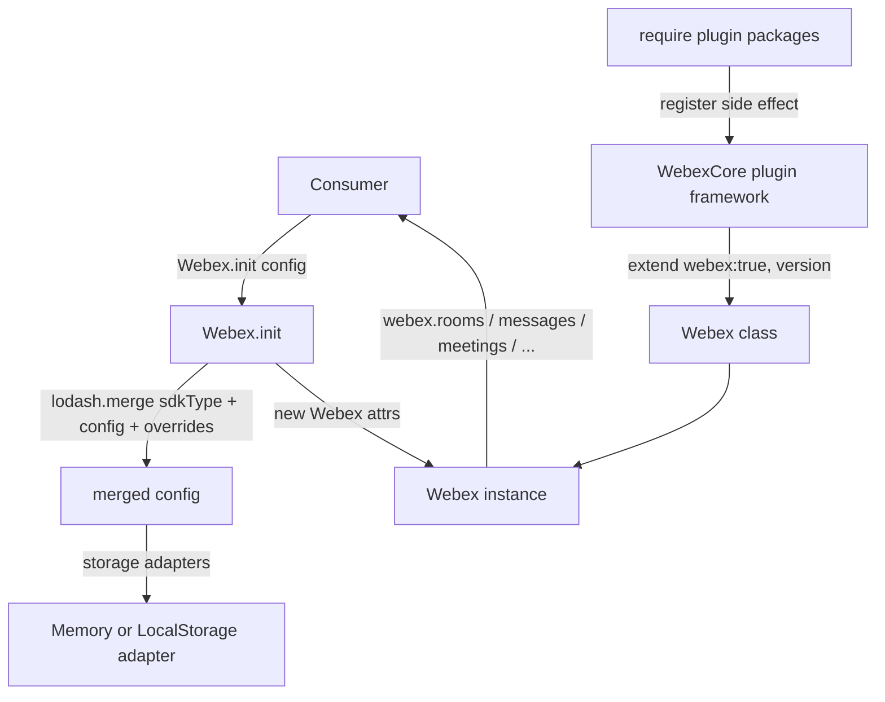
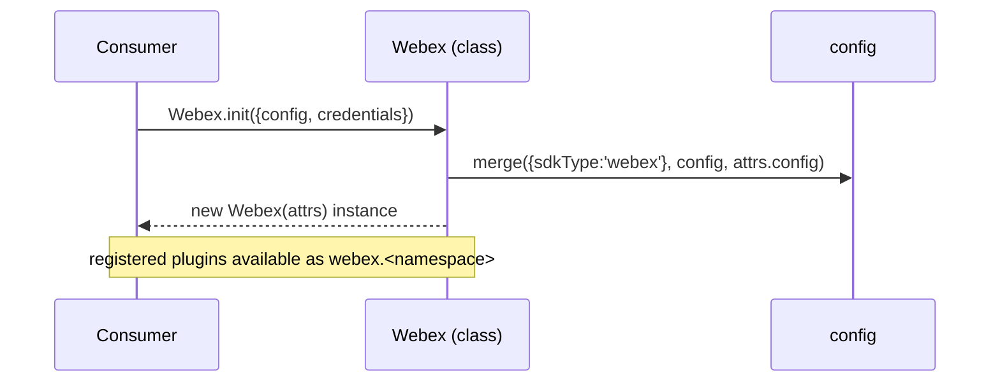
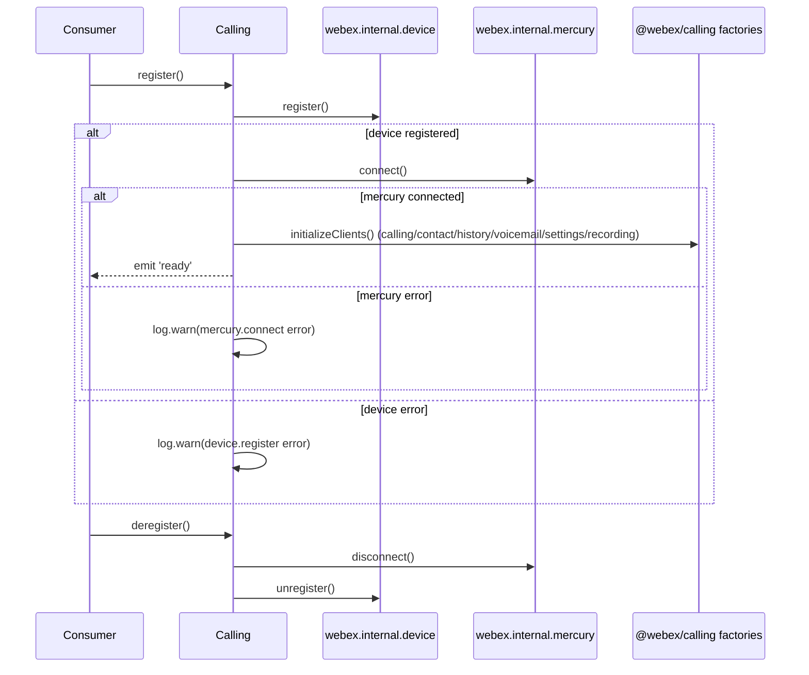
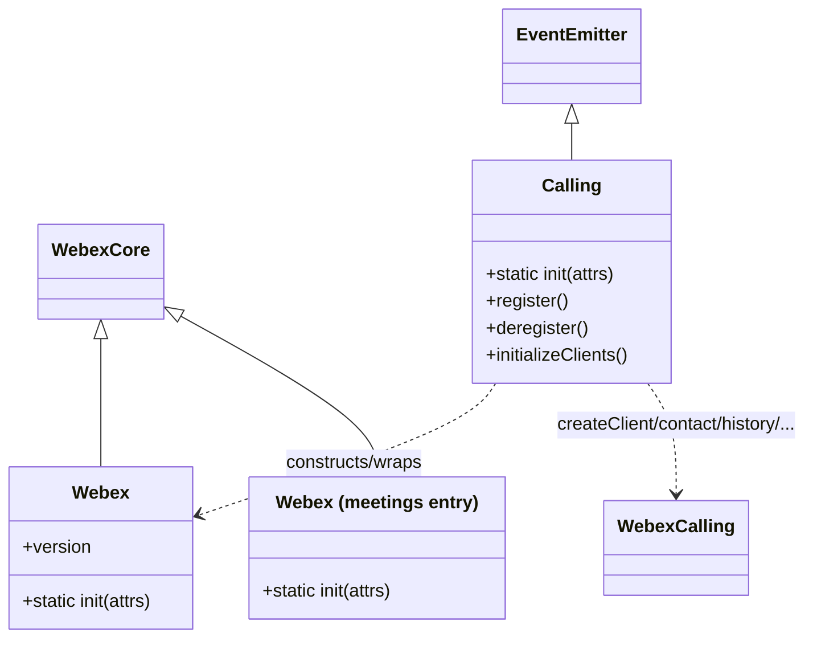

# @webex/webex — SPEC

> Start here → root [`AGENTS.md`](../../../AGENTS.md) (agent entry) · router [`SPEC_INDEX.md`](../../../ai-docs/SPEC_INDEX.md) · system [`ARCHITECTURE.md`](../../../ai-docs/ARCHITECTURE.md). This is the module's canonical spec: orientation, requirements, design, flows, state, protocol, UI, data, and tests.
> Context-efficiency: link to canonical docs — don't duplicate them. Load specs on demand per `SPEC_INDEX.md`.

## Metadata
| Field | Value |
|---|---|
| Module id | `webex` |
| Source path(s) | `packages/webex/src/` |
| Parent spec | `—` (top-level aggregate SDK package; composed from workspace plugins, no parent module) |
| Doc kind | Module spec |
| Coverage score | Pending coverage assessment |
| Generated from | `module-spec` @ SDLC template library `0.2.2` |
| generated_by / approved_by / updated_at | claude-cli / pending-human-review / 2026-08-06 |
| Validation status | not-run, validator `pending`, assessed 2026-08-06 |

Coverage score is `Pending coverage assessment` until the first coverage review runs. Manifest coverage
state (`Partial`) is authoritative and kept in `.sdd/manifest.json`.

## Evidence Rules
Every requirement below cites concrete source evidence using `file path`. Test evidence is preferred for
WHY. Requirements are grounded in the current implementation under `packages/webex/src/` and its unit
tests under `packages/webex/test/`.

## Source Material Register
| Source material | Scope | Decision | Detail location or disposition |
|---|---|---|---|
| N/A — code-grounded generation | none | none | No routed source spec for this module (`source_paths` empty in the completion plan). All content derived from `packages/webex/src/` and `packages/webex/package.json`. |

## Overview

`webex` is the top-level, browser/UMD-facing aggregate package of the Cisco Webex JS SDK. It does not
implement domain behavior itself; instead it composes the public and internal Webex plugins into a single
ready-to-use `Webex` class by extending `WebexCore` and registering a curated set of plugins as an
import side effect. Consumers install one package (`webex`) and get authorization, messaging, meetings,
calling, presence, and related capabilities pre-wired.

Structure: `src/index.js` is the CommonJS entry that loads the `@babel/polyfill` (unless already present)
and re-exports `src/webex.js`. `src/webex.js` `require`s each plugin package for its registration side
effect, then builds `Webex = WebexCore.extend({webex: true, version: PACKAGE_VERSION})` and defines
`Webex.init(attrs)` which merges a default `{sdkType: 'webex'}` config with the package `config` and
caller overrides. Two additional purpose-built entry points ship alongside the default: `src/calling.js`
(the `webex/calling` export, wrapping `@webex/calling` client factories in a `Calling` EventEmitter) and
`src/meetings.js` (the `webex/meetings` export, a meetings-focused composition). Storage defaults differ
by environment via `src/config-storage.js` and its browser shim `src/config-storage.shim.js`.

A maintainer should start at `packages/webex/src/webex.js` (the default composition and `init`),
`packages/webex/package.json` (the `exports` map and the full plugin dependency set), and then the two
alternate entry points `src/calling.js` and `src/meetings.js`.

## Purpose / Responsibility

Owns the browser/UMD aggregate composition of the Webex SDK: which plugins are registered, the default
config (`sdkType`, Hydra service URLs, storage adapters), and the `Webex.init` factory. It does NOT own
plugin behavior (each plugin package owns its own), the core plugin framework (`@webex/webex-core`), or
the Node aggregate composition (`webex-node`).

## Stack

JavaScript (CommonJS entry files authored as `require`/`module.exports`, ES-module config files),
Node `>=18` (`packages/webex/package.json` `engines`). Built with `webex-legacy-tools build` producing
`dist/` from `src/` with JS, TS declarations, and source maps. Unit tests run under Jest and integration
tests under Mocha via `webex-legacy-tools test`, using `@webex/test-helper-chai`,
`@webex/test-helper-mock-webex`, `@webex/test-helper-test-users`, and `sinon`. The browser build also
provides a UMD bundle exposing `window.Webex` (`packages/webex/README.md`).

## Folder / Package Structure

```
packages/webex/src/
├── index.js                  # CommonJS entry: load polyfill, re-export ./webex
├── webex.js                  # Default composition: require plugins, extend WebexCore, Webex.init({sdkType:'webex'})
├── calling.js                # `webex/calling` export: Calling EventEmitter wrapping @webex/calling factories
├── meetings.js               # `webex/meetings` export: meetings-focused composition, Webex.init({sdkType:'meetings'})
├── config.js                 # Default config: hydra/hydraServiceUrl, credentials, device, storage adapters
├── config-storage.js         # Node/default storage adapters (MemoryStoreAdapter for bounded+unbounded)
└── config-storage.shim.js    # Browser storage adapters (LocalStorageStoreAdapter bounded, Memory unbounded)
```

## Key Files (source of truth)

| File | Holds |
|---|---|
| `packages/webex/src/webex.js` | The default plugin registration list, `WebexCore.extend`, and `Webex.init` default config merge (`sdkType: 'webex'`) |
| `packages/webex/src/calling.js` | The `webex/calling` `Calling` class: register/deregister, client initialization, static stream/effect helpers |
| `packages/webex/src/meetings.js` | The `webex/meetings` composition and `Webex.init({sdkType:'meetings', meetings:{disableHydraId:true}})` |
| `packages/webex/src/config.js` | Default `hydra`/`hydraServiceUrl` (`https://webexapis.com/v1`), `credentials.clientType`, `device`, `storage` |
| `packages/webex/src/config-storage.js` / `config-storage.shim.js` | Environment-specific storage adapter selection (browser field in `package.json` swaps them) |
| `packages/webex/package.json` | `exports` map (`.`, `./calling`, `./meetings`, `./package`) and the composed plugin dependency set |

## Public Surface

Consumed as an npm package (`webex`) and as a UMD global (`window.Webex`). It exposes a `Webex` class with
a static `init` factory and three subpath entry points via the `package.json` `exports` map.

| Contract ID | Type | Surface | Purpose | Compatibility / deprecation | Schema / detail link | Root index |
|---|---|---|---|---|---|---|
| `webex.default` | SDK | `require('webex')` / `import Webex from 'webex'` → `Webex` | Default browser/UMD aggregate SDK class | Stable package entry (`exports["."]`) | `packages/webex/src/webex.js` | `../../../ai-docs/CONTRACTS.md` |
| `webex.init` | SDK | `Webex.init({config?, credentials?})` → `Webex` | Create a configured Webex instance; merges `sdkType:'webex'` + package config + overrides | Stable factory | `packages/webex/src/webex.js` | `../../../ai-docs/CONTRACTS.md` |
| `webex.version` | SDK | `Webex.version` / `instance.version` | Package version injected at build as `PACKAGE_VERSION` | Stable read-only property | `packages/webex/src/webex.js` | `../../../ai-docs/CONTRACTS.md` |
| `webex.calling` | SDK | `require('webex/calling')` → `Calling` (EventEmitter); `Calling.init(attrs)` | Calling-focused entry wrapping `@webex/calling` client factories | Stable subpath export (`exports["./calling"]`) | `packages/webex/src/calling.js` | `../../../ai-docs/CONTRACTS.md` |
| `webex.meetings` | SDK | `require('webex/meetings')` → `Webex` | Meetings-focused composition (`sdkType:'meetings'`, `disableHydraId`) | Stable subpath export (`exports["./meetings"]`) | `packages/webex/src/meetings.js` | `../../../ai-docs/CONTRACTS.md` |

Compatibility notes:
- The `exports` map (`.`, `./calling`, `./meetings`, `./package`) is the semver-controlled entry surface;
  removing or renaming an entry is a breaking change.
- The composed plugin set in `package.json` `dependencies` determines which `webex.<plugin>` namespaces
  exist on an instance; the individual plugin contracts live in each plugin's own spec and root
  `CONTRACTS.md`.

## Requires (dependencies)

- `@webex/webex-core` — provides `WebexCore` (the base class this package extends) and `MemoryStoreAdapter`
  used by the storage config.
- Registered plugin packages (import side effect in `src/webex.js`): `@webex/plugin-authorization`,
  `@webex/internal-plugin-calendar`, `@webex/internal-plugin-device`, `@webex/internal-plugin-dss`,
  `@webex/internal-plugin-presence`, `@webex/internal-plugin-support`, `@webex/internal-plugin-llm`,
  `@webex/internal-plugin-task`, `@webex/plugin-attachment-actions`, `@webex/plugin-device-manager`,
  `@webex/plugin-logger`, `@webex/plugin-meetings`, `@webex/plugin-messages`,
  `@webex/plugin-memberships`, `@webex/plugin-people`, `@webex/plugin-rooms`, `@webex/plugin-teams`,
  `@webex/plugin-team-memberships`, `@webex/plugin-webhooks`, `@webex/plugin-encryption`,
  `@webex/contact-center`. Additional packages participate in the `calling`/`meetings` entries
  (`@webex/calling`, `@webex/internal-plugin-mercury`, `@webex/internal-plugin-metrics`,
  `@webex/internal-plugin-user`, `@webex/internal-plugin-voicea`, `@webex/common`).
- `lodash` (`merge` for config composition) and `@webex/storage-adapter-local-storage` (browser bounded
  storage). Evidence: `packages/webex/src/webex.js`, `packages/webex/src/config-storage.shim.js`,
  `packages/webex/package.json`.

## Requirements

| ID | WHAT | WHY | Source Evidence | Test / Example Evidence | Assumptions / Gaps | Confidence |
|---|---|---|---|---|---|---|
| `WEBEX-R-001` | The default entry composes a `Webex` class by `require`-ing the public/internal plugin set for their registration side effect and extending `WebexCore` with `{webex: true, version: PACKAGE_VERSION}`. | Consumers get all bundled plugins pre-wired from a single import. | `packages/webex/src/webex.js` | `packages/webex/test/unit/spec/webex.js` | Plugin list is maintained by hand in `src/webex.js` | PRESENT |
| `WEBEX-R-002` | `Webex.init(attrs = {})` merges (via `lodash/merge`) a default `{sdkType: 'webex'}`, the package `config`, and `attrs.config`, then returns `new Webex(attrs)`. | Callers can override config while inheriting sane defaults and the correct `sdkType`. | `packages/webex/src/webex.js`, `packages/webex/src/config.js` | `packages/webex/test/unit/spec/webex.js` | none identified | PRESENT |
| `WEBEX-R-003` | `Webex.version` and `instance.version` expose the build-injected `PACKAGE_VERSION`. | Consumers and telemetry need a reliable SDK version. | `packages/webex/src/webex.js` | `packages/webex/test/unit/spec/webex.js` (asserts `Webex.version` and `webex.version` exist) | Version is `0.0.0` in the unbuilt test context | PRESENT |
| `WEBEX-R-004` | The package exposes exactly the entry points `.`, `./calling`, `./meetings`, and `./package` through the `exports` map, mapping to `dist/index.js`, `dist/calling.js`, `dist/meetings.js`, and `package.json`. | A stable, enumerated public entry surface for bundlers and consumers. | `packages/webex/package.json` | `packages/webex/test/unit/` | none identified | PRESENT |
| `WEBEX-R-005` | The `meetings` entry initializes with `{sdkType: 'meetings', meetings: {disableHydraId: true}}` and registers a meetings-focused plugin subset. | The meetings bundle needs meetings-specific defaults distinct from the full SDK. | `packages/webex/src/meetings.js` | `packages/webex/test/unit/` | none identified | PRESENT |
| `WEBEX-R-006` | The `calling` entry (`Calling`, an `EventEmitter`) registers the device via `webex.internal.device.register()` then connects Mercury, initializes the configured calling/contact/callHistory/voicemail/callSettings/callRecording clients, and emits `ready`; `deregister()` tears down active lines, disconnects Mercury, and unregisters the device. | Calling consumers need lifecycle management around the underlying `@webex/calling` factories and the SDK transport. | `packages/webex/src/calling.js` | `packages/webex/test/unit/` | Errors during register/mercury are logged as warnings, not rethrown | PRESENT |
| `WEBEX-R-007` | Storage defaults are environment-specific: the default/Node config uses `MemoryStoreAdapter` for bounded and unbounded stores, while the browser build swaps `config-storage.js` for `config-storage.shim.js`, using `LocalStorageStoreAdapter('webex')` for the bounded store. | Browser persistence must survive reloads while Node stays in-memory; the `package.json` `browser` field performs the swap. | `packages/webex/src/config-storage.js`, `packages/webex/src/config-storage.shim.js`, `packages/webex/package.json` | `packages/webex/test/unit/` | none identified | PRESENT |
| `WEBEX-R-008` | Default config sets `hydra`/`hydraServiceUrl` to `process.env.HYDRA_SERVICE_URL || 'https://webexapis.com/v1'`, `credentials.clientType: 'confidential'`, and `device: {validateDomains: true, ephemeral: true}`. | Provide correct production service endpoints and secure device defaults out of the box. | `packages/webex/src/config.js` | `packages/webex/test/unit/spec/webex.js` (fedramp overrides discovery services) | none identified | PRESENT |

## Design Overview

The package is a thin composition layer. The core mechanism is the Webex plugin framework in
`@webex/webex-core`: each plugin package, when `require`d, registers itself with the framework as a side
effect. `src/webex.js` therefore lists its `require` statements first, then calls `WebexCore.extend(...)`
so the resulting class picks up every registered plugin namespace (e.g. `webex.rooms`, `webex.messages`).
`Webex.init` centralizes config precedence: hardcoded `sdkType` default < package `config` < caller
`attrs.config`, merged deeply with `lodash/merge`.

Three entry points share this pattern but differ in intent. The default (`webex.js`) is the full
browser/UMD SDK. `meetings.js` registers a meetings-centric plugin subset and supplies meetings-specific
init defaults (`disableHydraId`). `calling.js` is structurally different: rather than only extending
`WebexCore`, it defines a `Calling` `EventEmitter` that either wraps an existing `webex` instance or
constructs one, then orchestrates device registration, Mercury connection, and lazy client construction
against the `@webex/calling` factory functions. This keeps calling lifecycle concerns out of the core SDK
class while still reusing the same underlying `Webex` instance.

Storage selection is resolved at bundle time: the `package.json` `browser` map redirects
`config-storage.js` to `config-storage.shim.js`, so the same `config.js` import yields memory adapters in
Node and a local-storage bounded adapter in the browser.

## Data Flow



## Sequence Diagram(s)

Sequence coverage:

| Operation group | Diagram | Failure / recovery coverage |
|---|---|---|
| Initialize default SDK | 1. Webex.init | Config merge is synchronous; no network in `init` itself |
| Calling lifecycle | 2. Calling.register/deregister | `opt`/`alt` cover device.register, mercury.connect, and client-init failures logged as warnings |

### 1. Webex.init



### 2. Calling.register / deregister



## Class / Component Relationships



`Webex` (default and meetings entries) extends `WebexCore`. `Calling` extends `EventEmitter` and composes
a `Webex` instance plus the `@webex/calling` factory functions.

## Use Cases

- **UC-1 Initialize the SDK:** consumer calls `Webex.init({credentials:{access_token}})` → merged config → `new Webex` → uses `webex.rooms`/`webex.messages`/etc. Evidence: `packages/webex/src/webex.js`, `packages/webex/README.md`.
- **UC-2 Use the meetings bundle:** consumer `require('webex/meetings')` and `Webex.init(...)` to get a meetings-focused instance with `disableHydraId`. Evidence: `packages/webex/src/meetings.js`.
- **UC-3 Register for calling:** consumer `require('webex/calling')`, `Calling.init({webexConfig, callingConfig})`, then `register()` to bring up device+Mercury+clients and listen for `ready`. Evidence: `packages/webex/src/calling.js`.

## State Model

The `Calling` entry holds client-side lifecycle state: `registered` (boolean), and lazily-constructed
client handles (`callingClient`, `contactClient`, `callHistoryClient`, `voicemailClient`,
`callSettingsClient`, `callRecordingClient`). `register()` sets `registered = true` after a successful
Mercury connect; `deregister()` returns early when not registered and resets `registered = false` after
device unregister. The default and meetings `Webex` classes hold no additional module-level state beyond
what `WebexCore` manages. Evidence: `packages/webex/src/calling.js`.

## Concurrency & Reactive Flow

`Webex.init` is synchronous (config merge + constructor). The `Calling` entry is asynchronous and
event-driven: `register()` chains Promises (`device.register().then(mercury.connect()).then(initializeClients())`),
and when constructed without an existing `webex` it defers logger wiring and the `ready` emission to the
`webex 'ready'` event. `initializeClients()` awaits `createClient` and constructs the other clients
conditionally on `clientConfig` flags. Failures in register/connect are caught and logged as warnings
rather than rejecting, so callers should listen for `ready` and check `registered`. Evidence:
`packages/webex/src/calling.js`.

## Pitfalls

- Plugin availability is determined by the `require` list in `src/webex.js` (and the `dependencies` in
  `package.json`); a namespace missing at runtime usually means the plugin was not required/registered, not
  a bug in core.
- The default `Webex` and the `meetings`/`calling` entries are distinct compositions with different plugin
  sets and init defaults — do not assume `webex/meetings` or `webex/calling` expose the same namespaces as
  the default entry.
- `Calling.register()` swallows device/Mercury errors as warnings; a failed registration does not reject —
  gate on the `ready` event and `registered` flag rather than a thrown error.
- Storage behavior differs between Node and browser because the `browser` field swaps `config-storage.js`
  for `config-storage.shim.js`; bounded storage is `localStorage`-backed only in the browser.
- `hydra`/`hydraServiceUrl` default to `https://webexapis.com/v1` and are overridable via
  `HYDRA_SERVICE_URL`; do not hardcode endpoints elsewhere.

## Export Stability

The package is published as `webex` with `main: dist/index.js` and the `exports` map `.`, `./calling`,
`./meetings`, `./package`. Adding a new subpath export is additive (minor); removing or renaming an
existing subpath, or changing `Webex.init`'s signature/config-merge semantics, is a breaking change
(major). `Webex.version` is a read-only build-injected value. Evidence: `packages/webex/package.json`,
`packages/webex/src/webex.js`.

## Test-Case Strategy (module)

Unit tests (`test/unit`, Jest + chai) mock heavy plugins (e.g. `plugin-meetings`,
`internal-plugin-calendar`) and browser globals (`Worker`, `URL.createObjectURL`) and assert
composition-level behavior: `Webex.version` and `instance.version` exist and equal the build version, and
`fedramp` config toggles the discovery `hydra`/`u2c` service URLs. Integration tests (`test/integration`,
Mocha) exercise the composed instance against real services with provisioned test users. The module test
focus is composition and config precedence, not per-plugin behavior (owned by each plugin's spec).

| Behavior / Requirement | Existing test evidence | Gap |
|---|---|---|
| `WEBEX-R-001` | `packages/webex/test/unit/spec/webex.js` | Add explicit assertion that a sampled plugin namespace is registered |
| `WEBEX-R-002` | `packages/webex/test/unit/spec/webex.js` | Add coverage asserting `sdkType:'webex'` after merge |
| `WEBEX-R-003` | `packages/webex/test/unit/spec/webex.js` | none |
| `WEBEX-R-004` | `packages/webex/test/unit/` | Add export-map presence test |
| `WEBEX-R-005` | `packages/webex/test/unit/` | Add meetings-entry init-default coverage |
| `WEBEX-R-006` | `packages/webex/test/unit/` | Add register/deregister lifecycle coverage |
| `WEBEX-R-007` | `packages/webex/test/unit/` | Add browser-vs-node storage adapter coverage |
| `WEBEX-R-008` | `packages/webex/test/unit/spec/webex.js` | Extend fedramp/default endpoint coverage |

## Traceability

- Repo architecture: [`ARCHITECTURE.md`](../../../ai-docs/ARCHITECTURE.md) · Registry: [`SPEC_INDEX.md`](../../../ai-docs/SPEC_INDEX.md)
- Coverage state & contracts baseline: `.sdd/manifest.json`
